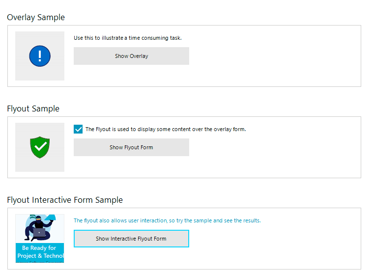

# WinForms Flyout Screen Overview

Thank you for choosing __Flyout Screen__!

Flyout control is a powerful tool that combines the overlay form with any container control, which allows you to fit any design you like. It can be used as a notification to notify the user of a long-running background process with user control inside its content. Another use case is to fit in scenarios where a complex user control needs to be shown which requires user input. 

## Key Features

Here are a few of the **RadFlyout**'s main features:

* **Auto-Size**: The flyout screen size is based on the size of the user control which is placed inside its content area.

* **Themable**: The control support all themes which the Telerik WinForms suite provides.

* **Customizable**: The ability to show custom user controls as the content of the Flyout Screen gives the user the freedom to customize the Flyout window per their requirements.
 

## Telerik UI for WinForms Learning Resources
* [Telerik UI for WinForms flyout Homepage](https://www.telerik.com/products/winforms/flyout.aspx)
* [Get Started with the Telerik UI for WinForms flyout]()
* [Telerik UI for WinForms API Reference](https://docs.telerik.com/devtools/winforms/api/)
* [Getting Started with Telerik UI for WinForms Components]()
* [Telerik UI for WinForms Virtual Classroom (Training Courses for Registered Users)](https://learn.telerik.com/learn/course/external/view/elearning/17/TelerikUIforWinForms) 
* [Telerik UI for WinForms Forum](https://www.telerik.com/forums/winforms)
* [Telerik UI for WinForms Knowledge Base](https://docs.telerik.com/devtools/winforms/knowledge-base)

# See Also

* [Getting Started]()

 
        
