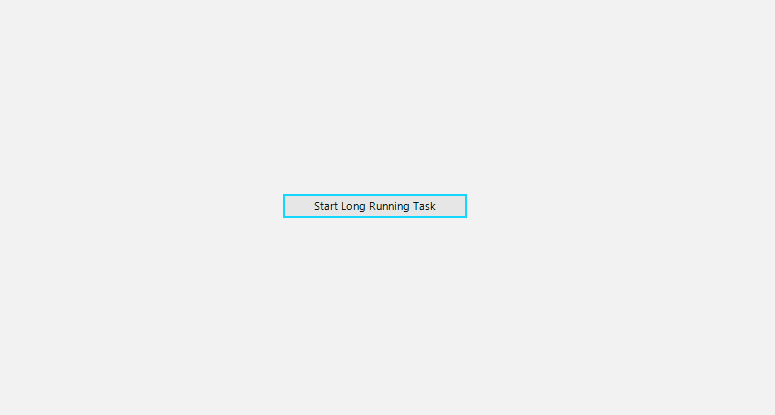

# Custom Overlay Screen

This tutorial will walk you through how you can create a custom __Overlay Screen__. 



1\. To create a custom overlay screen, we can create our own form/class which derives from __RadOverlayForm__. Then, we can construct our new overlay form per our requirements. For the purpose of this example, we are going to add a label in the midding of the form. We can call the base class with a false parameter to remove the default __RadWaitingBar__ control.

## Custom RadOverlayForm

{{source=..\SamplesCS\SplashScreens\Overlay\OverlaySettings.cs region=CustomOverlayForm}} 
{{source=..\SamplesVB\SplashScreens\Overlay\OverlaySettings.vb region=CustomOverlayForm}}

````C#

public class CustomOverlayForm : RadOverlayForm
{
	private RadLabel loadingLabel;
	public CustomOverlayForm() : base(false)
	{
		loadingLabel = new RadLabel();
		this.loadingLabel.Parent = this;
		this.loadingLabel.ForeColor = Color.Black;
		this.loadingLabel.Font = new Font(loadingLabel.Font.FontFamily, 16);
		this.loadingLabel.Text = "Loading...";
	}
	protected override void OnSizeChanged(EventArgs e)
	{
		base.OnSizeChanged(e);

		this.UpdateLoadingLabelLocation();
	}
	private void UpdateLoadingLabelLocation()
	{
		if (this.loadingLabel == null)
		{
			return;
		}

		var total = this.ClientSize;
		var wbSize = this.loadingLabel.Size;
		Point location = new Point();
		location.X = (total.Width - wbSize.Width) / 2;
		location.Y = (total.Height - wbSize.Height) / 2;
		this.loadingLabel.Location = location;
	}
}
	

````
````VB.NET

Public Class CustomOverlayForm
    Inherits RadOverlayForm

    Private loadingLabel As RadLabel

    Public Sub New()
        MyBase.New(False)
        loadingLabel = New RadLabel()
        Me.loadingLabel.Parent = Me
        loadingLabel.ForeColor = Color.Black
        loadingLabel.Font = New Font(loadingLabel.Font.FontFamily, 16)
        loadingLabel.Text = "Loading..."
        Me.Opacity = 0.75
    End Sub

    Public ReadOnly Property LoadingLabel As RadLabel
        Get
            Return Me.loadingLabel
        End Get
    End Property

    Protected Overrides Sub OnSizeChanged(ByVal e As EventArgs)
        MyBase.OnSizeChanged(e)
        Me.UpdateLoadingLabelLocation()
    End Sub

    Private Sub UpdateLoadingLabelLocation()
        If Me.LoadingLabel Is Nothing Then
            Return
        End If

        Dim total = Me.ClientSize
        Dim wbSize = Me.LoadingLabel.Size
        Dim location As Point = New Point()
        location.X = (total.Width - wbSize.Width) / 2
        location.Y = (total.Height - wbSize.Height) / 2
        Me.LoadingLabel.Location = location
    End Sub
End Class


````

{{endregion}}

2\. Next step is to apply our custom form by returning it in the __CreateFrom__ of the __OverlayScreen__ class.

## Custom OverlayScreen

{{source=..\SamplesCS\SplashScreens\Overlay\OverlaySettings.cs region=CustomOverlayScreen}} 
{{source=..\SamplesVB\SplashScreens\Overlay\OverlaySettings.vb region=CustomOverlayScreen}}

````C#

public class CustomOverlayScreen : OverlayScreen
{
	public override RadOverlayForm CreateFrom()
	{
		return new CustomOverlayForm();
	}
}

	

````
````VB.NET

Public Class CustomOverlayScreen
    Inherits OverlayScreen

    Public Overrides Function CreateFrom() As RadOverlayForm
        Return New CustomOverlayForm()
    End Function
End Class


````

{{endregion}}

3\. Our final step is to replace the default overlay screen with our custom one by setting the RadOverlayManager.OverlayInstance static property.

## Override OverlayInstance

{{source=..\SamplesCS\SplashScreens\Overlay\OverlaySettings.cs region=OverlayInstance}} 
{{source=..\SamplesVB\SplashScreens\Overlay\OverlaySettings.vb region=OverlayInstance}}

````C#

public void SetCustomOverlayScreen()
{
	RadOverlayManager.OverlayInstance = new CustomOverlayScreen();
}
	

````
````VB.NET

Public Sub SetCustomOverlayScreen()
    RadOverlayManager.OverlayInstance = New CustomOverlayScreen()
End Sub


````

{{endregion}}

# See Also

* [Overview]()
 
        
