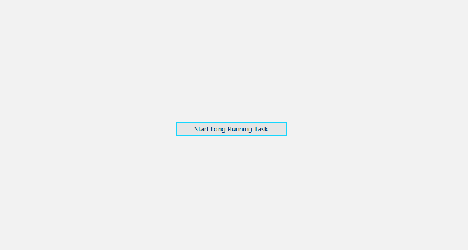

# Overlay

Thank you for choosing __RadOverlay__!

Overlay control enables you to display a notification whenever a longer-running background process is being handled by the application. This makes the UI more informative and the user experience smoother.

## Key Features

Here are a few of the **RadOverlay**'s main features:

* **Auto-Size**: The overlay screen size is based on the size of the form/control on which it is placed.

* **Themable**: The control supports all themes which the Telerik WinForms suite provides.

* **Customizable**: The RadOverlay control exposes an API that can be used to customize the default look of the overlay form per your requirements.
 
# See Also

* [Getting Started]()

 
        
