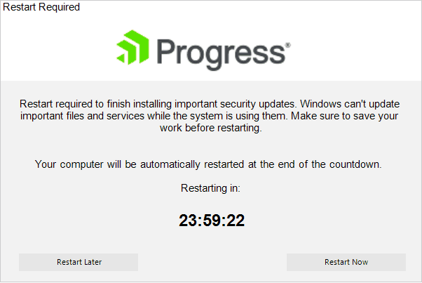
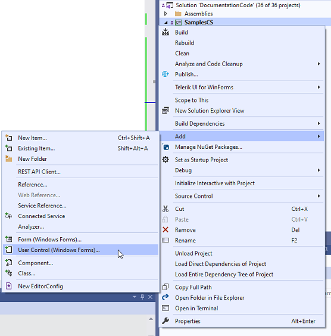

# Custom Splash

The **RadSplashScreenManager** offers an overload of the **Show** method that accepts **Type** argument. This allows you to create a custom **UserControl** with the desired design for example and show it as a splash screen.

>caption Custom Splash

 

1\. Create a new UserControl to your project, e.g. RestartRequiredUserControl.cs

 

2\. Construct the UI according to the specific design you may have. For the above splash, it is necessary to add 4 RadLabels, 1 RadPictureBox, 2 RadButtons and a Timer to the UserControl.


````C#

       private void InitializeComponent()
       {
           this.components = new System.ComponentModel.Container();
           this.radLabel1 = new Telerik.WinControls.UI.RadLabel();
           this.radPictureBox1 = new Telerik.WinControls.UI.RadPictureBox();
           this.radLabel2 = new Telerik.WinControls.UI.RadLabel();
           this.radLabel3 = new Telerik.WinControls.UI.RadLabel();
           this.radLabel4 = new Telerik.WinControls.UI.RadLabel();
           this.radButton1 = new Telerik.WinControls.UI.RadButton();
           this.radButton2 = new Telerik.WinControls.UI.RadButton();
           this.timer1 = new System.Windows.Forms.Timer(this.components);
           ((System.ComponentModel.ISupportInitialize)(this.radLabel1)).BeginInit();
           ((System.ComponentModel.ISupportInitialize)(this.radPictureBox1)).BeginInit();
           ((System.ComponentModel.ISupportInitialize)(this.radLabel2)).BeginInit();
           ((System.ComponentModel.ISupportInitialize)(this.radLabel3)).BeginInit();
           ((System.ComponentModel.ISupportInitialize)(this.radLabel4)).BeginInit();
           ((System.ComponentModel.ISupportInitialize)(this.radButton1)).BeginInit();
           ((System.ComponentModel.ISupportInitialize)(this.radButton2)).BeginInit();
           this.SuspendLayout();
           // 
           // radLabel1
           // 
           this.radLabel1.AutoSize = false;
           this.radLabel1.BackColor = System.Drawing.Color.White;
           this.radLabel1.Dock = System.Windows.Forms.DockStyle.Top;
           this.radLabel1.Font = new System.Drawing.Font("Arial", 11F);
           this.radLabel1.Location = new System.Drawing.Point(0, 0);
           this.radLabel1.Name = "radLabel1";
           this.radLabel1.Size = new System.Drawing.Size(600, 18);
           this.radLabel1.TabIndex = 0;
           this.radLabel1.Text = "Restart Required";
           // 
           // radPictureBox1
           // 
           this.radPictureBox1.BackColor = System.Drawing.Color.White;
           this.radPictureBox1.Dock = System.Windows.Forms.DockStyle.Top;
           this.radPictureBox1.Image = Properties.Resources.ProgressLogo;
           this.radPictureBox1.ImageLayout = Telerik.WinControls.UI.RadImageLayout.Center;
           this.radPictureBox1.Location = new System.Drawing.Point(0, 18);
           this.radPictureBox1.Name = "radPictureBox1";
           this.radPictureBox1.Size = new System.Drawing.Size(600, 96);
           this.radPictureBox1.TabIndex = 1;
           // 
           // radLabel2
           // 
           this.radLabel2.AutoSize = false;
           this.radLabel2.Dock = System.Windows.Forms.DockStyle.Top;
           this.radLabel2.Font = new System.Drawing.Font("Arial", 11F);
           this.radLabel2.Location = new System.Drawing.Point(0, 114);
           this.radLabel2.Name = "radLabel2";
           this.radLabel2.Size = new System.Drawing.Size(600, 103);
           this.radLabel2.TabIndex = 2;
           this.radLabel2.Text = "Restart required to finish installing important security updates. Windows can\'t u" +
   "pdate important files and services while the system is using them. Make sure to " +
   "save your work before restarting.";
           this.radLabel2.TextAlignment = System.Drawing.ContentAlignment.MiddleCenter;
           // 
           // radLabel3
           // 
           this.radLabel3.AutoSize = false;
           this.radLabel3.Dock = System.Windows.Forms.DockStyle.Top;
           this.radLabel3.Font = new System.Drawing.Font("Arial", 11F);
           this.radLabel3.Location = new System.Drawing.Point(0, 217);
           this.radLabel3.Name = "radLabel3";
           this.radLabel3.Size = new System.Drawing.Size(600, 68);
           this.radLabel3.TabIndex = 3;
           this.radLabel3.Text = "Your computer will be automatically restarted at the end of the countdown.\r\n\r\nRes" +
   "tarting in:";
           this.radLabel3.TextAlignment = System.Drawing.ContentAlignment.MiddleCenter;
           // 
           // radLabel4
           // 
           this.radLabel4.AutoSize = false;
           this.radLabel4.Dock = System.Windows.Forms.DockStyle.Top;
           this.radLabel4.Font = new System.Drawing.Font("Arial", 22F, System.Drawing.FontStyle.Bold);
           this.radLabel4.Location = new System.Drawing.Point(0, 285);
           this.radLabel4.Name = "radLabel4";
           this.radLabel4.Size = new System.Drawing.Size(600, 57);
           this.radLabel4.TabIndex = 4;
           this.radLabel4.Text = "24:00:00";
           this.radLabel4.TextAlignment = System.Drawing.ContentAlignment.MiddleCenter;
           // 
           // radButton1
           // 
           this.radButton1.Location = new System.Drawing.Point(26, 360);
           this.radButton1.Name = "radButton1";
           this.radButton1.Size = new System.Drawing.Size(170, 25);
           this.radButton1.TabIndex = 5;
           this.radButton1.Text = "Restart Later";
           // 
           // radButton2
           // 
           this.radButton2.Anchor = ((System.Windows.Forms.AnchorStyles)((System.Windows.Forms.AnchorStyles.Top | System.Windows.Forms.AnchorStyles.Right)));
           this.radButton2.Location = new System.Drawing.Point(408, 360);
           this.radButton2.Name = "radButton2";
           this.radButton2.Size = new System.Drawing.Size(170, 25);
           this.radButton2.TabIndex = 6;
           this.radButton2.Text = "Restart Now";
           // 
           // timer1
           // 
           this.timer1.Interval = 1000;
           this.timer1.Tick += new System.EventHandler(this.timer1_Tick);
           // 
           // RestartRequiredUserControl
           // 
           this.AutoScaleDimensions = new System.Drawing.SizeF(6F, 13F);
           this.AutoScaleMode = System.Windows.Forms.AutoScaleMode.Font;
           this.Controls.Add(this.radButton2);
           this.Controls.Add(this.radButton1);
           this.Controls.Add(this.radLabel4);
           this.Controls.Add(this.radLabel3);
           this.Controls.Add(this.radLabel2);
           this.Controls.Add(this.radPictureBox1);
           this.Controls.Add(this.radLabel1);
           this.Name = "RestartRequiredUserControl";
           this.Size = new System.Drawing.Size(600, 400);
           ((System.ComponentModel.ISupportInitialize)(this.radLabel1)).EndInit();
           ((System.ComponentModel.ISupportInitialize)(this.radPictureBox1)).EndInit();
           ((System.ComponentModel.ISupportInitialize)(this.radLabel2)).EndInit();
           ((System.ComponentModel.ISupportInitialize)(this.radLabel3)).EndInit();
           ((System.ComponentModel.ISupportInitialize)(this.radLabel4)).EndInit();
           ((System.ComponentModel.ISupportInitialize)(this.radButton1)).EndInit();
           ((System.ComponentModel.ISupportInitialize)(this.radButton2)).EndInit();
           this.ResumeLayout(false);

       }

       #endregion

       private Telerik.WinControls.UI.RadLabel radLabel1;
       private Telerik.WinControls.UI.RadPictureBox radPictureBox1;
       private Telerik.WinControls.UI.RadLabel radLabel2;
       private Telerik.WinControls.UI.RadLabel radLabel3;
       private Telerik.WinControls.UI.RadLabel radLabel4;
       private Telerik.WinControls.UI.RadButton radButton1;
       private Telerik.WinControls.UI.RadButton radButton2;
       private System.Windows.Forms.Timer timer1;

````
````VB.NET

 

````


3\. Start the timer to update the remaining time in the UserControl:

{{source=..\SamplesCS\SplashScreens\SplashScreen\RestartRequiredUserControl.cs region=CustomSplash}}
{{source=..\SamplesVB\SplashScreens\SplashScreen\SplashScreenSettings.vb region=CustomSplash}}

````C#

public partial class RestartRequiredUserControl : UserControl
{
    TimeSpan remainingTime;
    public RestartRequiredUserControl()
    {
        InitializeComponent();
        remainingTime = TimeSpan.FromDays(1);
        timer1.Start();

        this.radPictureBox1.RootElement.EnableElementShadow = false;

    }

    private void timer1_Tick(object sender, EventArgs e)
    {
        remainingTime = remainingTime.Subtract(TimeSpan.FromSeconds(1));
        this.radLabel4.Text = remainingTime.ToString(@"hh\:mm\:ss");
    }
}

````
````VB.NET

 

````

{{endregion}}


4\. Show the splash with the custom control from your main form:

{{source=..\SamplesCS\SplashScreens\SplashScreen\SplashScreenSettings.cs region=ShowCustomSplash}}
{{source=..\SamplesVB\SplashScreens\SplashScreen\SplashScreenSettings.vb region=ShowCustomSplash}}

````C#

RadSplashScreenManager.Show(typeof(RestartRequiredUserControl));

````
````VB.NET

 

````

{{endregion}}

 

# See Also

* [Structure]() 
 
        
