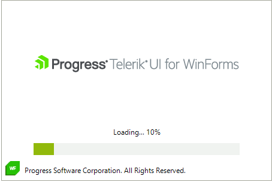

# Getting Started

The splash screen is represented by a **RadSplashScreenForm**. Actually, it is a [ShapedForm]() which content is displayed as a splash. There are two modes of the splash:

* The splash can display a predefined **RadSplashScreenControl** by given **RadSplashScreenSettings**, that contains the initial image and text. The **RadSplashScreenControl** is built by all the elements of the splash. By default, it is [TopMost](https://docs.microsoft.com/en-us/dotnet/api/system.windows.forms.form.topmost?view=windowsdesktop-6.0).

* The splash form can contain any control/UserControl, so you can achieve any look and design you like.

The **RadSplashScreenManager** is responsible for showing/closing a splash screen. 

>caution The RadSplashScreenManager internally uses a background **Thread** for showing the splash. Make sure that you don't access the RadSplashScreenControl or its elements from the main UI thread. Note that all UI controls are not thread safe controls in the whole Windows Forms platform (not just Telerik controls, but all controls out there). You should use an [Invoke](http://msdn.microsoft.com/en-us/library/zyzhdc6b.aspx) to update the controls in cross threading scenario.

By default, the RadSplashScreenManager shows the default RadSplashScreenControl:

 

{{source=..\SamplesCS\SplashScreens\SplashScreen\SplashScreenSettings.cs region=ShowDefaultSplash}}
{{source=..\SamplesVB\SplashScreens\SplashScreen\SplashScreenSettings.vb region=ShowDefaultSplash}}

````C#

Timer timer;
int currentProgress = 0;
private void ShowSplash()
{
    timer = new Timer();
    timer.Interval = 500;
    timer.Tick += Timer_Tick;
    timer.Start();

    System.Drawing.Size splashSize = new System.Drawing.Size(450, 300);
    System.Drawing.Point location = new System.Drawing.Point((this.Width - splashSize.Width) / 2, (this.Height - splashSize.Height) / 2);

    Telerik.WinControls.UI.SplashScreen.RadSplashScreenSettings settings = new RadSplashScreenSettings()
    {
        StartPosition = SplashStartPosition.Manual,
        Location = this.PointToScreen(location),
        Size = splashSize,
        Image = Telerik.WinControls.ResFinder.WinFormsLogoWithText,
        FooterLogo = new Bitmap(ResFinder.WinFormsIcon.ToBitmap(), new System.Drawing.Size(24, 24)),
        State = SplashScreenProgressIndicatorState.Determinate,
        Text = "Loading... 0%",
        FooterText = "Progress Software Corporation. All Rights Reserved.",
    };
    Telerik.WinControls.UI.RadSplashScreenManager.Show(settings);
}
private void Timer_Tick(object sender, EventArgs e)
{
    if (this.currentProgress < 100)
    {
        this.currentProgress = Math.Min(100, this.currentProgress + 10);

        RadSplashScreenManager.SetProgress(currentProgress);
        RadSplashScreenManager.SetContent(string.Format("Loading... {0}%", this.currentProgress));
        if (this.currentProgress == 100)
        {
            RadSplashScreenManager.SetContent("Completed");
            System.Threading.Thread.Sleep(2000);
        }
    }
    else
    {
        this.currentProgress = 0;
        this.timer.Stop();
        RadSplashScreenManager.Close();
    }
}

````
````VB.NET

Private timer As Timer
Private currentProgress As Integer = 0

Private Sub ShowSplash()
    timer = New Timer()
    timer.Interval = 500
    AddHandler timer.Tick, AddressOf Timer_Tick
    timer.Start()
    Dim splashSize As System.Drawing.Size = New System.Drawing.Size(450, 300)
    Dim location As System.Drawing.Point = New System.Drawing.Point((Me.Width - splashSize.Width) / 2, (Me.Height - splashSize.Height) / 2)
    Dim settings As Telerik.WinControls.UI.SplashScreen.RadSplashScreenSettings = New RadSplashScreenSettings() With {
        .StartPosition = SplashStartPosition.Manual,
        .Location = Me.PointToScreen(location),
        .Size = splashSize,
        .Image = Telerik.WinControls.ResFinder.WinFormsLogoWithText,
        .FooterLogo = New Bitmap(Telerik.WinControls.ResFinder.WinFormsIcon.ToBitmap(), New System.Drawing.Size(24, 24)),
        .State = SplashScreenProgressIndicatorState.Determinate,
        .Text = "Loading... 0%",
        .FooterText = "Progress Software Corporation. All Rights Reserved."
    }
    Telerik.WinControls.UI.RadSplashScreenManager.Show(settings)
End Sub

Private Sub Timer_Tick(ByVal sender As Object, ByVal e As EventArgs)
    If Me.currentProgress < 100 Then
        Me.currentProgress = Math.Min(100, Me.currentProgress + 10)
        RadSplashScreenManager.SetProgress(currentProgress)
        RadSplashScreenManager.SetContent(String.Format("Loading... {0}%", Me.currentProgress))

        If Me.currentProgress = 100 Then
            RadSplashScreenManager.SetContent("Completed")
            System.Threading.Thread.Sleep(2000)
        End If
    Else
        Me.currentProgress = 0
        Me.timer.[Stop]()
        RadSplashScreenManager.Close()
    End If
End Sub

````

{{endregion}}

## RadSplashScreenSettings

The **RadSplashScreenSettings** allows specifying certain settings when showing the default **RadSplashScreenControl**. The available options are:

* **Size** - Specifies the splash size.
* **Image** - Specifies the image displayed in the splash.
* **Text** - Specifies the text displayed in the splash.
* **State** - The **SplashScreenProgressIndicatorState** enumeration defines members for the possible states of the SplashScreenProgressIndicatorElement.
	* **Determinate** - Defines a determined state. The progress is indicated by a RadProgressBarElement.
	* **Indeterminate** - Defines an undetermined state. The RadWaitingBarElement is used to express the undetermined progress.
	* **None** - The progress indicators are not displayed.
* **FooterLogo** - Gets or sets the footer's logo.
* **FooterText** - Gets or set the footer's text.
* **StartPosition** - Gets or sets the screen start position. The SplashStartPosition can be *Manual* or *CenterScreen*. When *Manual* the position of the form is determined by the RadSplashScreenSettings.Location property. When *CenterScreen* the splash form is centered on the current display, and has dimensions specified in the RadSplashScreenSettings's Size property.
* **Location** - Gets or sets the desktop location when the StartPosition is SplashStartPosition.Manual.

## SplashAnimationManager

It is accessed by the SplashScreen.**AnimationManager** property. The following settings are available:

* **ShowAnimationType** - specifies the animation type when showing the splash. It can be *None*, *Fade*, *Slide*.
* **CloseAnimationType** - specifies the animation type when closing the splash. It can be *None*, *Fade*, *Slide*.
* **ShowAnimationDuration** - specifies the duration of the animation for showing the splash.
* **CloseAnimationDuration** - specifies the duration of the animation for closing the splash.

# See Also

* [Structure]() 
 
        
