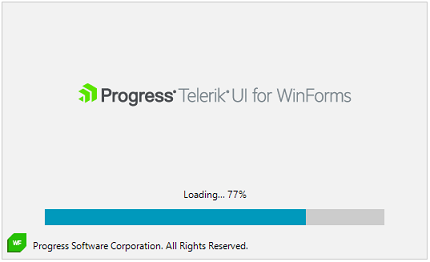
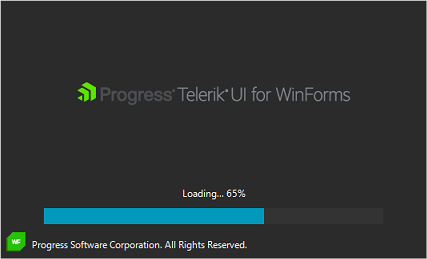

# WinForms SplashScreen Overview

The WinForms SplashScreen allows you to display a Telerik themed control that notifies the user that the program is loading. You can customize the image of the splash screen, its animations and loading process visualization.

 

## Key Features:

* Customizable image content: The control allows you to easily set the splash screen image. 

* Built-in progress bar: By default, the control shows an indeterminate progress indicator. You can easily change this and indicate some loading progress.

* Customizable content/footer UI: You can customize the content/footer of the splash screen by only setting the Content/Footer properties.

* Animations: The control comes with show and hide animations that can be fine-tuned. 

* Rich set of themes: You can use the Telerik themes to modernize your UI or implement different designs that can be changed at runtime. 
 

## Telerik UI for WinForms Learning Resources
* [Telerik UI for WinForms Overlay Homepage](https://www.telerik.com/products/winforms/splashscreen.aspx)
* [Get Started with the Telerik UI for WinForms Overlay]()
* [Telerik UI for WinForms API Reference](https://docs.telerik.com/devtools/winforms/api/)
* [Getting Started with Telerik UI for WinForms Components]()
* [Telerik UI for WinForms Virtual Classroom (Training Courses for Registered Users)](https://learn.telerik.com/learn/course/external/view/elearning/17/TelerikUIforWinForms) 
* [Telerik UI for WinForms Forum](https://www.telerik.com/forums/winforms)
* [Telerik UI for WinForms Knowledge Base](https://docs.telerik.com/devtools/winforms/knowledge-base)

# See Also

* [Custom Splash]() 
* [Getting Started]() 
* [Structure]() 
 
        
