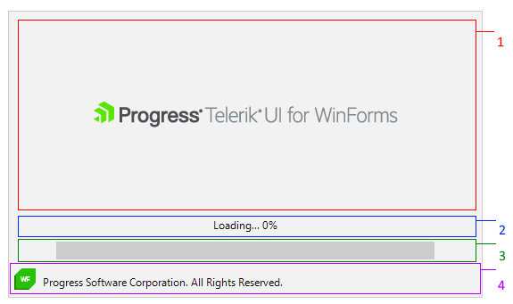

# Structure

This article describes the inner structure and organization of the elements which build the RadSplashScreenControl.

The **RadSplashScreenElement** is the main element in **RadSplashScreenControl**. It contains one main vertically oriented container represented by a StackLayoutElement. This main stack contains the following internal elements:

1\. Image Container represented by a **StackLayoutElement**. It contains:

* Image element represented by a **SplashScreenLightVisualElement**.

2\. Text Container represented by a **StackLayoutElement**. It contains:

* Text element represented by a **SplashScreenLightVisualElement**.
	
3\. Progress Indicator contained represented by a **StackLayoutElement**. It contains:

* Progress Indicator element represented by a **SplashScreenProgressIndicatorElement**.

4\. Footer container represented by a **StackLayoutElement**. It contains:

* Footer Logo represented by a **SplashScreenLightVisualElement**.
* Footer Image represented by a **SplashScreenLightVisualElement**.
	
 

# See Also

* [Custom Splash]() 
* [Getting Started]()  
 
        
