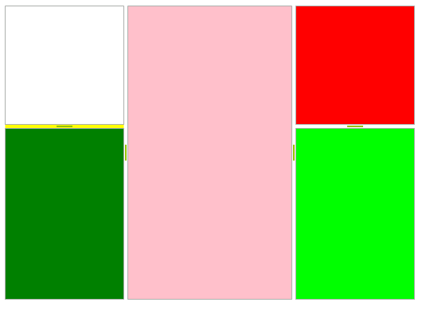

# Building a layout of RadSplitContainers programmatically

You can programmatically build a layout of panels using **RadSplitContainer**. To do so, refer to the code snippet below:

#### Building layout

<snippet id='splitcontainer-buildinglayout-basiclayout-cs' />
<snippet id='splitcontainer-buildinglayout-basiclayout-vb' />

The result is shown on the screenshot below. Note that the *TelerikMetro* theme is initially applied:

>tip You can find advanced layouts created with **RadSplitContainers** in the Telerik UI for WinForms Demo application, section *SplitContainer >> Layout* . You can find it at *Start >> Programs >> Telerik >> UI for WinForms [version] >> Run Demos* (Please note that you should have the Telerik UI for WinForms suite installed).
>

# See Also

* [Building Advanced Layouts]()	
