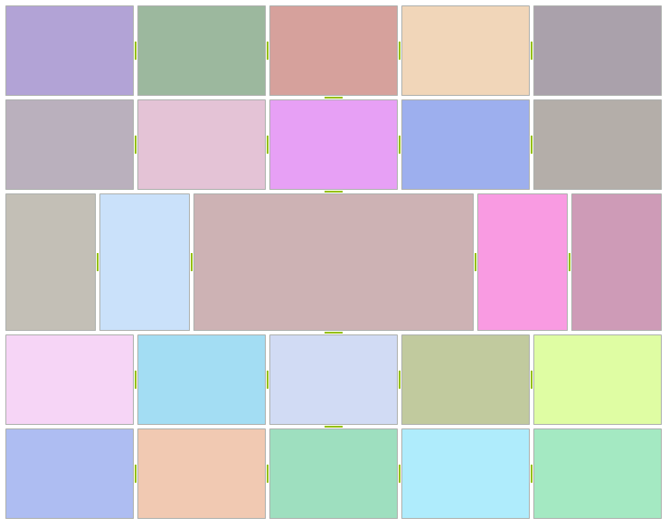
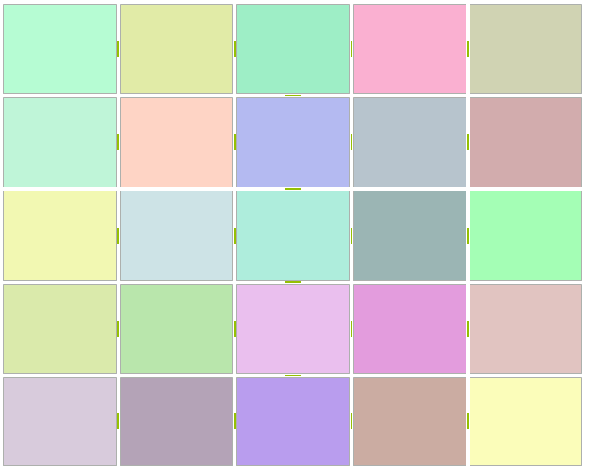

# Building Advanced Layouts

This tutorial demonstrates how to create a 5*5 grid of **SplitPanel** instances, with the center panel’s **SizeMode** set to SplitPanelSizeMode.*Fill*. The following screenshot illustrates the result.


           
In order to achieve the layout on the top screen, refer to the code snippet below:

{{source=..\SamplesCS\SplitContainer\BuildingLayout.cs region=advancedLayout}} 
{{source=..\SamplesVB\SplitContainer\BuildingLayout.vb region=advancedLayout}} 

````C#
private void CreateGrid(RadSplitContainer container, int cols, int rows, Orientation orientation, bool centerFill)
{
    container.Orientation = orientation;
    for (int i = 0; i < rows; i++)
    {
        RadSplitContainer newContainer = new RadSplitContainer();
        newContainer.Orientation = Orientation.Vertical;
        newContainer.SizeInfo.AbsoluteSize = new Size(100, 100);
        for (int j = 0; j < cols; j++)
        {
            SplitPanel panel = CreateSplitPanel();
            panel.SizeInfo.AbsoluteSize = new Size(100, 100);
            newContainer.SplitPanels.Add(panel);
        }
        container.SplitPanels.Add(newContainer);
    }
    if (centerFill)
    {
        (container.SplitPanels[rows / 2] as RadSplitContainer).SplitPanels[cols / 2].SizeInfo.SizeMode = Telerik.WinControls.UI.Docking.SplitPanelSizeMode.Fill;
    }
}
// color helper method
Random random = new Random();
private SplitPanel CreateSplitPanel()
{
    SplitPanel panel = new SplitPanel();
    Color back = Color.FromArgb(this.random.Next(155, 255), this.random.Next(155, 255), this.random.Next(155, 255));
    panel.SplitPanelElement.Fill.BackColor = back;
    panel.SplitPanelElement.Fill.GradientStyle = GradientStyles.Solid;
    return panel;
}

````
````VB.NET
Private Sub CreateGrid(ByVal container As RadSplitContainer, ByVal cols As Integer, ByVal rows As Integer, ByVal orientation As Orientation, ByVal centerFill As Boolean)
    container.Orientation = orientation
    For i As Integer = 0 To rows - 1
        Dim newContainer As New RadSplitContainer()
        newContainer.Orientation = orientation.Vertical
        newContainer.SizeInfo.AbsoluteSize = New Size(100, 100)
        For j As Integer = 0 To cols - 1
            Dim panel As SplitPanel = CreateSplitPanel()
            panel.SizeInfo.AbsoluteSize = New Size(100, 100)
            newContainer.SplitPanels.Add(panel)
        Next j
        container.SplitPanels.Add(newContainer)
    Next i
    If centerFill Then
        TryCast(container.SplitPanels(rows \ 2), RadSplitContainer).SplitPanels(cols \ 2).SizeInfo.SizeMode = Telerik.WinControls.UI.Docking.SplitPanelSizeMode.Fill
    End If
End Sub
' color helper method
Private random As New Random()
Private Function CreateSplitPanel() As SplitPanel
    Dim panel As New SplitPanel()
    Dim back As Color = Color.FromArgb(Me.random.Next(155, 255), Me.random.Next(155, 255), Me.random.Next(155, 255))
    panel.SplitPanelElement.Fill.BackColor = back
    panel.SplitPanelElement.Fill.GradientStyle = GradientStyles.Solid
    Return panel
End Function

````

{{endregion}} 

What we are doing here is to create a number (specified by the "**rows**" parameter) of split containers and for each container to add the desired number(defined by the "**cols**" parameter) split panels. When we have a descendant split panel with **SizeMode** set to *Fill*, then all other descendants are sized absolutely to allow the *Fill* panel occupy entire remaining size. The layout engine is smart enough to traverse the entire layout tree, thus allowing the fill panel to reside at any branch.
         
If we do not apply the *Fill* size mode to the center panel, then we have evenly auto-sized panels.



## Size Restrictions

Each **SplitPanelSizeInfo** instance has **MinimumSize** and **MaximumSize** members, which control the allowed size boundaries for the owning **SplitPanel** instance. The following code demonstrates how to utilize these features:

#### Restricting panels

{{source=..\SamplesCS\SplitContainer\BuildingLayout.cs region=panelRestrictions}} 
{{source=..\SamplesVB\SplitContainer\BuildingLayout.vb region=panelRestrictions}} 

````C#
private void ApplyPanelRestrictions(SplitPanel panel, Size minSize, Size maxSize)
{
    SplitPanelSizeInfo sizeInfo = panel.SizeInfo;
    sizeInfo.MinimumSize = minSize;
    sizeInfo.MaximumSize = maxSize;
}

````
````VB.NET
Private Sub ApplyPanelRestrictions(ByVal panel As SplitPanel, ByVal minSize As Size, ByVal maxSize As Size)
    Dim sizeInfo As SplitPanelSizeInfo = panel.SizeInfo
    sizeInfo.MinimumSize = minSize
    sizeInfo.MaximumSize = maxSize
End Sub

````

{{endregion}} 

The panel in the center is with applied size restrictions.


       
These settings are considered by both the layout engine and the splitter logic, which will clamp the drag hint to visually emphasize on the restrictions.
        
# See Also

* [Building a Layout of RadSplitContainers Programmatically]()	
