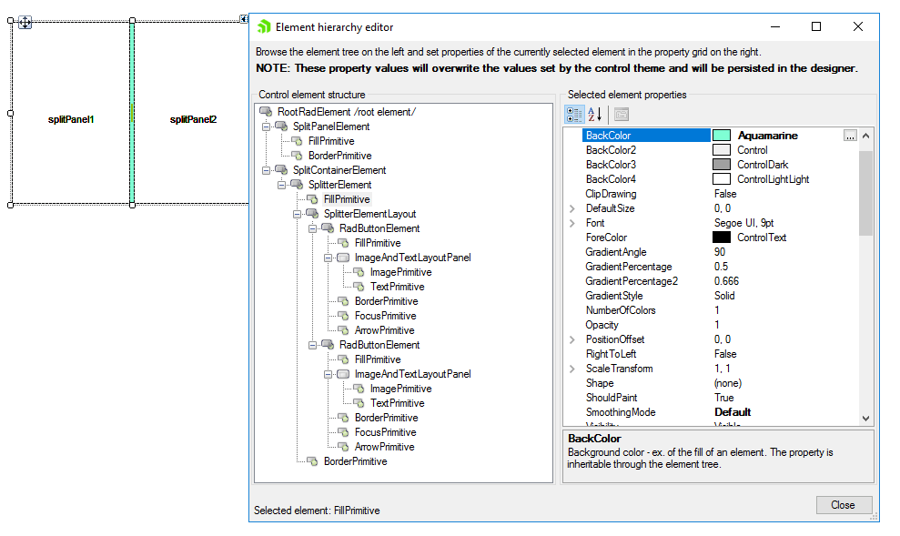
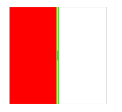

# Accessing and Customizing Elements
 
Accessing and customizing elements can be performed either at design time, or at run time. Before proceeding with this topic, it is recommended to get familiar with the [visual structure]() of **RadSplitContainer**.
      

## Design time

You can access and modify the style for different elements in **RadSplitContainer** by using the *Element hierarchy editor*.

>caption Figure 1: Element hierarchy editor

## Programmatically

You can customize the nested elements at run time as well:

>caption Fig.2 Customize elements

#### Customize elements 

<snippet id='splitcontainer-buildinglayout-customizeelements-cs' />
<snippet id='splitcontainer-buildinglayout-customizeelements-vb' />

# See Also

* [Themes]()	
