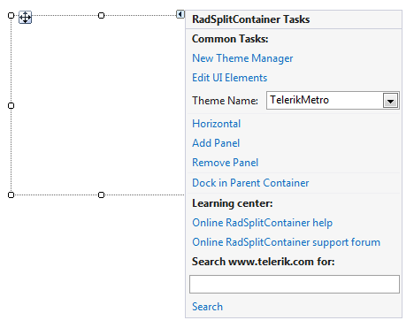

# Design Time

To start using **RadSplitContainer** just drag it from the toolbox and drop it at the form.
 
## Smart Tag

Select **RadSplitContainer** and click the small arrow on the top right position in order to open the __Smart Tag__. The __Smart Tag__ for **RadSplitContainer** lets you quickly access common tasks involved with building **RadSplitContainer** elements and customizing appearance through themes.

>caption Figure 1: Smart Tag

* __New Theme Manager__: adds a new __RadThemeManager__ component to the form.
            
* __Edit UI Elements__: allows setting properties at multiple levels of the class hierarchy.
            
* __Horizontal/Vertical__: determines the orientation of **RadSplitContainer**.

* __Add Panel__: adds a new **SplitPanel** to the container.
            
* __Remove Panel__: removes the last added **SplitPanel**.

* __Dock in Parent Container__: docks in the parent container.
           
* __Learning Center__: Navigate to the Telerik help, code library projects or support forum.

* __Search__: Search the Telerik site for a given string.         
        
# See Also

* [Element Hierarchy Editor]()
* [Using default themes]()

