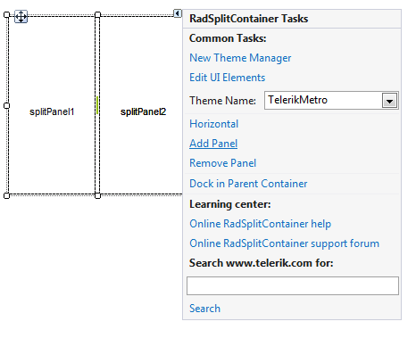
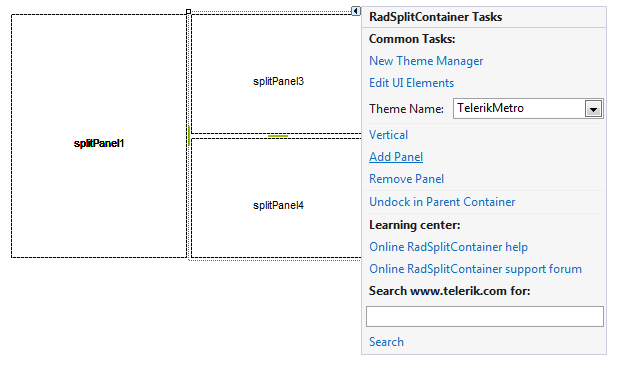
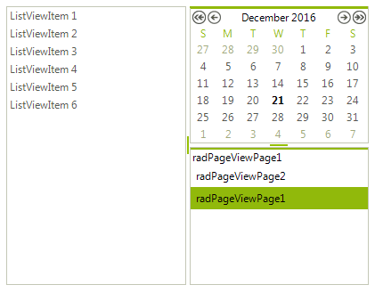

# Getting Started with WinForms SplitContainer

In this example we will position several **RadControls** in a specific layout using the **RadSplitContainer**:

1\. Drop a **RadSplitContainer** on your form.

2\. Click its **Smart Tag** to open the Action Menu. Notice that there is an option for the orientation of the **SplitPanels** in the **RadSplitContainer**. While it is set to '*Horizontal*' click twice on the **Add Panel** option. This will add two **SplitPanels** aligned horizontally in the **RadSplitContainer**.

3\. Now we want to have two **SplitPanels** aligned vertically in the place that is taken by the *SplitPanel2*. To do so, drag a new **RadSplitContainer** instance on the *SplitPanel2* and set its **Dock** property to *Fill*.

4\. Click on the **Smart Tag** of the second **RadSplitContainer** to open its Action Menu. Click on the '*Horizontal*' option to change it to '*Vertical*'. Now click twice on the **Add Panel** option. Since the alignment is set to '*Vertical*' the new **SplitPanels** will be aligned vertically.

5\. Drag and drop the desired controls on the **SplitPanels** and set their **Dock** property to *Fill*. Set the **Dock** property of the main **RadSplitContainer** to *Fill* as well. The result is shown on the screenshot below:

# See Also

* [Structure]()	
* [Design Time]()	

## Telerik UI for WinForms Learning Resources
* [Telerik UI for WinForms SplitContainer Component](https://www.telerik.com/products/winforms/split-container.aspx)
* [Getting Started with Telerik UI for WinForms Components](https://docs.telerik.com/devtools/winforms/getting-started/first-steps)
* [Telerik UI for WinForms Setup](https://docs.telerik.com/devtools/winforms/installation-and-upgrades/installing-on-your-computer)
* [Telerik UI for WinForms Application Modernization](https://docs.telerik.com/devtools/winforms/winforms-converter/overview)
* [Telerik UI for WinForms Visual Studio Templates](https://docs.telerik.com/devtools/winforms/visual-studio-integration/visual-studio-templates)
* [Deploy Telerik UI for WinForms Applications](https://docs.telerik.com/devtools/winforms/deployment-and-distribution/application-deployment)
* [Telerik UI for WinForms Virtual Classroom(Training Courses for Registered Users)](https://learn.telerik.com/learn/course/external/view/elearning/17/telerik-ui-for-winforms)
* [Telerik UI for WinForms License Agreement)](https://www.telerik.com/purchase/license-agreement/winforms-dlw-s)

