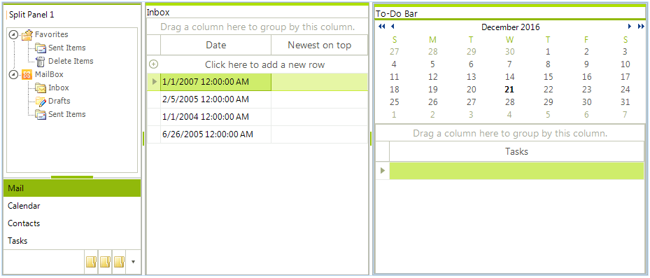

# WinForms SplitContainer Overview

**RadSplitContainer** is a layout control which allows you to add many container panels to a form, separated by splitter(s). It is very handy for creating complex user interfaces where a selection in one panel determines what objects are shown in another panel. The splitter makes it very easy for users to re-size the panels to fit their personal liking.





The design of the control is simple, yet flexible enough to handle virtually any complex layout scenario. The layout consists of one or more **SplitPanel** instances, organized in containers. A container has “Orientation”, which defines the direction in which each child panel will be laid-out. It also composes a **SplitContainerLayoutStrategy** instance, which handles all layout requests from its owning container. Each **SplitPanel** instance has a member of type **SplitPanelSizeInfo**, which is used by the strategy to determine the size and position of this panel on its hosting container. Available are four different sizing modes per panel basis:

* *Auto*: a panel is auto-sized, based on the available remaining size of the container.

* *Relative*: a panel occupies amount of space, relative to the container’s available size. This amount is specified through the SplitPanelSizeInfo.**RelativeRatio** property.

* *Absolute*: Absolute size is used for a panel. The amount of size is specified through the SplitPanelSizeInfo.**AbsoluteSize** property.

* *Fill*: Special mode currently used by the **MainDocumentContainer**. When a **RadSplitContainer** has a descendant(s) with this special size mode, all panels are sized absolutely, leaving the available space for all the “Fill” panels.

Having all these sizing modes, combined with the **Orientation** setting, available per split container basis, allow for virtually any layout scenario to be easily achieved.

## Telerik UI for WinForms Learning Resources
* [Telerik UI for WinForms SplitContainer Homepage](https://www.telerik.com/products/winforms/split-container.aspx)
* [Get Started with the Telerik UI for WinForms SplitContainer]()
* [Telerik UI for WinForms API Reference](https://docs.telerik.com/devtools/winforms/api/)
* [Getting Started with Telerik UI for WinForms Components]()
* [Telerik UI for WinForms Virtual Classroom (Training Courses for Registered Users)](https://learn.telerik.com/learn/course/external/view/elearning/17/TelerikUIforWinForms) 
* [Telerik UI for WinForms Forum](https://www.telerik.com/forums/winforms)
* [Telerik UI for WinForms Knowledge Base](https://docs.telerik.com/devtools/winforms/knowledge-base)

## See Also

* [Structure]()	
* [Getting Started]()	

