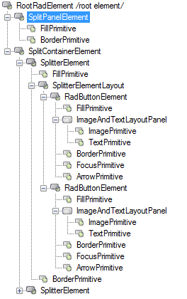
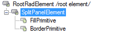
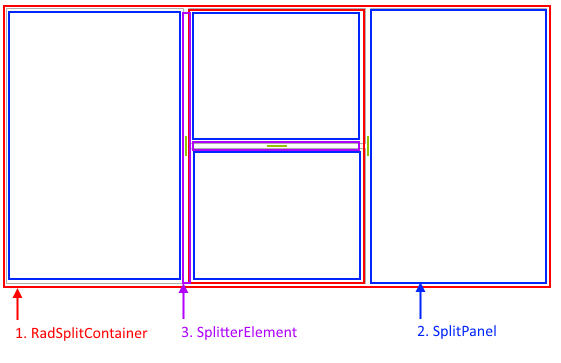
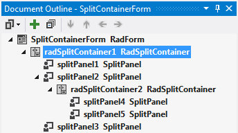

# Structure

This article illustrates the inner structure and organization of the elements which build the **RadSplitContainer** control.

>caption Figure 1: RadSplitContainer's elements hierarchy

>caption Figure 2: SplitPanel's elements hierarchy

>caption Figure 3: RadSplitContainer's visual structure

 

# See Also

* [RadControlSpy]()

