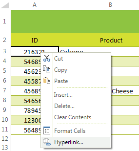
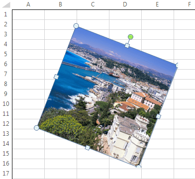

# SpreadProcessing Features

This article briefly describes what are the available spread processing features and refer to the relevant help article.

## Hyperlinks

Hyperlinks enable quick access to web pages, places in the workbook or email addresses. You can add a hyperlink via the context menu:

>caption Figure 1: Hyperlink option in context menu

 

>caption Figure 2: Hyperlink dialog

 

Additional information how to manipulate hyperlinks is available [here](https://docs.telerik.com/devtools/document-processing/libraries/radspreadprocessing/features/hyperlink). 

>note The Hyperlink dialog can be triggered by the **RadSpreadsheetRibbonBar** as well. It is necessary to select the **Insert** tab and press the **Hyperlink** button.

## Images

>caption Figure 3: Images

The image is a kind of a shape which is characterized by having an image source.

 

You can easily add an image via the **RadSpreadsheetRibbonBar**. It is necessary to select the **Insert** tab and click the **Pictures** button.

>caption Figure 4: Insert image

 

Additional information how to manipulate images is available [here](https://docs.telerik.com/devtools/document-processing/libraries/radspreadprocessing/features/shapes-and-images). 
