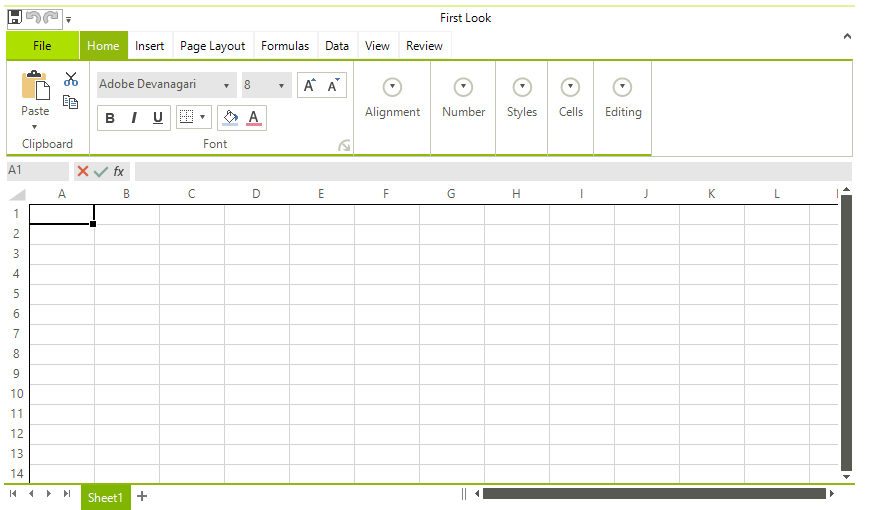
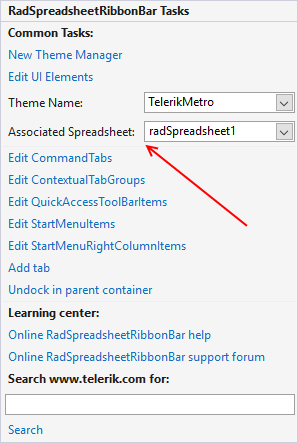

# Getting Started

This article explains how to add a __RadSpreadsheet__ control to a form and wire it with __UI__.
      

It contains the following sections:

* [Assembly References](#assembly-references)

* [Spreadsheet and Ribbon UI](#spreadsheet-and-ribbonbar)

## Assembly References

The assemblies that contain the implementation of __RadSpreadsheet__ and must be referenced in order to use the control are:

* Telerik.WinControls.RadSpreadsheet

* Telerik.WinControls

* TelerikCommon

* Telerik.WinControls.UI

* Telerik.WinControls.GridView.dll


For export and import to XLSX:

* Telerik.Windows.Zip.dll

* Telerik.Windows.Documents.Spreadsheet.FormatProviders.OpenXml.dll

To export a document to PDF, you will need to add a reference to the corresponding assembly:

* Telerik.Windows.Documents.Spreadsheet.FormatProviders.Pdf.dll

## Spreadsheet and RibbonBar

Now add the __RadSpreadsheet__ control to the form.After that add __RadSpreadsheetRibbonBar__ to the form. Dock it to the top and then Dock the __RadSpreadsheet__ to fill the remaining space. Your layout should look like this.

 

Open the Smart Tag of the ribbon and set the associated control. 

 

That is all. You are ready to start the application and examine the control features.

### Programmatically loading documents

In some cases you may need to load the document in the code behind, not by using the UI. The following snippet demonstrates how you can load the document directly from file.

#### Load document with code.

{{source=..\SamplesCS\Spreadsheet\GettingStartedCode.cs region=LoadFile}} 
{{source=..\SamplesVB\Spreadsheet\GettingStartedCode.vb region=LoadFile}}

````C#
string fileName = @"C:\Test.xlsx";
var formatProvider = new XlsxFormatProvider();
using (Stream input = new FileStream(fileName, FileMode.Open))
{
    radSpreadsheet1.Workbook = formatProvider.Import(input);
}

````
````VB.NET
Dim fileName As String = "C:\Test.xlsx"
Dim formatProvider = New XlsxFormatProvider()
Using input As Stream = New FileStream(fileName, FileMode.Open)
    radSpreadsheet1.Workbook = formatProvider.Import(input)
End Using

````


{{endregion}} 

>note Detailed information about the format providers is available [here](https://docs.telerik.com/devtools/document-processing/libraries/radspreadprocessing/formats-and-conversion/general-information).

## See Also

* [SpreadProcessing](https://docs.telerik.com/devtools/document-processing/libraries/radspreadprocessing/overview)

