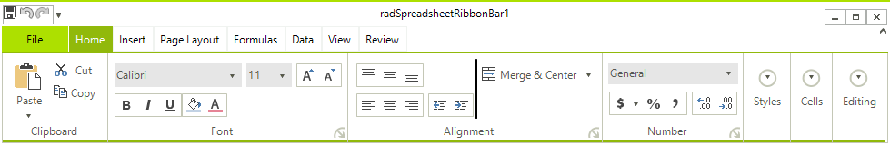
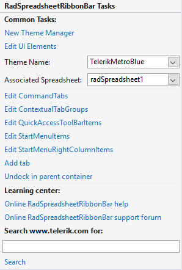

# Spreadsheet UI

RadSpreadsheet comes with pre-defined UI that is automatically wired with all of the commands provided by the control and shows its full potential. **RadSpreadsheetRibbonBar** automatically registers the UI components of **RadSpreadsheet** and keeps them up-to-date after each upgrade.

#### Figure 1: RadSpreadsheet with default UI and context menu

## Add RadSpreadsheet with Predefined UI to Your Application

**RadSpreadsheetRibbonBar** control compliments **RadSpreadsheet**, with convenient ribbon exposing the variety of features the latter supports. Just drop the control on the form and you will get all the UI expected from a standard spreadsheet editing application, including multiple ribbon tabs full of commands, styles gallery, formula and status bar. When updating from version to version, you'll automatically get UI for all the new commands we expose.

The Smart Tag allows you to associate the **RadSpreadsheet** with the **RadSpreadsheetRibbonBar**

## See Also

* [Getting Started with RadSpreadsheet]()
* [Visual Structure]()
