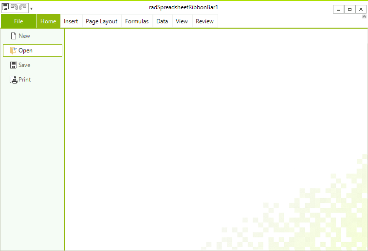

# Import/Export


The model of **RadSpreadsheet** enables you to easily open or save documents from the most common spreadsheet formats. This topic describes how you can use these functionalities in your application.

## Supported Formats

Here is a list of all the formats supported in **RadSpreadsheet**:

* **Xlsx**: Rich text format, which exports the whole content of a workbook: worksheets, formula values, formatting, hyperlinks etc.

* **Xls**: Supported as of **R3 2020 SP1**. Rich text format, which exports the content of a workbook: worksheets, formula values, formatting, hyperlinks etc. Supported in older applications.

* **Pdf**: Fixed format, which preserves the content of a workbook in independent from software or hardware manner.

* **Csv** (comma separated): Plain text format that saves the content of the cells in the *active* worksheet. The format strips all formatting and keeps only the result values of cells. These values are separated by a *culture dependent* delimiter.

* **Txt** (tab delimited): Plain text format, which preserves only the content of the cells in the *active* worksheet. The format does not save any formatting and keeps only the result values of the cells. These values are delimited via tabs.

## Open/Save Document

### Using Code-Behind

To open or save a document with RadSpreadsheet, you can use the **Import()** and **Export()** methods respectively. Each of the format providers expose them and **Example 2** and **Example 3** shows how you could use both functionalities with [**XlsxFormatProvider**](https://docs.telerik.com/devtools/document-processing/libraries/radspreadprocessing/formats-and-conversion/xlsx/xlsxformatprovider). 


#### Example 1: Import XLSX document

{{source=..\SamplesCS\Spreadsheet\Events.cs region=FormatProviderImport}} 
{{source=..\SamplesVB\Spreadsheet\Events.vb region=FormatProviderImport}}

````C#
XlsxFormatProvider formatProvider = new XlsxFormatProvider();
using (Stream input = new FileStream(fileName, FileMode.Open))
{
    this.radSpreadsheet.Workbook = formatProvider.Import(input);
}

````
````VB.NET
Dim formatProvider As New XlsxFormatProvider()
Using input As Stream = New FileStream(fileName, FileMode.Open)
    Me.radSpreadsheet.Workbook = formatProvider.Import(input)
End Using

```` 

 
{{endregion}} 

#### Example 2: Export XLSX document
 
{{source=..\SamplesCS\Spreadsheet\Events.cs region=FormatProviderExport}} 
{{source=..\SamplesVB\Spreadsheet\Events.vb region=FormatProviderExport}}

````C#
XlsxFormatProvider formatProvider = new XlsxFormatProvider();
using (Stream output = new FileStream(fileName, FileMode.Create))
{
    formatProvider.Export(this.radSpreadsheet.Workbook, output);
}

````
````VB.NET
Dim formatProvider As New XlsxFormatProvider()
Using output As Stream = New FileStream(fileName, FileMode.Create)
    formatProvider.Export(Me.radSpreadsheet.Workbook, output)
End Using

```` 

 
{{endregion}} 


>More information about the usage of the format providers is available in the [Formats and Conversion](https://docs.telerik.com/devtools/document-processing/libraries/radspreadprocessing/formats-and-conversion/general-information) section of the documentation for the model of **RadSpreadsheet** - [**RadSpreadProcessing**](https://docs.telerik.com/devtools/document-processing/libraries/radspreadprocessing/overview).

### Using UI

Through the UI of RadSpreadsheet you can enable the end user to open and save documents. Clicking the Open or Save button in the File menu of RadRSpreadsheetRibbon opens the Open/Save File dialog and lets the user to choose the file they would like to open or, respectively, the location they would like to save to.

#### Figure 1: Open and Save buttons in the File menu




## See Also

* [Spreadsheet UI]()
* [Formats and Conversion - RadSpreadProcessing](https://docs.telerik.com/devtools/document-processing/libraries/radspreadprocessing/formats-and-conversion/general-information)
