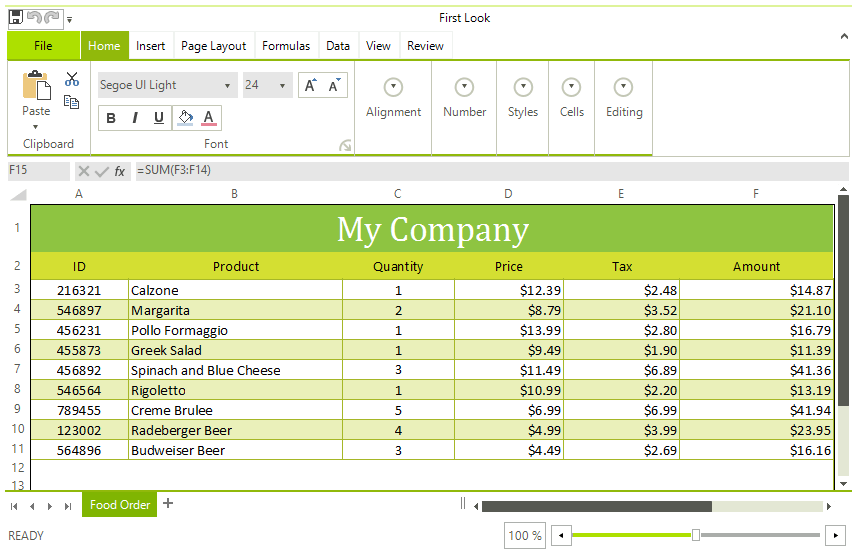

# WinForms Spreadsheet Overview

Thank you for choosing Telerik __RadSpreadsheet__!

__RadSpreadsheet__ is a control that allows editing tabular data utilizing a variety of cell formatting options, styles and themes. 





>note **RadSpreadsheet** requires **.NET Framework 4.0** and cannot be used with an older version. 

Some of its features are:

* Named Ranges

* Protection: Different options available for protecting the workbook and its worksheets from modifications.

* Shapes and Images: The UI enables you to work with images. [API](https://docs.telerik.com/devtools/document-processing/libraries/radspreadprocessing/features/shapes-and-images) for insertion, positioning and deletion of images in worksheets.

* Document themes

* [Freeze panes]()

* Create and use multiple sheets, each one with its own history stack

* Selection and active cell

* Scrolling - there are two scrolling modes - ItemBased and PixelBased. 
        	The first one ensures that the whole content of the top left cell is visible, the latter designed for smoother interaction

* Insert and delete cells, rows and columns

* Merge cells, merge cells across columns and unmerge

* Resize rows and columns, auto fit

* Use different cell formatting

	* Various fonts and font sizes

	* ForeColor and background color

	* Bold, italics and underline

	* Vertical and horizontal cell alignment

	* Text wrapping

	* Cell borders

	* Use cell styles and themes for a more consistent look.

* A battery of data formatting options:

    - Number

    - Currency

    - Accounting

    - Date

    - Time

    - Percentage

    - Fraction

    - Scientific

    - Text

    - Special

    - Custom

* Auto fill and Series - fill cells automatically with data following a specific pattern

* [Data Validation](): Enables you to control the type of data or the values that users enter into a cell. Different data validation rules are available, including list, number, date, text length or custom rules.

* A broad range of formulas in different categories: Logical, Text, Date and Time, Math and Trigonometry. **RadSpreadsheet** comes with more than 200 built-in functions. The API enables you to easily plug custom ones as well. For more information, refer to the [Formulas](https://docs.telerik.com/devtools/document-processing/libraries/radspreadprocessing/features/formulas/formulas) section for SpreadProcessing. 

* [Filtering]() worksheet data.

* [Sorting]() the data in the worksheet.

* [Find and replace data](https://docs.telerik.com/devtools/document-processing/libraries/radspreadprocessing/features/find-and-replace).

* Copy/Paste: Add or copy worksheets within or across workbooks. Of course, copying and pasting of cells is supported as well.

* Customize row/column headings.

* Show/Hide grid lines and headers.

* Zoom in and out each sheet separately.

* Named Ranges: You can use the named ranges on workbook and worksheet levels.

* [Printing]()

* [Headers and Footers](): The functionality enables you to add rich text content in the page margins when laying out a worksheet to pages.

* [Selection]() and active cell

* [Customizing the selection appearance]()

* Easy integration with __RadSpreadSheetRibbonBar__

* [Localization](): You can easily translate the string resources of RadSpreadsheet.

## Telerik UI for WinForms Learning Resources
* [Telerik UI for WinForms Spreadsheet Homepage](https://www.telerik.com/products/winforms/spreadsheet.aspx)
* [Get Started with the Telerik UI for WinForms Spreadsheet]()
* [Telerik UI for WinForms API Reference](https://docs.telerik.com/devtools/winforms/api/)
* [Getting Started with Telerik UI for WinForms Components]()
* [Telerik UI for WinForms Virtual Classroom (Training Courses for Registered Users)](https://learn.telerik.com/learn/course/external/view/elearning/17/TelerikUIforWinForms) 
* [Telerik UI for WinForms Forum](https://www.telerik.com/forums/winforms)
* [Telerik UI for WinForms Knowledge Base](https://docs.telerik.com/devtools/winforms/knowledge-base)

## Telerik UI for WinForms Additional Resources
* [Telerik UI for WinForms Product Overview](https://www.telerik.com/products/winforms.aspx)
* [Telerik UI for WinForms Blog](https://www.telerik.com/blogs/desktop-winforms)
* [Telerik UI for WinForms Videos](https://www.telerik.com/videos/product/winforms)
* [Telerik UI for WinForms Roadmap](https://www.telerik.com/support/whats-new/winforms/roadmap)
* [Telerik UI for WinForms Pricing](https://www.telerik.com/purchase/individual/winforms.aspx)
* [Telerik UI for WinForms Code Library](https://www.telerik.com/support/code-library/winforms)
* [Telerik UI for WinForms Support](https://www.telerik.com/support/winforms)
* [What’s New in Telerik UI for WinForms](https://www.telerik.com/support/whats-new/winforms)

## See Also

 * [Getting Started]()
 
 * [Spread Processing Features]()
 
 * [Working with UI Selection]()

 * [Printing]()

 * [Unsupported Features]()
