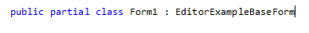
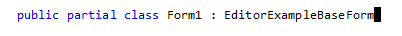
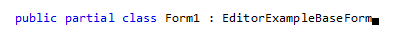
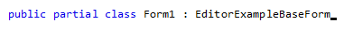
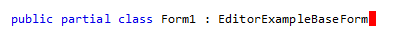

# Caret

The caret of **RadSyntaxEditor** is a vertical 'blinking' line that represents the current cursor position of a control that accepts text input. The appearance of the caret can be controlled by the **CaretDisplayMode** property. There are 4 different modes that you can choose from - *Normal*, *Block*, *HalfBlock* and *QuarterBlock*. The resulting appearance can be observed in Figure 1.

#### Figure 1: Caret's display mode

* **Normal** - 
* **Block** -  
* **HalfBlock** - 
* **QuarterBlock** - 

#### Setting the caret's display mode

{{source=..\SamplesCS\SyntaxEditor\SyntaxEditorGettingStarted.cs region=SetCaretDisplayMode}} 
{{source=..\SamplesVB\SyntaxEditor\SyntaxEditorGettingStarted.vb region=SetCaretDisplayMode}}

````C#
this.radSyntaxEditor1.CaretDisplayMode = CaretDisplayMode.QuarterBlock;

````
````VB.NET
Me.RadSyntaxEditor1.CaretDisplayMode = CaretDisplayMode.QuarterBlock

````

{{endregion}} 

## Hide the Caret

If you want to hide the caret, you can do so by setting the **IsCaretVisible** property to *false*. This setting can be used along with the **IsReadOnly** property which disallows users from making changes in the editor.

#### Setting the caret's display mode

{{source=..\SamplesCS\SyntaxEditor\SyntaxEditorGettingStarted.cs region=HideCaret}} 
{{source=..\SamplesVB\SyntaxEditor\SyntaxEditorGettingStarted.vb region=HideCaret}}

````C#
this.radSyntaxEditor1.IsCaretVisible = false;
this.radSyntaxEditor1.SyntaxEditorElement.IsReadOnly = true;

````
````VB.NET
Me.RadSyntaxEditor1.IsCaretVisible = False
Me.RadSyntaxEditor1.SyntaxEditorElement.IsReadOnly = True

````

{{endregion}} 

## Caret Color

Through the **CaretColor** property, you can change the caret's color to a color of your liking. The default color is Black.

#### Setting the caret's color

{{source=..\SamplesCS\SyntaxEditor\SyntaxEditorGettingStarted.cs region=CaretColor}} 
{{source=..\SamplesVB\SyntaxEditor\SyntaxEditorGettingStarted.vb region=CaretColor}}

````C#
this.radSyntaxEditor1.CaretColor = Color.Red;

````
````VB.NET
Me.RadSyntaxEditor1.CaretColor = Color.Red

````

{{endregion}} 

#### Figure 2: RadSyntaxEditor caret with red color

