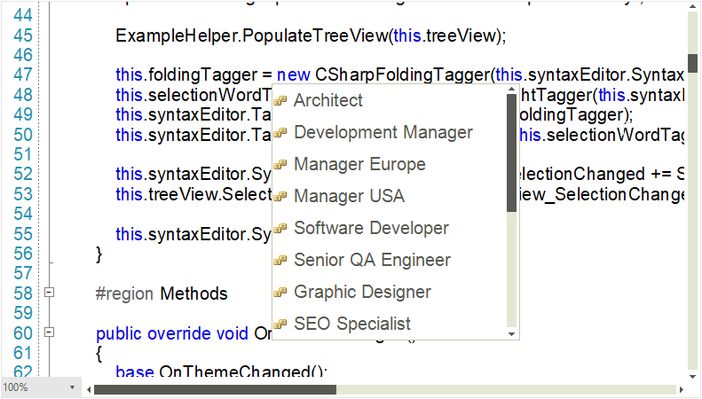

# Fonts

**RadSyntaxEditor** responds to changes in its font properties just as any other WinForms control. You can modify the font size and family of the control through the **EditorFontSize** and **EditorFontFamily** properties as demonstrated in **Example 1**.

#### Example 1: Setting font properties

<snippet id='syntax-editor-syntaxeditorlayers-font-cs' />
<snippet id='syntax-editor-syntaxeditorlayers-font-vb' />

These properties, however, will be applied to the line numbers, editor presenter and intelliprompt parts of the control.

## Monospaced Font Optimization

When the used font is **Consolas**, **Courier New** or **Lucida Console**, you can benefit from the monospaced font optimization to boost the performance of the control. To enable this optimization, you need to set the **UseMonospacedFontOptimization** property to *true* for **RadSyntaxEditorElement**.

#### Example 2: Enabling monospaced font optimization

<snippet id='syntax-editor-syntaxeditorlayers-optimization-cs' />
<snippet id='syntax-editor-syntaxeditorlayers-optimization-vb' />

