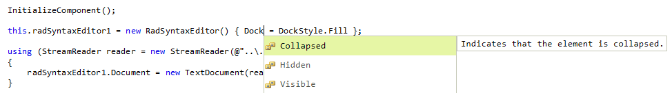
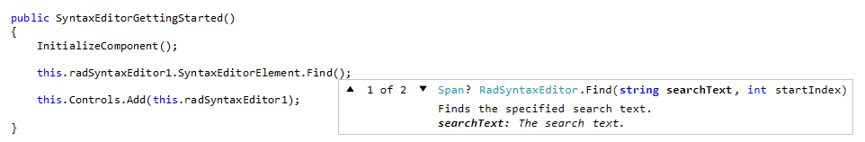

# IntelliPrompts

The **RadSyntaxEditor** has support for intelliprompts which aim to speed up coding by reducing typos and other common mistakes.

## Code Completion

You can show a collection of items when the user inputs a given string through the **CompletionListWindow**. To do so, you need to populate the presenter's **CompletionListItems** collection.

#### Example 1: Populate and display the completion list window

{{source=..\SamplesCS\SyntaxEditor\SyntaxEditorGettingStarted.cs region=IntelliPrompts}}
{{source=..\SamplesVB\SyntaxEditor\SyntaxEditorGettingStarted.vb region=IntelliPrompts}}

````C#

CompletionInfoCollection completionList = new CompletionInfoCollection()
{
    new CompletionInfo("Collapsed", "Indicates that the element is collapsed.", Image.FromFile(@"../../SyntaxEditor/Entity-Enum.png")),
    new CompletionInfo("Hidden", "Indicates that the element is hidden.",Image.FromFile(@"../../SyntaxEditor/Entity-Enum.png")),
    new CompletionInfo("Visible", "Indicates that the element is visible." ,Image.FromFile(@"../../SyntaxEditor/Entity-Enum.png")),
};

this.radSyntaxEditor1.SyntaxEditorElement.IntelliPrompts.CompletionListWindow.Presenter.CompletionListItems = completionList;

````
````VB.NET

Dim CompletionList As CompletionInfoCollection = New CompletionInfoCollection() From 
{
    New CompletionInfo("Collapsed", "Indicates that the element is collapsed.", Image.FromFile("../../SyntaxEditor/Entity-Enum.png")),
    New CompletionInfo("Hidden", "Indicates that the element is hidden.", Image.FromFile("../../SyntaxEditor/Entity-Enum.png")),
    New CompletionInfo("Visible", "Indicates that the element is visible.", Image.FromFile("../../SyntaxEditor/Entity-Enum.png"))
}

Me.RadSyntaxEditor1.SyntaxEditorElement.IntelliPrompts.CompletionListWindow.Presenter.CompletionListItems = CompletionList

````

{{endregion}} 

#### Figure 1: Code completion


>note **CodeCompletionCommand** is being executed by **RadSyntaxEditor** when pressing `Space`+`Control` keys. It shows the **CompletionListWindow**. An alternative solution is to display the dialog programmatically by simply calling the SyntaxEditorElement.IntelliPrompts.CompletionListWindow.**Show** method.

## Overload List

Through the **OverloadListWindow** you can show a collection of overloads when the user tries to invoke a certain method. To do so, you need to first populate its presenter's **OverloadListItems** collection. Thanks to the [HTML-like text formatting]() that Telerik Presentation Framework provides it is possible to apply advanced styling mechanism to display formatted text as font style, font color, font size, etc.

#### Example 2: Populate and display the completion list window

{{source=..\SamplesCS\SyntaxEditor\SyntaxEditorGettingStarted.cs region=}}

````C#
            
OverloadInfoCollection overloadList = new OverloadInfoCollection
{
    new OverloadInfo("<html><font=Consolas><size=10><color=43,145,175>Span<color=Black>? <color=43,145,175>RadSyntaxEditor<color=Black>.Find(<color=Blue><b>string <color=Black>searchText</b>, <color=Blue>int <color=Black>startIndex)", "<html><font=Consolas><size=10>Finds the specified search text.<br><b><i>searchText:</b> The search text.</i>"),
    new OverloadInfo("signature2signature2signature2signature2signature2", "description2"),
};

this.radSyntaxEditor1.SyntaxEditorElement.IntelliPrompts.OverloadListWindow.Presenter.OverloadListItems = overloadList;
this.radSyntaxEditor1.SyntaxEditorElement.IntelliPrompts.OverloadListWindow.Show();

````
````VB.NET

Dim OverloadList As OverloadInfoCollection = New OverloadInfoCollection From 
{
    New OverloadInfo("<html><font=Consolas><size=10><color=43,145,175>Span<color=Black>? <color=43,145,175>RadSyntaxEditor<color=Black>.Find(<color=Blue><b>string <color=Black>searchText</b>, <color=Blue>int <color=Black>startIndex)", "<html><font=Consolas><size=10>Finds the specified search text.<br><b><i>searchText:</b> The search text.</i>"),
    New OverloadInfo("signature2signature2signature2signature2signature2", "description2")
}

Me.RadSyntaxEditor1.SyntaxEditorElement.IntelliPrompts.OverloadListWindow.Presenter.OverloadListItems = OverloadLis
Me.RadSyntaxEditor1.SyntaxEditorElement.IntelliPrompts.OverloadListWindow.Show()

````

{{endregion}} 

#### Figure 2: Code completion
 

# See Also

* [Conditional Intelliprompts in SyntaxEditor]() 