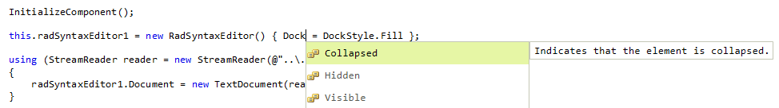
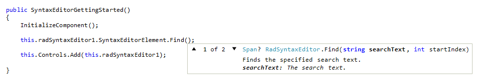

# IntelliPrompts

The **RadSyntaxEditor** has support for intelliprompts which aim to speed up coding by reducing typos and other common mistakes.

## Code Completion

You can show a collection of items when the user inputs a given string through the **CompletionListWindow**. To do so, you need to populate the presenter's **CompletionListItems** collection.

#### Example 1: Populate and display the completion list window

<snippet id='syntax-editor-syntaxeditorgettingstarted-intelliprompts-cs' />
<snippet id='syntax-editor-syntaxeditorgettingstarted-intelliprompts-vb' />

#### Figure 1: Code completion

>note **CodeCompletionCommand** is being executed by **RadSyntaxEditor** when pressing `Space`+`Control` keys. It shows the **CompletionListWindow**. An alternative solution is to display the dialog programmatically by simply calling the SyntaxEditorElement.IntelliPrompts.CompletionListWindow.**Show** method.

## Overload List

Through the **OverloadListWindow** you can show a collection of overloads when the user tries to invoke a certain method. To do so, you need to first populate its presenter's **OverloadListItems** collection. Thanks to the [HTML-like text formatting]() that Telerik Presentation Framework provides it is possible to apply advanced styling mechanism to display formatted text as font style, font color, font size, etc.

#### Example 2: Populate and display the completion list window

<snippet id='syntax-editor-syntaxeditorgettingstarted-overloadlist-cs' />
<snippet id='syntax-editor-syntaxeditorgettingstarted-overloadlist-vb' />

#### Figure 2: Code completion
 

# See Also

* [Conditional Intelliprompts in SyntaxEditor]() 
