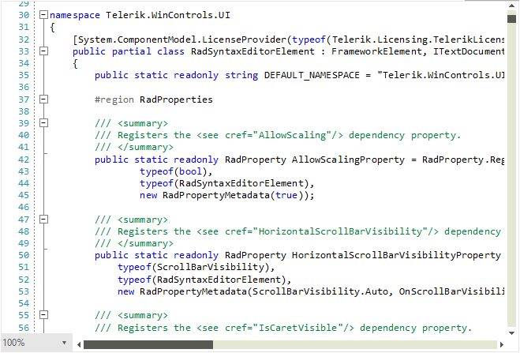
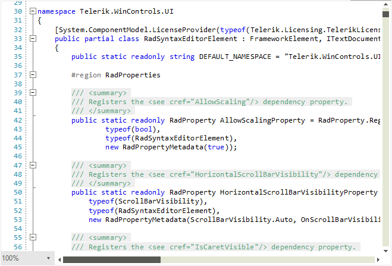

# Layers

**RadSyntaxEditor** renders its elements on different layers based on the types of tags that are used. It does so with the help of a **UILayersBuilder** class. The default builder renders the following stack of layers:

* **TextHighlightUILayer**
* **TextBorderUILayer**
* **TextUnderlineUILayer**
* **TextUILayer**
* **TextToolTipUILayer**
* **SelectionUILayer**
* **FoldingUILayer**

These layers are responsible for drawing different elements on the canvas of the **RadSyntaxEditor** control. For example, the **FoldingUILayer** generates a **FoldedRegionButton** with a tool-tip, containing the folded text.

## Custom Layer and UILayersBuilder

We will now create a custom layer which will be responsible for highlighting any comments in the code. For the purpose, we need to override the **GetLinePartUIElement** method and return a **FrameworkElement** to be drawn on the layer - a *LightGray* rectangle in this case.

#### Creating a custom layer

{{source=..\SamplesCS\SyntaxEditor\SyntaxEditorLayers.cs region=CustomLayer}}
{{source=..\SamplesVB\SyntaxEditor\SyntaxEditorLayers.vb region=CustomLayer}}

````C#

public class CommentsUILayer : LineBasedUILayer<Telerik.WinForms.SyntaxEditor.Core.Tagging.ClassificationTag>
{
    public override string Name
    {
        get
        {
            return "UnderlineOnMouseOver";
        }
    }

    public CommentsUILayer()
    {
    }

    protected override FrameworkElement GetLinePartUIElement(Telerik.WinForms.SyntaxEditor.Core.Tagging.ClassificationTag tag,
        Telerik.WinForms.SyntaxEditor.Core.Text.Span span, UIUpdateContext updateContext)
    {
        if (tag.ClassificationType != Telerik.WinForms.SyntaxEditor.Core.Tagging.ClassificationTypes.Comment)
        {
            return null;
        }

        Rect rect = updateContext.Editor.GetLinePartBoundingRectangle(span);
        Telerik.WinControls.SyntaxEditor.UI.Rectangle rectangle = this.GetElementFromPool<Telerik.WinControls.SyntaxEditor.UI.Rectangle>();
        rectangle.ShouldHandleMouseInput = true;
        rectangle.Width = rect.Width;
        rectangle.Height = rect.Height;
        rectangle.Fill = new SolidBrush(System.Drawing.Color.FromArgb(100, System.Drawing.Color.LightGray));

        return rectangle;
    }

    protected override void ResetPooledElementProperties(object element)
    {
        Telerik.WinControls.SyntaxEditor.UI.Rectangle rectangle = (Telerik.WinControls.SyntaxEditor.UI.Rectangle)element;
        rectangle.ClearValue(Telerik.WinControls.SyntaxEditor.UI.Rectangle.FillProperty);
    }
}         


````
````VB.NET

Public Class CommentsUILayer
    Inherits LineBasedUILayer(Of Telerik.WinForms.SyntaxEditor.Core.Tagging.ClassificationTag)

    Public Overrides ReadOnly Property Name As String
        Get
            Return "UnderlineOnMouseOver"
        End Get
    End Property

    Public Sub New()
    End Sub

    Protected Overrides Function GetLinePartUIElement(ByVal tag As Telerik.WinForms.SyntaxEditor.Core.Tagging.ClassificationTag, _
        ByVal span As Telerik.WinForms.SyntaxEditor.Core.Text.Span, ByVal updateContext As UIUpdateContext) _
    As Telerik.WinControls.SyntaxEditor.UI.FrameworkElement
        If Not tag.ClassificationType.Equals(Telerik.WinForms.SyntaxEditor.Core.Tagging.ClassificationTypes.Comment) Then
            Return Nothing
        End If

        Dim rect As Telerik.WinControls.SyntaxEditor.UI.Rect = updateContext.Editor.GetLinePartBoundingRectangle(span)
        Dim rectangle As Telerik.WinControls.SyntaxEditor.UI.Rectangle = Me.GetElementFromPool(Of Telerik.WinControls.SyntaxEditor.UI.Rectangle)()
        rectangle.ShouldHandleMouseInput = True
        rectangle.Width = rect.Width
        rectangle.Height = rect.Height
        rectangle.Fill = New SolidBrush(System.Drawing.Color.FromArgb(100, System.Drawing.Color.LightGray))
        Return rectangle
    End Function

    Protected Overrides Sub ResetPooledElementProperties(ByVal element As Object)
        Dim rectangle As Telerik.WinControls.SyntaxEditor.UI.Rectangle = CType(element, Telerik.WinControls.SyntaxEditor.UI.Rectangle)
        rectangle.ClearValue(Telerik.WinControls.SyntaxEditor.UI.Rectangle.FillProperty)
    End Sub
End Class

````

{{endregion}} 


For our custom layer to be recognized by the **RadSyntaxEditor** we need to add it to the **UILayerStack**. We can do so by creating a custom **UILayersBuilder** and overriding its **BuildUILayers** method.

#### Using the custom layer in a custom layers builder

{{source=..\SamplesCS\SyntaxEditor\SyntaxEditorLayers.cs region=Builder}}
{{source=..\SamplesVB\SyntaxEditor\SyntaxEditorLayers.vb region=Builder}}

````C#
            
public class CustomUILayersBuilder : Telerik.WinForms.Controls.SyntaxEditor.UI.Layers.UILayersBuilder
{
    private CommentsUILayer customLayer;
    public override void BuildUILayers(UILayerStack uiLayers)
            {
                base.BuildUILayers(uiLayers);

                customLayer = new CommentsUILayer();
                uiLayers.AddLast(customLayer);
            }

    public void ClearCustomLayer()
    {
        foreach (Telerik.WinControls.SyntaxEditor.UI.Rectangle item in this.customLayer.Container.Children.OfType<Telerik.WinControls.SyntaxEditor.UI.Rectangle>())
        {
            item.Fill = System.Drawing.Brushes.Transparent;
        }
    }
}

````
````VB.NET
Public Class CustomUILayersBuilder
    Inherits Telerik.WinForms.Controls.SyntaxEditor.UI.Layers.UILayersBuilder

    Private customLayer As CommentsUILayer

    Public Overrides Sub BuildUILayers(ByVal uiLayers As Telerik.WinForms.Controls.SyntaxEditor.UI.Layers.UILayerStack)
        MyBase.BuildUILayers(uiLayers)
        customLayer = New CommentsUILayer()
        uiLayers.AddLast(customLayer)
    End Sub

    Public Sub ClearCustomLayer()
        For Each item As Telerik.WinControls.SyntaxEditor.UI.Rectangle In Me.customLayer.Container.Children.OfType(Of Telerik.WinControls.SyntaxEditor.UI.Rectangle)()
            item.Fill = System.Drawing.Brushes.Transparent
        Next
    End Sub
End Class


````

{{endregion}} 

Finally, we need to set the **UILayersBuilder** to an instance of the custom layers builder class.

#### Using the custom layers builder

{{source=..\SamplesCS\SyntaxEditor\SyntaxEditorLayers.cs region=Apply}}
{{source=..\SamplesVB\SyntaxEditor\SyntaxEditorLayers.vb region=Apply}}

````C#
            
this.radSyntaxEditor1.SyntaxEditorElement.UILayersBuilder = new CustomUILayersBuilder();

````
````VB.NET
Me.RadSyntaxEditor1.SyntaxEditorElement.UILayersBuilder = New CustomUILayersBuilder()

````

{{endregion}} 

Consider that we have the following taggers applied to **RadSyntaxEditor**:

{{source=..\SamplesCS\SyntaxEditor\SyntaxEditorLayers.cs region=AddTaggers}}
{{source=..\SamplesVB\SyntaxEditor\SyntaxEditorLayers.vb region=AddTaggers}}

````C#
            CSharpTagger currentLanguageTagger = new Telerik.WinForms.Controls.SyntaxEditor.Tagging.Taggers.CSharpTagger(this.radSyntaxEditor1.SyntaxEditorElement);
            this.radSyntaxEditor1.TaggersRegistry.RegisterTagger(currentLanguageTagger);

            CSharpFoldingTagger foldingTagger = new Telerik.WinForms.Controls.SyntaxEditor.Taggers.CSharpFoldingTagger(this.radSyntaxEditor1.SyntaxEditorElement);
            foldingTagger.FoldingRegionDefinitions.Add(new FoldingRegionDefinition("#if", "#endif"));

````
````VB.NET

Dim currentLanguageTagger As CSharpTagger = New Telerik.WinForms.Controls.SyntaxEditor.Taggers.CSharpTagger(Me.RadSyntaxEditor1.SyntaxEditorElement)
Me.RadSyntaxEditor1.TaggersRegistry.RegisterTagger(currentLanguageTagger)
Dim foldingTagger As CSharpFoldingTagger = New Telerik.WinForms.Controls.SyntaxEditor.Taggers.CSharpFoldingTagger(Me.RadSyntaxEditor1.SyntaxEditorElement)
foldingTagger.FoldingRegionDefinitions.Add(New FoldingRegionDefinition("#if", "#endif"))
RadSyntaxEditor1.TaggersRegistry.RegisterTagger(foldingTagger)


````

{{endregion}} 

Once you run the application, the comments are expected to be colored as it is illustrated below:

>caption Figure 1: Default comments' style



>caption Figure 2: Custom layer for comments



# See Also

* [How to Achieve Underline Text in RadSyntaxEditor]()
 