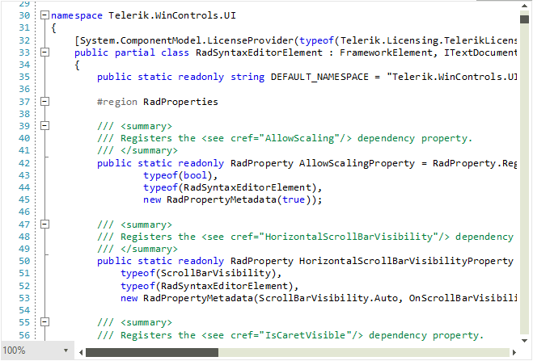
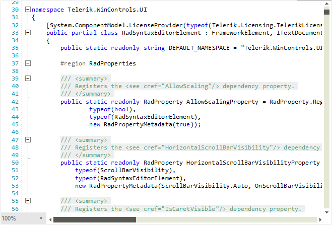

# Layers

**RadSyntaxEditor** renders its elements on different layers based on the types of tags that are used. It does so with the help of a **UILayersBuilder** class. The default builder renders the following stack of layers:

* **TextHighlightUILayer**
* **TextBorderUILayer**
* **TextUnderlineUILayer**
* **TextUILayer**
* **TextToolTipUILayer**
* **SelectionUILayer**
* **FoldingUILayer**

These layers are responsible for drawing different elements on the canvas of the **RadSyntaxEditor** control. For example, the **FoldingUILayer** generates a **FoldedRegionButton** with a tool-tip, containing the folded text.

## Custom Layer and UILayersBuilder

We will now create a custom layer which will be responsible for highlighting any comments in the code. For the purpose, we need to override the **GetLinePartUIElement** method and return a **FrameworkElement** to be drawn on the layer - a *LightGray* rectangle in this case.

#### Creating a custom layer

<snippet id='syntax-editor-syntaxeditorlayers-customlayer-cs' />
<snippet id='syntax-editor-syntaxeditorlayers-customlayer-vb' />

For our custom layer to be recognized by the **RadSyntaxEditor** we need to add it to the **UILayerStack**. We can do so by creating a custom **UILayersBuilder** and overriding its **BuildUILayers** method.

#### Using the custom layer in a custom layers builder

<snippet id='syntax-editor-syntaxeditorlayers-builder-cs' />
<snippet id='syntax-editor-syntaxeditorlayers-builder-vb' />

Finally, we need to set the **UILayersBuilder** to an instance of the custom layers builder class.

#### Using the custom layers builder

<snippet id='syntax-editor-syntaxeditorlayers-apply-cs' />
<snippet id='syntax-editor-syntaxeditorlayers-apply-vb' />

Consider that we have the following taggers applied to **RadSyntaxEditor**:

<snippet id='syntax-editor-syntaxeditorlayers-addtaggers-cs' />
<snippet id='syntax-editor-syntaxeditorlayers-addtaggers-vb' />

Once you run the application, the comments are expected to be colored as it is illustrated below:

>caption Figure 1: Default comments' style

>caption Figure 2: Custom layer for comments

# See Also

* [How to Achieve Underline Text in RadSyntaxEditor]()
 
