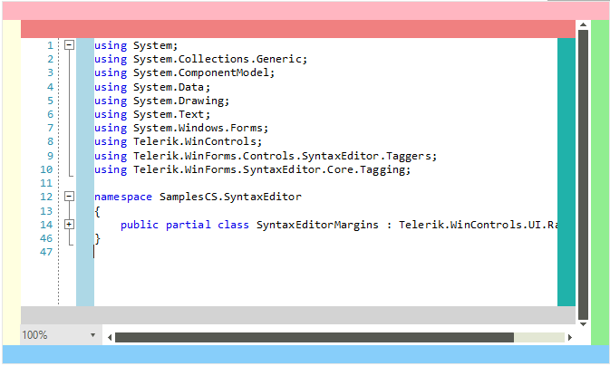
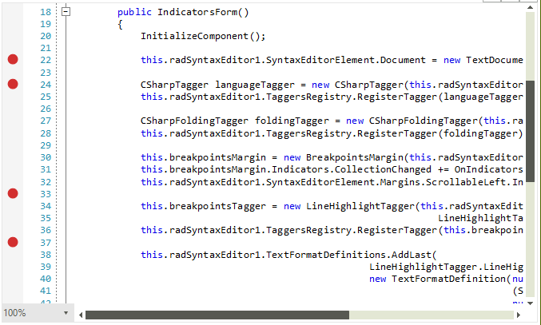
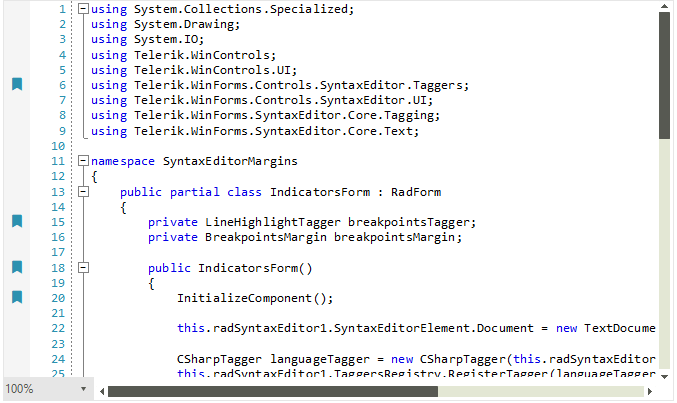
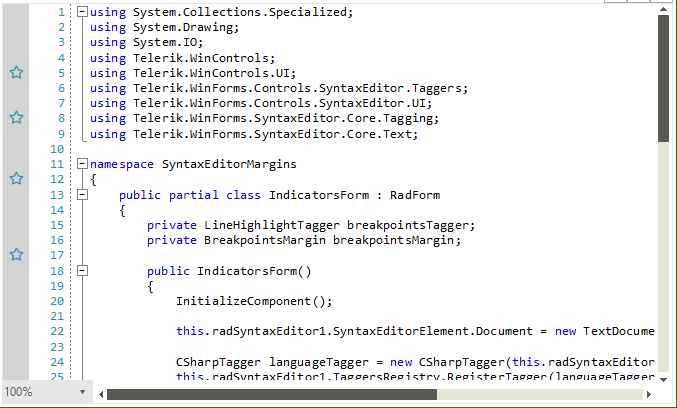
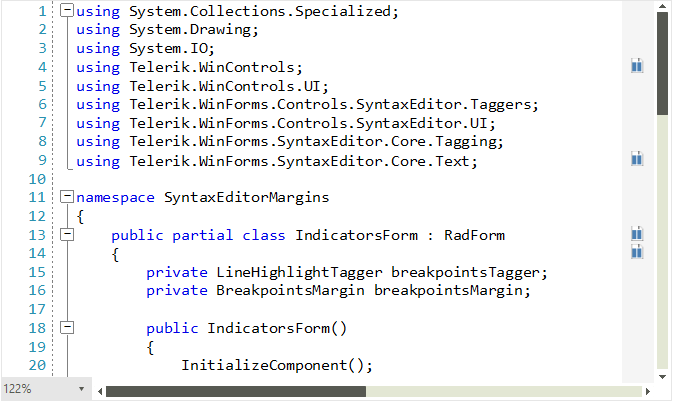

# Margins

As of R2 2021 SP1 **RadSyntaxEditorElement** exposes the **Margins** collection where you can add elements to predefined containers:  *Left*, *Top*, *Bottom*, *Right*, and *ScrollableLeft*, *ScrollableTop*, *ScrollableRight*, *ScrollableBottom*. The allowed elements need to inherit the Telerik.WinControls.SyntaxEditor.UI.FrameworkElement. 

## Margin Panels

The following example demonstrates how you can add some custom elements around the RadSyntaxEditor and provides a visualization of the default locations for all panels. It also demonstrates the line numbers and folding tagger features, which are implemented with the help of the left scrollable margin.

#### Defining Simple Margins

{{source=..\SamplesCS\SyntaxEditor\SyntaxEditorMargins.cs region=SimpleMargins}}
{{source=..\SamplesVB\SyntaxEditor\SyntaxEditorMargins.vb region=SimpleMargins}}

````C#
this.radSyntaxEditor1.SyntaxEditorElement.Margins.Left.Add(new Telerik.WinControls.SyntaxEditor.UI.Rectangle() { Fill = Brushes.LightYellow, Width = 20 });
this.radSyntaxEditor1.SyntaxEditorElement.Margins.Right.Add(new Telerik.WinControls.SyntaxEditor.UI.Rectangle() { Fill = Brushes.LightGreen, Width = 20 });
this.radSyntaxEditor1.SyntaxEditorElement.Margins.Top.Add(new Telerik.WinControls.SyntaxEditor.UI.Rectangle() { Fill = Brushes.LightPink, Height = 20 });
this.radSyntaxEditor1.SyntaxEditorElement.Margins.Bottom.Add(new Telerik.WinControls.SyntaxEditor.UI.Rectangle() { Fill = Brushes.LightSkyBlue, Height = 20 });

this.radSyntaxEditor1.SyntaxEditorElement.Margins.ScrollableLeft.Add(new Telerik.WinControls.SyntaxEditor.UI.Rectangle() { Fill = Brushes.LightBlue, Width = 20 });
this.radSyntaxEditor1.SyntaxEditorElement.Margins.ScrollableRight.Add(new Telerik.WinControls.SyntaxEditor.UI.Rectangle() { Fill = Brushes.LightSeaGreen, Width = 20 });
this.radSyntaxEditor1.SyntaxEditorElement.Margins.ScrollableTop.Add(new Telerik.WinControls.SyntaxEditor.UI.Rectangle() { Fill = Brushes.LightCoral, Height = 20 });
this.radSyntaxEditor1.SyntaxEditorElement.Margins.ScrollableBottom.Add(new Telerik.WinControls.SyntaxEditor.UI.Rectangle() { Fill = Brushes.LightGray, Height = 20 });

````
````VB.NET
Private Sub SetupSimpleMargins()
    Me.RadSyntaxEditor1.SyntaxEditorElement.Margins.Left.Add(New Telerik.WinControls.SyntaxEditor.UI.Rectangle() With {
        .Fill = Brushes.LightYellow,
        .Width = 20
    })
    Me.RadSyntaxEditor1.SyntaxEditorElement.Margins.Right.Add(New Telerik.WinControls.SyntaxEditor.UI.Rectangle() With {
        .Fill = Brushes.LightGreen,
        .Width = 20
    })
    Me.RadSyntaxEditor1.SyntaxEditorElement.Margins.Top.Add(New Telerik.WinControls.SyntaxEditor.UI.Rectangle() With {
        .Fill = Brushes.LightPink,
        .Height = 20
    })
    Me.RadSyntaxEditor1.SyntaxEditorElement.Margins.Bottom.Add(New Telerik.WinControls.SyntaxEditor.UI.Rectangle() With {
        .Fill = Brushes.LightSkyBlue,
        .Height = 20
    })
    Me.RadSyntaxEditor1.SyntaxEditorElement.Margins.ScrollableLeft.Add(New Telerik.WinControls.SyntaxEditor.UI.Rectangle() With {
        .Fill = Brushes.LightBlue,
        .Width = 20
    })
    Me.RadSyntaxEditor1.SyntaxEditorElement.Margins.ScrollableRight.Add(New Telerik.WinControls.SyntaxEditor.UI.Rectangle() With {
        .Fill = Brushes.LightSeaGreen,
        .Width = 20
    })
    Me.RadSyntaxEditor1.SyntaxEditorElement.Margins.ScrollableTop.Add(New Telerik.WinControls.SyntaxEditor.UI.Rectangle() With {
        .Fill = Brushes.LightCoral,
        .Height = 20
    })
    Me.RadSyntaxEditor1.SyntaxEditorElement.Margins.ScrollableBottom.Add(New Telerik.WinControls.SyntaxEditor.UI.Rectangle() With {
        .Fill = Brushes.LightGray,
        .Height = 20
    })
End Sub

````

{{endregion}} 

>caption Figure 1: Defining Simple Margins



## Indicators Margin

You can add indicators to particular lines of the **RadSyntaxEditor** control by using the new **IndicatorsMargin&#60;T&#62;** class.

The generic type parameter T determines the type of the created object which must be a **FrameworkElement**. The class also exposes an **UpdateIndicator** method in which you can set the properties of the created indicator element. You can also conditionally style the element as the method also provides the line number corresponding to the line that the indicator is drawn on.

The class inherits from the abstract **IndicatorsMarginBase** class which defines the **IndicatorBrush** property used to control the background of the margin and the Indicators property which holds a collection of integers corresponding to the lines which include an indicator element.

### Breakpoints Indicator

This example demonstrates how to create a margin which holds a collection of breakpoints.

#### Defining Breakpoints Margins

{{source=..\SamplesCS\SyntaxEditor\SyntaxEditorMargins.cs region=BreakpointsMargin}}
{{source=..\SamplesVB\SyntaxEditor\SyntaxEditorMargins.vb region=BreakpointsMargin}}

````C#
private void SetupBreakPoints()
{
    BreakpointsMargin breakpointsMargin = new BreakpointsMargin(this.radSyntaxEditor1.SyntaxEditorElement); 
    this.radSyntaxEditor1.SyntaxEditorElement.Margins.ScrollableLeft.Insert(0, breakpointsMargin);
}

/// <summary>
/// A margin holding a collection of breakpoints to highlight lines of the RadSyntaxEditor control.
/// </summary>
public class BreakpointsMargin : IndicatorsMargin<Ellipse>
{
    /// <summary>
    /// Initializes a new instance of the <see cref="BreakpointsMargin"/> class.
    /// </summary>
    /// <param name="syntaxEditor">The RadSyntaxEditor instance.</param>
    public BreakpointsMargin(RadSyntaxEditorElement syntaxEditor)
        : base(syntaxEditor)
    {
        this.IndicatorBrush = new SolidBrush(System.Drawing.Color.FromArgb(255, 210, 47, 47));
    }

    /// <summary>
    /// Called when an indicator needs to be updated. This can happen when the indicator is
    /// first created, when it is brought inside or outside of the viewport or when
    /// the EditorFontSize property of the RadSyntaxEditor or the IndicatorBrush property
    /// of the margin change.
    /// </summary>
    /// <param name="path">The Path to update.</param>
    /// <param name="lineNumber">The line number the indicator is placed on.</param>
    protected override void UpdateIndicator(Ellipse ellipse, int lineNumber)
    {
        if (ellipse.Width != this.Editor.EditorFontSize)
        {
            ellipse.Width = this.Editor.EditorFontSize;
        }

        if (ellipse.Height != this.Editor.EditorFontSize)
        {
            ellipse.Height = this.Editor.EditorFontSize;
        }

        if (ellipse.Background != this.IndicatorBrush)
        {
            ellipse.Background = this.IndicatorBrush;
        }
    }
}


````
````VB.NET
Private Sub SetupBreakPoints()
    Dim breakpointsMargin As BreakpointsMargin = New BreakpointsMargin(Me.RadSyntaxEditor1.SyntaxEditorElement)
    Me.RadSyntaxEditor1.SyntaxEditorElement.Margins.ScrollableLeft.Insert(0, breakpointsMargin)
End Sub

Public Class BreakpointsMargin
    Inherits IndicatorsMargin(Of Ellipse)

    Public Sub New(ByVal syntaxEditor As RadSyntaxEditorElement)
        MyBase.New(syntaxEditor)
        Me.IndicatorBrush = New SolidBrush(System.Drawing.Color.FromArgb(255, 210, 47, 47))
    End Sub

    Protected Overrides Sub UpdateIndicator(ByVal ellipse As Ellipse, ByVal lineNumber As Integer)
        If ellipse.Width <> Me.Editor.EditorFontSize Then
            ellipse.Width = Me.Editor.EditorFontSize
        End If

        If ellipse.Height <> Me.Editor.EditorFontSize Then
            ellipse.Height = Me.Editor.EditorFontSize
        End If

        If ellipse.Background Is Nothing Then
            ellipse.Background = Me.IndicatorBrush
        ElseIf Not ellipse.Background.Equals(Me.IndicatorBrush) Then
            ellipse.Background = Me.IndicatorBrush
        End If
    End Sub
End Class

````

{{endregion}} 

>caption Figure 2: Defining Breakpoint Margins



>note You can add new breakpoints by clicking on the margin in the UI.

### Bookmarks Indicator

This example demonstrates how to create a margin which holds a collection of bookmarks.

#### Defining Bookmarks Margins

{{source=..\SamplesCS\SyntaxEditor\SyntaxEditorMargins.cs region=BookmarksMargin}}
{{source=..\SamplesVB\SyntaxEditor\SyntaxEditorMargins.vb region=BookmarksMargin}}

````C#
private void SetupBookmarkMargins()
{
    BookmarksMargin bookmarksMargin = new BookmarksMargin(this.radSyntaxEditor1.SyntaxEditorElement);
    this.radSyntaxEditor1.SyntaxEditorElement.Margins.ScrollableLeft.Insert(0, bookmarksMargin);
}
public class BookmarksMargin : GlyphsMargin
{
    private const string BookmarksGlyph = "\uF02E";

    public BookmarksMargin(RadSyntaxEditorElement syntaxEditor)
        : base(syntaxEditor)
    {
        this.CustomFont = "Font Awesome 5 Free Solid";
    }

    protected override void UpdateIndicator(TextBlock element, int lineNumber)
    {
        base.UpdateIndicator(element, lineNumber);

        element.Margin = new System.Windows.Forms.Padding(2, 0, 0, 0);
    }

    public override string GetGlyph()
    {
        return BookmarksGlyph;
    }
}

public abstract class GlyphsMargin : IndicatorsMargin<TextBlock>
{
    public GlyphsMargin(RadSyntaxEditorElement syntaxEditor)
        : base(syntaxEditor)
    {
    }

    protected override void UpdateIndicator(TextBlock element, int lineNumber)
    {
        element.Width = this.Width;
        element.Height = this.Width;

        element.FontFamily = new FontFamily(this.CustomFont);
        element.Foreground = this.IndicatorBrush;
        element.Text = this.GetGlyph();
        element.SmoothingMode = System.Drawing.Drawing2D.SmoothingMode.HighQuality;
    }

    public abstract string GetGlyph();
}

````
````VB.NET
Private Sub SetupBookmarkMargins()
    Dim bookmarksMargin As BookmarksMargin = New BookmarksMargin(Me.RadSyntaxEditor1.SyntaxEditorElement)
    Me.RadSyntaxEditor1.SyntaxEditorElement.Margins.ScrollableLeft.Insert(0, bookmarksMargin)
End Sub

Public Class BookmarksMargin
    Inherits GlyphsMargin

    Private Const BookmarksGlyph As String = ""

    Public Sub New(ByVal syntaxEditor As RadSyntaxEditorElement)
        MyBase.New(syntaxEditor)
        Me.CustomFont = "Font Awesome 5 Free Solid"
    End Sub

    Protected Overrides Sub UpdateIndicator(ByVal element As TextBlock, ByVal lineNumber As Integer)
        MyBase.UpdateIndicator(element, lineNumber)
        element.Margin = New System.Windows.Forms.Padding(2, 0, 0, 0)
    End Sub

    Public Overrides Function GetGlyph() As String
        Return BookmarksGlyph
    End Function
End Class

Public MustInherit Class GlyphsMargin
    Inherits IndicatorsMargin(Of TextBlock)

    Public Sub New(ByVal syntaxEditor As RadSyntaxEditorElement)
        MyBase.New(syntaxEditor)
    End Sub

    Protected Overrides Sub UpdateIndicator(ByVal element As TextBlock, ByVal lineNumber As Integer)
        element.Width = Me.Width
        element.Height = Me.Width
        element.FontFamily = New FontFamily(Me.CustomFont)
        element.Foreground = Me.IndicatorBrush
        element.Text = Me.GetGlyph()
        element.SmoothingMode = System.Drawing.Drawing2D.SmoothingMode.HighQuality
    End Sub

    Public MustOverride Function GetGlyph() As String
End Class

````

{{endregion}} 

>caption Figure 3: Defining Bookmarks Margins



### Stars Indicators

Using the **GlyphsMargin** implementation in the previous example, we can construct an indicator with any glyph, e.g. a star glyph:

#### Defining Stars Margins

{{source=..\SamplesCS\SyntaxEditor\SyntaxEditorMargins.cs region=StarsMargins}}
{{source=..\SamplesVB\SyntaxEditor\SyntaxEditorMargins.vb region=StarsMargins}}

````C#
private void SetupStarsMargins()
{
    StarsMargin starsMargin = new StarsMargin(this.radSyntaxEditor1.SyntaxEditorElement);
    this.radSyntaxEditor1.SyntaxEditorElement.Margins.ScrollableLeft.Insert(0, starsMargin);
}

public class StarsMargin : GlyphsMargin
{
    private const string StarGlyph = "\uF005";

    public StarsMargin(RadSyntaxEditorElement syntaxEditor)
        : base(syntaxEditor)
    {
        this.Background = new System.Drawing.SolidBrush(System.Drawing.Color.LightGray);

        this.CustomFont = "Font Awesome 5 Free Regular";
    }

    public override string GetGlyph()
    {
        return StarGlyph;
    }
}

````
````VB.NET
Private Sub SetupStarsMargins()
    Dim starsMargin As StarsMargin = New StarsMargin(Me.RadSyntaxEditor1.SyntaxEditorElement)
    Me.RadSyntaxEditor1.SyntaxEditorElement.Margins.ScrollableLeft.Insert(0, starsMargin)
End Sub

Public Class StarsMargin
    Inherits GlyphsMargin

    Private Const StarGlyph As String = ""

    Public Sub New(ByVal syntaxEditor As RadSyntaxEditorElement)
        MyBase.New(syntaxEditor)
        Me.Background = New System.Drawing.SolidBrush(System.Drawing.Color.LightGray)
        Me.CustomFont = "Font Awesome 5 Free Regular"
    End Sub

    Public Overrides Function GetGlyph() As String
        Return StarGlyph
    End Function
End Class

````

{{endregion}}

>caption Figure 4: Defining Stars Margins



### SVG Indicators

It is possible to create an indicator with a vector image which is scaled properly when RadSyntaxEditor is zoomed.

#### Defining SvgsMargins

{{source=..\SamplesCS\SyntaxEditor\SyntaxEditorMargins.cs region=SvgMargins}}
{{source=..\SamplesVB\SyntaxEditor\SyntaxEditorMargins.vb region=SvgMargins}}

````C#
private void SetupSvgMargins()
{
    SvgsMargin svgsMargin = new SvgsMargin(this.radSyntaxEditor1.SyntaxEditorElement)
    {
        SvgImage = RadSvgImage.Deserialize(File.ReadAllText(@"..\..\Resources\insert merge field-01.svg"))
    };
    this.radSyntaxEditor1.SyntaxEditorElement.Margins.ScrollableRight.Insert(0, svgsMargin);
}

/// <summary>
/// A margin holding a collection of breakpoints to highlight lines of the RadSyntaxEditor control.
/// </summary>
public class SvgsMargin : IndicatorsMargin<RadSvgFrameworkElement>
{
    /// <summary>
    /// Initializes a new instance of the <see cref="BreakpointsMargin"/> class.
    /// </summary>
    /// <param name="syntaxEditor">The RadSyntaxEditor instance.</param>
    public SvgsMargin(RadSyntaxEditorElement syntaxEditor)
        : base(syntaxEditor)
    {
    }

    public RadSvgImage SvgImage { get; set; }

    protected override void UpdateIndicator(RadSvgFrameworkElement svgElement, int lineNumber)
    {
        svgElement.SvgImage = this.SvgImage;
        if (svgElement.Width != this.Editor.EditorFontSize)
        {
            svgElement.Width = this.Editor.EditorFontSize;
        }

        if (svgElement.Height != this.Editor.EditorFontSize)
        {
            svgElement.Height = this.Editor.EditorFontSize;
        }
    }
}

public class RadSvgFrameworkElement : FrameworkElement, IImageElement
{
    private ImagePrimitiveImpl imagePrimitiveImpl;

    private RadSvgImage svgImage;

    protected override void InitializeFields()
    {
        base.InitializeFields();

        this.imagePrimitiveImpl = new ImagePrimitiveImpl(this);
    }

    public RadSvgImage SvgImage
    {
        get
        {
            return this.svgImage;
        }
        set
        {
            this.svgImage = value;
        }
    }

    public System.Drawing.Image Image { get => throw new System.NotImplementedException(); set => throw new System.NotImplementedException(); }
    public int ImageIndex { get => throw new System.NotImplementedException(); set => throw new System.NotImplementedException(); }
    public string ImageKey { get => throw new System.NotImplementedException(); set => throw new System.NotImplementedException(); }

    protected override void PaintElement(IGraphics graphics, float angle, System.Drawing.SizeF scale)
    {
        base.PaintElement(graphics, angle, scale);

        this.PaintImage(graphics, this.SvgImage);
    }

    private void PaintImage(IGraphics graphics, RadSvgImage image)
    {
        image.Width = this.Bounds.Width;
        image.Height = this.Bounds.Height;

        this.imagePrimitiveImpl.PaintImage(graphics, image, this.Bounds,
                                            ImageLayout.Center, ContentAlignment.MiddleCenter, 1f, false);
    }
}

````
````VB.NET
Private Sub SetupSvgMargins()
    Dim svgsMargin As SvgsMargin = New SvgsMargin(Me.RadSyntaxEditor1.SyntaxEditorElement) With {
        .SvgImage = RadSvgImage.Deserialize(File.ReadAllText("..\..\Resources\insert merge field-01.svg"))
    }
    Me.RadSyntaxEditor1.SyntaxEditorElement.Margins.ScrollableRight.Insert(0, svgsMargin)
End Sub

Public Class SvgsMargin
    Inherits IndicatorsMargin(Of RadSvgFrameworkElement)

    Public Sub New(ByVal syntaxEditor As RadSyntaxEditorElement)
        MyBase.New(syntaxEditor)
    End Sub

    Public Property SvgImage As RadSvgImage

    Protected Overrides Sub UpdateIndicator(ByVal svgElement As RadSvgFrameworkElement, ByVal lineNumber As Integer)
        svgElement.SvgImage = Me.SvgImage

        If svgElement.Width <> Me.Editor.EditorFontSize Then
            svgElement.Width = Me.Editor.EditorFontSize
        End If

        If svgElement.Height <> Me.Editor.EditorFontSize Then
            svgElement.Height = Me.Editor.EditorFontSize
        End If
    End Sub
End Class

Public Class RadSvgFrameworkElement
    Inherits FrameworkElement
    Implements IImageElement

    Private imagePrimitiveImpl As ImagePrimitiveImpl
    Private _svgImage As RadSvgImage

    Protected Overrides Sub InitializeFields()
        MyBase.InitializeFields()
        Me.imagePrimitiveImpl = New ImagePrimitiveImpl(Me)
    End Sub

    Public Property SvgImage As RadSvgImage
        Get
            Return Me._svgImage
        End Get
        Set(ByVal value As RadSvgImage)
            Me._svgImage = value
        End Set
    End Property

    Public Property Image As System.Drawing.Image Implements IImageElement.Image
        Get
            Throw New NotImplementedException()
        End Get
        Set(value As System.Drawing.Image)
            Throw New NotImplementedException()
        End Set
    End Property

    Public Property ImageIndex As Integer Implements IImageElement.ImageIndex
        Get
            Throw New NotImplementedException()
        End Get
        Set(value As Integer)
            Throw New NotImplementedException()
        End Set
    End Property

    Public Property ImageKey As String Implements IImageElement.ImageKey
        Get
            Throw New NotImplementedException()
        End Get
        Set(value As String)
            Throw New NotImplementedException()
        End Set
    End Property

    Protected Overrides Sub PaintElement(ByVal graphics As IGraphics, ByVal angle As Single, ByVal scale As System.Drawing.SizeF)
        MyBase.PaintElement(graphics, angle, scale)
        Me.PaintImage(graphics, Me.SvgImage)
    End Sub

    Private Sub PaintImage(ByVal graphics As IGraphics, ByVal image As RadSvgImage)
        image.Width = Me.Bounds.Width
        image.Height = Me.Bounds.Height
        Me.imagePrimitiveImpl.PaintImage(graphics, image, Me.Bounds, ImageLayout.Center, ContentAlignment.MiddleCenter, 1.0F, False)
    End Sub

End Class

````

{{endregion}}

>caption Figure 5: Defining SVG Margins



# See Also
 
* [Layers]()
* [Path Indicators]()
