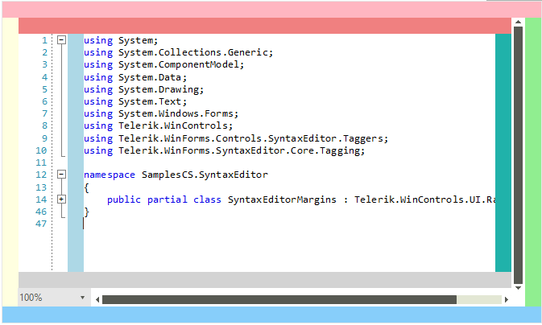
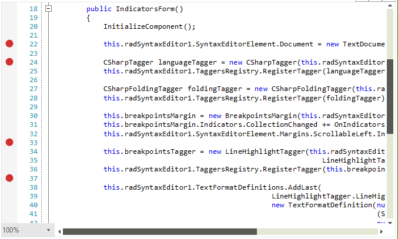
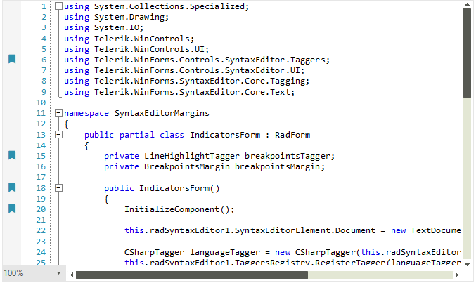
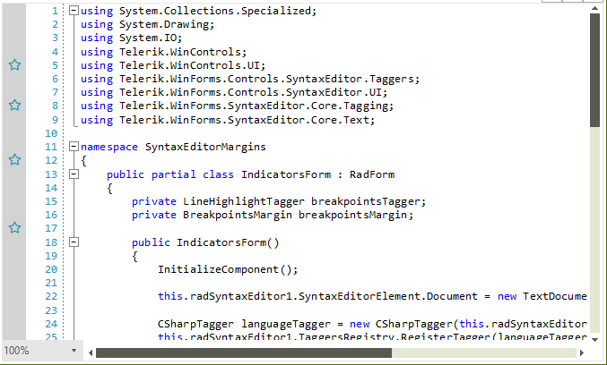
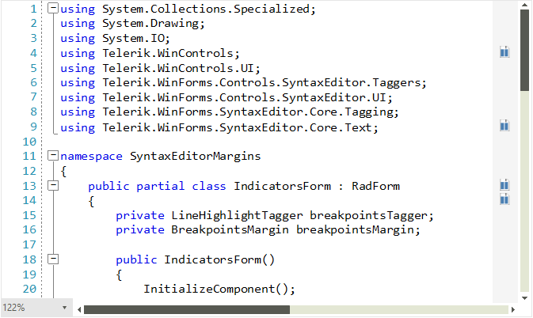

# Margins

As of R2 2021 SP1 **RadSyntaxEditorElement** exposes the **Margins** collection where you can add elements to predefined containers:  *Left*, *Top*, *Bottom*, *Right*, and *ScrollableLeft*, *ScrollableTop*, *ScrollableRight*, *ScrollableBottom*. The allowed elements need to inherit the Telerik.WinControls.SyntaxEditor.UI.FrameworkElement. 

## Margin Panels

The following example demonstrates how you can add some custom elements around the RadSyntaxEditor and provides a visualization of the default locations for all panels. It also demonstrates the line numbers and folding tagger features, which are implemented with the help of the left scrollable margin.

#### Defining Simple Margins

<snippet id='syntax-editor-syntaxeditormargins-simplemargins-cs' />
<snippet id='syntax-editor-syntaxeditormargins-simplemargins-vb' />

>caption Figure 1: Defining Simple Margins

## Indicators Margin

You can add indicators to particular lines of the **RadSyntaxEditor** control by using the new **IndicatorsMargin&#60;T&#62;** class.

The generic type parameter T determines the type of the created object which must be a **FrameworkElement**. The class also exposes an **UpdateIndicator** method in which you can set the properties of the created indicator element. You can also conditionally style the element as the method also provides the line number corresponding to the line that the indicator is drawn on.

The class inherits from the abstract **IndicatorsMarginBase** class which defines the **IndicatorBrush** property used to control the background of the margin and the Indicators property which holds a collection of integers corresponding to the lines which include an indicator element.

### Breakpoints Indicator

This example demonstrates how to create a margin which holds a collection of breakpoints.

#### Defining Breakpoints Margins

<snippet id='syntax-editor-syntaxeditormargins-breakpointsmargin-cs' />
<snippet id='syntax-editor-syntaxeditormargins-breakpointsmargin-vb' />

>caption Figure 2: Defining Breakpoint Margins

>note You can add new breakpoints by clicking on the margin in the UI.

### Bookmarks Indicator

This example demonstrates how to create a margin which holds a collection of bookmarks.

#### Defining Bookmarks Margins

<snippet id='syntax-editor-syntaxeditormargins-bookmarksmargin-cs' />
<snippet id='syntax-editor-syntaxeditormargins-bookmarksmargin-vb' />

>caption Figure 3: Defining Bookmarks Margins

### Stars Indicators

Using the **GlyphsMargin** implementation in the previous example, we can construct an indicator with any glyph, e.g. a star glyph:

#### Defining Stars Margins

<snippet id='syntax-editor-syntaxeditormargins-starsmargins-cs' />
<snippet id='syntax-editor-syntaxeditormargins-starsmargins-vb' />

>caption Figure 4: Defining Stars Margins

### SVG Indicators

It is possible to create an indicator with a vector image which is scaled properly when RadSyntaxEditor is zoomed.

#### Defining SvgsMargins

<snippet id='syntax-editor-syntaxeditormargins-svgmargins-cs' />
<snippet id='syntax-editor-syntaxeditormargins-svgmargins-vb' />

>caption Figure 5: Defining SVG Margins

# See Also
 
* [Layers]()
* [Path Indicators]()
