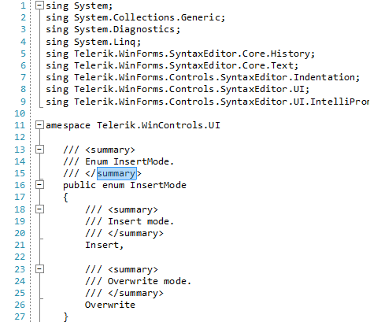

# Selection Drag Drop

**RadSyntaxEditor** allows the end-users to drag the selection and drop it onto another position in the loaded document. The SyntaxEditorElement.**Selection** exposes several events that allow you to control the drag and drop operation:

* **PreviewDragStart** - Occurs when selection dragging is about to be started. The **PreviewDragStartEventArgs** offers the **CanStart** and **StartPosition** arguments. If the drag operation is not allowed, setting the **CanStart** argument to *false* indicates that the drag operation won't be started at all. The **StartPostion** returns the **CaretPosition** from which the drag operation will start. The start position is always within the current selection.   

* **PreviewDragOver** - Occurs upon moving the selection over the document. The **PreviewDragOverEventArgs** offers the following arguments:
	* **CanDrop** - Determines whether the selection can be dropped. This property is taken into consideration when changing the mouse cursor. If it is not allowed to drop the selection being dragged, set the **CanDrop** property to *false*.
	* **StartPostion** - The **CaretPosition** at which the drag operation has been start. The start position is always within the current selection.
	* **DropPosition** - The **CaretPosition** at which the selection is being dragged over.

* **PreviewDragDrop** - Occurs upon releasing the mouse and dropping the selection. The **PreviewDragDropEventArgs** offers the following arguments:
	* **Handled** - Determines whether the event is handled. If the property is set to *true*, the selection will not be moved to the dragged position.
	* **DropPosition** - The **CaretPosition** at which the selection will be dropped.
	* **StartPostion** - The  **CaretPosition** at which the drag operation has been started. The start position is always within the current selection.

#### Handling drag and drop events

<snippet id='syntax-editor-syntaxeditorselectiondragdrop-selectiondragdrop-cs' />
<snippet id='syntax-editor-syntaxeditorselectiondragdrop-selectiondragdrop-vb' />

>caption Disable dropping over "Telerik" 

