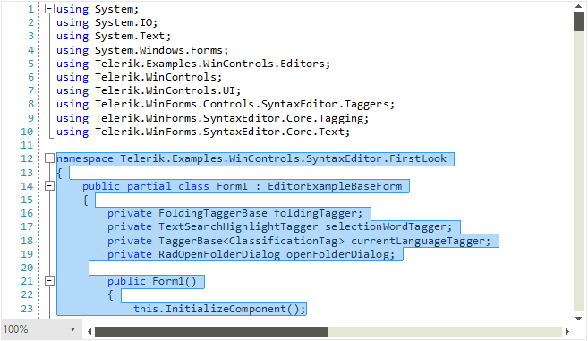
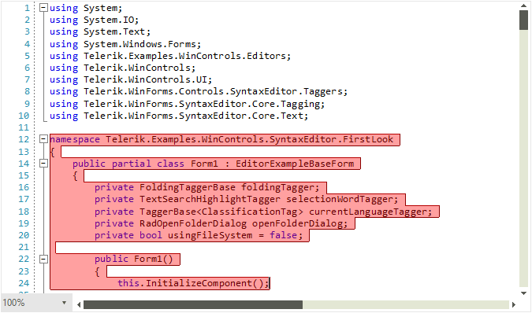

# Selection

The **RadSyntaxEditor** control supports not only selection via the UI but also exposes API to work with the selection programmatically. In addition, the selection can be controlled via the keyboard by a number of key combinations. You can also disable selection in the control if your business scenario demands it.

## UI Selection

The user is able to select the content inside **RadSyntaxEditor** in the same way as in Visual Studio. This is done by clicking on the desired position and dragging to the desired end of the selection. 

#### Figure 1: RadSyntaxEditor with selected text



The UI selection is enabled by default. To enable or disable it use the **IsSelectionEnabled** property

#### Enable/Disable selection
{{source=..\SamplesCS\SyntaxEditor\SyntaxEditorGettingStarted.cs region=EnableSelection}} 
{{source=..\SamplesVB\SyntaxEditor\SyntaxEditorGettingStarted.vb region=EnableSelection}}

````C#
this.radSyntaxEditor1.IsSelectionEnabled = true;

````
````VB.NET
Me.RadSyntaxEditor1.IsSelectionEnabled = True

````

{{endregion}} 

## Keyboard Combinations

Users can also select text by using their keyboard. Here's a list of the supported key combinations.

#### Table 1: Hotkeys supported by the RadSyntaxEditor and their actions

|**Hotkeys**|**Action**|
|----|----|
|Shift + Right arrow|Extends selection one position forward.|
|Shift + Left arrow|Extends selection one position backward.|
|Shift + Up arrow|Extends selection to the same position on the previous line.|
|Shift + Down arrow|Extends selection to the same position on the next line.|
|Shift + Home|Extends selection to the start of the current line.|
|Shift + End|Extends selection to the end of the current line.|
|Ctrl + Shift + Left arrow|Extends selection to the current word start position.|
|Ctrl + Shift + Right arrow|Extends selection to the current word end position.|
|Ctrl + A|Selects the entire document.|

## Customize the Selection

You can modify the appearance of the selection in the control through the **SelectionFill** and **SelectionStroke** properties of **RadSyntaxEditor**.

#### Customize the appearance of the selection

{{source=..\SamplesCS\SyntaxEditor\SyntaxEditorGettingStarted.cs region=SelectionColor}} 
{{source=..\SamplesVB\SyntaxEditor\SyntaxEditorGettingStarted.vb region=SelectionColor}}

````C#
 this.radSyntaxEditor1.SyntaxEditorElement.SelectionFill = new SolidBrush(Color.FromArgb(95, Color.Red));
 this.radSyntaxEditor1.SyntaxEditorElement.SelectionStroke = new SolidBrush(Color.DarkRed);

````
````VB.NET
Me.RadSyntaxEditor1.SyntaxEditorElement.SelectionFill = New SolidBrush(Color.FromArgb(95, Color.Red))
Me.RadSyntaxEditor1.SyntaxEditorElement.SelectionStroke = New SolidBrush(Color.DarkRed)

````

{{endregion}} 

#### Figure 2: RadSyntaxEditor with custom selection color



## Programmatic Selection

Through the control's **Selection** property, you can programmatically manipulate the selection and get additional details for the selected span(s). The following example demonstrates how you can get the entire selection as a string through the **GetSelectedText** method.

{{source=..\SamplesCS\SyntaxEditor\SyntaxEditorGettingStarted.cs region=ProgrammaticSelection}} 
{{source=..\SamplesVB\SyntaxEditor\SyntaxEditorGettingStarted.vb region=ProgrammaticSelection}}

````C#
string selectedText = this.radSyntaxEditor1.SyntaxEditorElement.Selection.GetSelectedText();

````
````VB.NET
Dim selectedText As String = Me.RadSyntaxEditor1.SyntaxEditorElement.Selection.GetSelectedText()

````

{{endregion}} 

# See Also

* [How to Select the Clicked Word in RadSyntaxEditor]()
