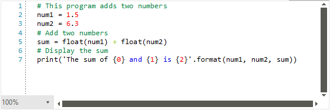

# Custom Language

By using the **WordTaggerBase** as a base, you can create custom syntax highlighting for any custom language. In this article we will create basic highlighting for the **Python** programming language.

Let's define the following class which will be responsible for classifying the words of the opened document.

#### The custom tagger

{{source=..\SamplesCS\SyntaxEditor\SyntaxEditorTaggers.cs region=PythonTagger}}
{{source=..\SamplesVB\SyntaxEditor\SyntaxEditorTaggers.vb region=PythonTagger}}

````C#
        public class PythonTagger : WordTaggerBase
        {
            private static readonly string[] Keywords = new string[] 
    { 
        "False", "None", "True", "and", "as", "assert","break", "class",  
        "continue", "def", "del", "elif", "else", "except", "for", "from", 
        "global", "if", "import", "in", "is", "lambda", "nonlocal", "not",  
        "or", "pass", "raise", "finally", "return", "try", "while", "with", "yield" 
    };

            private static readonly string[] Comments = new string[] 
    { 
        "#" 
    };

            private static readonly string[] Operators = new string[] 
    { 
        "+", "-",  "*", "/" 
    };

            public static readonly ClassificationType FruitsClassificationType = new ClassificationType("Fruits");

            private static readonly string[] Fruits = new string[] 
    { 
        "apple", "banana",  "cherry" 
    };

            private static readonly Dictionary<string, ClassificationType> WordsToClassificationType = new Dictionary<string, ClassificationType>();

            static PythonTagger()
            {
                WordsToClassificationType = new Dictionary<string, ClassificationType>();

                foreach (var keyword in Keywords)
                {
                    WordsToClassificationType.Add(keyword, ClassificationTypes.Keyword);
                }

                foreach (var preprocessor in Operators)
                {
                    WordsToClassificationType.Add(preprocessor, ClassificationTypes.Operator);
                }

                foreach (var comment in Comments)
                {
                    WordsToClassificationType.Add(comment, ClassificationTypes.Comment);
                }

                foreach (var comment in Fruits)
                {
                    WordsToClassificationType.Add(comment, FruitsClassificationType);
                }
            }

            public PythonTagger(RadSyntaxEditorElement editor)
                : base(editor)
            {
            }

            protected override Dictionary<string, ClassificationType> GetWordsToClassificationTypes()
            {
                return PythonTagger.WordsToClassificationType;
            }

            protected override bool TryGetClassificationType(string word, out ClassificationType classificationType)
            {
                int number;

                if (int.TryParse(word, out number))
                {
                    classificationType = ClassificationTypes.NumberLiteral;
                    return true;
                }

                return base.TryGetClassificationType(word, out classificationType);
            }
        }
         

````
````VB.NET
  Public Class PythonTagger
        Inherits WordTaggerBase

        Private Shared ReadOnly Keywords As String() = New String() {"False", "None", "True", "and", "as", "assert", "break", "class", "continue", "def", "del", "elif", "else", "except", "for", "from", "global", "if", "import", "in", "is", "lambda", "nonlocal", "not", "or", "pass", "raise", "finally", "return", "try", "while", "with", "yield"}
        Private Shared ReadOnly Comments As String() = New String() {"#"}
        Private Shared ReadOnly Operators As String() = New String() {"+", "-", "*", "/"}
        Public Shared ReadOnly FruitsClassificationType As ClassificationType = New ClassificationType("Fruits")
        Private Shared ReadOnly Fruits As String() = New String() {"apple", "banana", "cherry"}
        Private Shared ReadOnly WordsToClassificationType As Dictionary(Of String, ClassificationType) = New Dictionary(Of String, ClassificationType)()

        Shared Sub New()
            WordsToClassificationType = New Dictionary(Of String, ClassificationType)()

            For Each keyword In Keywords
                WordsToClassificationType.Add(keyword, ClassificationTypes.Keyword)
            Next

            For Each preprocessor In Operators
                WordsToClassificationType.Add(preprocessor, ClassificationTypes.[Operator])
            Next

            For Each comment In Comments
                WordsToClassificationType.Add(comment, ClassificationTypes.Comment)
            Next

            For Each comment In Fruits
                WordsToClassificationType.Add(comment, FruitsClassificationType)
            Next
        End Sub

        Public Sub New(ByVal editor As RadSyntaxEditorElement)
            MyBase.New(editor)
        End Sub

        Protected Overrides Function GetWordsToClassificationTypes() As Dictionary(Of String, ClassificationType)
            Return PythonTagger.WordsToClassificationType
        End Function
        Protected Overrides Function TryGetClassificationType(word As String, ByRef classificationType As ClassificationType) As Boolean
            Dim number As Integer

            If Integer.TryParse(word, number) Then
                classificationType = ClassificationTypes.NumberLiteral
                Return True
            End If

            Return MyBase.TryGetClassificationType(word, classificationType)
        End Function

    End Class


````

{{endregion}}

The code above defines custom arrays of words which are then assigned a **Keyword**, **Comment**, **Operator** or the custom **Fruits** classification type. In addition, in the **TryGetClassificationType** method override we assign the **NumberLiteral** classification type to any word that can be parsed to an integer.
We can then register the custom tagger in **RadSyntaxEditor**'s **TaggersRegistry** just as we would with any other tagger. We also add custom **TextFormatDefinitions** with specific foregrounds for the **NumberLiteral**, **Operator** and the custom **FruitsClassificationType** which we created earlier.

#### Registering the custom tagger

{{source=..\SamplesCS\SyntaxEditor\SyntaxEditorTaggers.cs region=RegisterTagger}}
{{source=..\SamplesVB\SyntaxEditor\SyntaxEditorTaggers.vb region=RegisterTagger}}

````C#
PythonTagger pythonTagger = new PythonTagger(this.radSyntaxEditor1.SyntaxEditorElement);
if (!this.radSyntaxEditor1.TaggersRegistry.IsTaggerRegistered(pythonTagger))
{
    this.radSyntaxEditor1.TaggersRegistry.RegisterTagger(pythonTagger);
}

this.radSyntaxEditor1.TextFormatDefinitions.AddLast(ClassificationTypes.NumberLiteral, new TextFormatDefinition(new SolidBrush(Color.Red)));
this.radSyntaxEditor1.TextFormatDefinitions.AddLast(ClassificationTypes.Operator, new TextFormatDefinition(new SolidBrush(Color.YellowGreen)));
this.radSyntaxEditor1.TextFormatDefinitions.AddLast(PythonTagger.FruitsClassificationType, new TextFormatDefinition(new SolidBrush(Color.LightCoral)));
         

````
````VB.NET
Dim pythonTagger As PythonTagger = New PythonTagger(Me.RadSyntaxEditor1.SyntaxEditorElement)

If Not Me.RadSyntaxEditor1.TaggersRegistry.IsTaggerRegistered(pythonTagger) Then
    Me.RadSyntaxEditor1.TaggersRegistry.RegisterTagger(pythonTagger)
End If

Me.RadSyntaxEditor1.TextFormatDefinitions.AddLast(ClassificationTypes.NumberLiteral, New TextFormatDefinition(New SolidBrush(Color.Red)))
Me.RadSyntaxEditor1.TextFormatDefinitions.AddLast(ClassificationTypes.[Operator], New TextFormatDefinition(New SolidBrush(Color.YellowGreen)))
Me.RadSyntaxEditor1.TextFormatDefinitions.AddLast(pythonTagger.FruitsClassificationType, New TextFormatDefinition(New SolidBrush(Color.LightCoral)))


````

{{endregion}}
 
Upon loading some Python code in the editor you will observe a result similar to the one illustrated in Figure 1.

>caption Figure 1: The custom Python tagger


