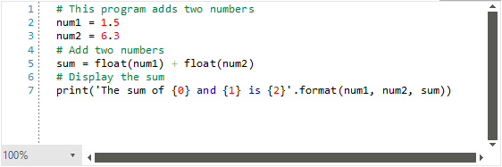

# Custom Language

By using the **WordTaggerBase** as a base, you can create custom syntax highlighting for any custom language. In this article we will create basic highlighting for the **Python** programming language.

Let's define the following class which will be responsible for classifying the words of the opened document.

#### The custom tagger

<snippet id='syntax-editor-syntaxeditortaggers-pythontagger-cs' />
<snippet id='syntax-editor-syntaxeditortaggers-pythontagger-vb' />

The code above defines custom arrays of words which are then assigned a **Keyword**, **Comment**, **Operator** or the custom **Fruits** classification type. In addition, in the **TryGetClassificationType** method override we assign the **NumberLiteral** classification type to any word that can be parsed to an integer.
We can then register the custom tagger in **RadSyntaxEditor**'s **TaggersRegistry** just as we would with any other tagger. We also add custom **TextFormatDefinitions** with specific foregrounds for the **NumberLiteral**, **Operator** and the custom **FruitsClassificationType** which we created earlier.

#### Registering the custom tagger

<snippet id='syntax-editor-syntaxeditortaggers-registertagger-cs' />
<snippet id='syntax-editor-syntaxeditortaggers-registertagger-vb' />

Upon loading some Python code in the editor you will observe a result similar to the one illustrated in Figure 1.

>caption Figure 1: The custom Python tagger

