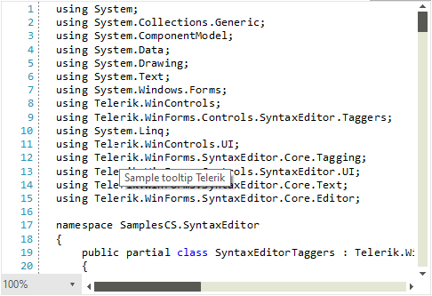

# Custom Taggers

To create a custom tagger, you can inherit from the abstract generic **TaggerBase** class. You then need to implement the abstract **GetTags** method which is responsible for acquiring all spans of tags which meet a specific condition.

To demonstrate this we will create the following class which shows a tool-tip on all occurrences of a specified search word.

#### Registering taggers

{{source=..\SamplesCS\SyntaxEditor\SyntaxEditorTaggers.cs region=DefineCustomTagger}}
{{source=..\SamplesVB\SyntaxEditor\SyntaxEditorTaggers.vb region=DefineCustomTagger}}

````C#
   public class SimpleToolTipTagger : TaggerBase<ToolTipTag>
        {
            private string searchWord;

            public SimpleToolTipTagger(ITextDocumentEditor editor)
                : base(editor)
            {
            }

            public override IEnumerable<TagSpan<ToolTipTag>> GetTags(NormalizedSnapshotSpanCollection spans)
            {
                if (string.IsNullOrEmpty(this.searchWord))
                {
                    yield break;
                }

                TextSnapshot snapshot = this.Document.CurrentSnapshot;
                foreach (TextSnapshotSpan snapshotSpan in spans)
                {
                    string lineString = snapshotSpan.GetText();
                    int index = lineString.IndexOf(this.searchWord);
                    while (index != -1)
                    {
                        TextSnapshotSpan tempSnapshotSpan = new TextSnapshotSpan(snapshot,
                            new Span(snapshotSpan.Start + index, searchWord.Length));

                        yield return new TagSpan<ToolTipTag>(tempSnapshotSpan, new ToolTipTag("Sample tooltip " + searchWord));

                        index = lineString.IndexOf(this.searchWord, index + this.searchWord.Length);
                    }
                }
            }

            public void UpdateSearchWord(string newSearchWord)
            {
                this.searchWord = newSearchWord;
                this.CallOnTagsChanged(this.Document.CurrentSnapshot.Span);
            }
        }          

````
````VB.NET

   Public Class SimpleToolTipTagger
        Inherits TaggerBase(Of ToolTipTag)

        Private searchWord As String

        Public Sub New(ByVal editor As ITextDocumentEditor)
            MyBase.New(editor)
        End Sub

        Public Overrides Iterator Function GetTags(ByVal spans As NormalizedSnapshotSpanCollection) As IEnumerable(Of TagSpan(Of ToolTipTag))
            If String.IsNullOrEmpty(Me.searchWord) Then
                Return
            End If

            Dim snapshot As TextSnapshot = Me.Document.CurrentSnapshot

            For Each snapshotSpan As TextSnapshotSpan In spans
                Dim lineString As String = snapshotSpan.GetText()
                Dim index As Integer = lineString.IndexOf(Me.searchWord)

                While index <> -1
                    Dim tempSnapshotSpan As TextSnapshotSpan = New TextSnapshotSpan(snapshot, New Span(snapshotSpan.Start + index, searchWord.Length))
                    Yield New TagSpan(Of ToolTipTag)(tempSnapshotSpan, New ToolTipTag("Sample tooltip " & searchWord))
                    index = lineString.IndexOf(Me.searchWord, index + Me.searchWord.Length)
                End While
            Next
        End Function

        Public Sub UpdateSearchWord(ByVal newSearchWord As String)
            Me.searchWord = newSearchWord
            Me.CallOnTagsChanged(Me.Document.CurrentSnapshot.Span)
        End Sub
    End Class

````

{{endregion}}

To use the tagger you need to register it in the **TaggersRegistry** as you would do with any other tagger. You can then call the **UpdateSearchWord** method to apply the tagger to any spans containing a specific word.

#### Using the custom tagger

{{source=..\SamplesCS\SyntaxEditor\SyntaxEditorTaggers.cs region=RegisterTooltipTagger}}
{{source=..\SamplesVB\SyntaxEditor\SyntaxEditorTaggers.vb region=RegisterTooltipTagger}}

````C#
SimpleToolTipTagger simpleToolTipTagger = new SimpleToolTipTagger(this.radSyntaxEditor1.SyntaxEditorElement);
if (!this.radSyntaxEditor1.TaggersRegistry.IsTaggerRegistered(simpleToolTipTagger))
{
    this.radSyntaxEditor1.TaggersRegistry.RegisterTagger(simpleToolTipTagger);
}
simpleToolTipTagger.UpdateSearchWord("Telerik");
         

````
````VB.NET
Dim simpleToolTipTagger As SimpleToolTipTagger = New SimpleToolTipTagger(Me.RadSyntaxEditor1.SyntaxEditorElement) 
If Not Me.RadSyntaxEditor1.TaggersRegistry.IsTaggerRegistered(simpleToolTipTagger) Then
    Me.RadSyntaxEditor1.TaggersRegistry.RegisterTagger(simpleToolTipTagger)
End If 
simpleToolTipTagger.UpdateSearchWord("Telerik")

````

{{endregion}}

>caption The custom tool-tip tagger




 