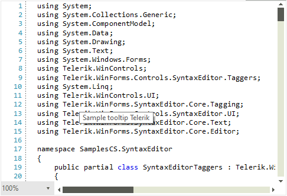

# Custom Taggers

To create a custom tagger, you can inherit from the abstract generic **TaggerBase** class. You then need to implement the abstract **GetTags** method which is responsible for acquiring all spans of tags which meet a specific condition.

To demonstrate this we will create the following class which shows a tool-tip on all occurrences of a specified search word.

#### Registering taggers

<snippet id='syntax-editor-syntaxeditortaggers-definecustomtagger-cs' />
<snippet id='syntax-editor-syntaxeditortaggers-definecustomtagger-vb' />

To use the tagger you need to register it in the **TaggersRegistry** as you would do with any other tagger. You can then call the **UpdateSearchWord** method to apply the tagger to any spans containing a specific word.

#### Using the custom tagger

<snippet id='syntax-editor-syntaxeditortaggers-registertooltiptagger-cs' />
<snippet id='syntax-editor-syntaxeditortaggers-registertooltiptagger-vb' />

>caption The custom tool-tip tagger

# See Also

* [How to Achieve Underline Text in RadSyntaxEditor]()

 
