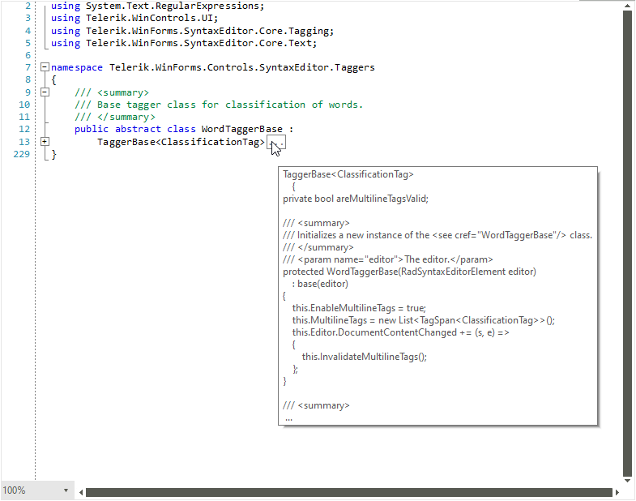

# Folding Taggers

The folding taggers are used when you want to create collapsible (foldable) sections of code in a document. The base class responsible for this functionality is the **FoldingTaggerBase** class with concrete implementations provided out of the box being the **BracketFoldingTagger**, **CSharpFoldingTagger** and **VisualBasicFoldingTagger**.

>caption RadSyntaxEditor with a registered CSharpFoldingTagger


 

## FoldingTaggerBase

**FoldingTaggerBase** is the class responsible for generating the collapsible code regions. You can inherit this class and add **FoldingRegionDefinitions** to define the start and end matching rules of a collapsible section.

#### Adding FoldingRegionDefinitions

{{source=..\SamplesCS\SyntaxEditor\SyntaxEditorTaggers.cs region=RegionDefinition}}
{{source=..\SamplesVB\SyntaxEditor\SyntaxEditorTaggers.vb region=RegionDefinition}}

````C#
 public CustomFoldingTagger(Telerik.WinForms.SyntaxEditor.Core.Editor.ITextDocumentEditor editor)
    : base(editor)
{
    this.FoldingRegionDefinitions.Add(new FoldingRegionDefinition("FUNCTION", "END"));
    this.FoldingRegionDefinitions.Add(new FoldingRegionDefinition("If", "End If"));
}
         

````
````VB.NET

Public Sub New(ByVal editor As Telerik.WinForms.SyntaxEditor.Core.Editor.ITextDocumentEditor)
    MyBase.New(editor)
    Me.FoldingRegionDefinitions.Add(New FoldingRegionDefinition("FUNCTION", "END"))
    Me.FoldingRegionDefinitions.Add(New FoldingRegionDefinition("If", "End If"))
End Sub

````

{{endregion}}

In addition, you may also want to override the **BuildStartRegionBlockPattern** and **BuildEndRegionBlockPattern** and return a custom regular expression to match the start and end.

#### Default implementation of the BuildStartRegionBlockPattern and BuildEndRegionBlockPattern methods of the VisualBasicFoldingTagger

{{source=..\SamplesCS\SyntaxEditor\SyntaxEditorTaggers.cs region=DefaultStartEndTagger }}
{{source=..\SamplesVB\SyntaxEditor\SyntaxEditorTaggers.vb region=DefaultStartEndTagger}}

````C#
protected override string BuildStartRegionBlockPattern(Dictionary<string, string> startToEndMap)
{
    List<string> finalList = new List<string>();

    foreach (string key in startToEndMap.Keys)
    {
        string endWord = startToEndMap[key];
        if (key == "If")
        {
            finalList.Add("\\b(?<!#)(?<!End )If\\b");
        }
        else if (endWord.StartsWith("#"))
        {
            finalList.Add(string.Format("(?<!#End ){0}\\b", key));
        }
        else if (endWord.Contains("End"))
        {
            finalList.Add(string.Format("\\b(?<!End ){0}\\b", key));
        }
        else
        {
            finalList.Add(key);
        }
    }

    string regexResult = string.Join("|", finalList);
    return regexResult;
}

protected override string BuildEndRegionBlockPattern(Dictionary<string, string> startToEndMap)
{
    List<string> finalList = new List<string>();

    foreach (string value in startToEndMap.Values)
    {
        if (value == "End If")
        {
            finalList.Add("\\b(?<!#)End If\\b");
        }
        else
        {
            finalList.Add(value);
        }
    }

    string regexResult = string.Join("|", finalList);
    return regexResult;
}
         

````
````VB.NET

Protected Overrides Function BuildStartRegionBlockPattern(ByVal startToEndMap As Dictionary(Of String, String)) As String
    Dim finalList As List(Of String) = New List(Of String)()

    For Each key As String In startToEndMap.Keys
        Dim endWord As String = startToEndMap(key)

        If key = "If" Then
            finalList.Add("\b(?<!#)(?<!End )If\b")
        ElseIf endWord.StartsWith("#") Then
            finalList.Add(String.Format("(?<!#End ){0}\b", key))
        ElseIf endWord.Contains("End") Then
            finalList.Add(String.Format("\b(?<!End ){0}\b", key))
        Else
            finalList.Add(key)
        End If
    Next

    Dim regexResult As String = String.Join("|", finalList)
    Return regexResult
End Function

Protected Overrides Function BuildEndRegionBlockPattern(ByVal startToEndMap As Dictionary(Of String, String)) As String
    Dim finalList As List(Of String) = New List(Of String)()

    For Each value As String In startToEndMap.Values

        If value = "End If" Then
            finalList.Add("\b(?<!#)End If\b")
        Else
            finalList.Add(value)
        End If
    Next

    Dim regexResult As String = String.Join("|", finalList)
    Return regexResult
End Function

````

{{endregion}}

Here's a full list of the overridable methods which you can use in order to create your own custom folding taggers. You can check their default implementations in the various out of the box folding taggers to get a general understanding of how to use them by [downloading the source code]() of the UI for WinForms suite.
* **string BuildStartRegionBlockPattern(Dictionary<string, string> startToEndMap)**: Prepares patters for matching start of collapsible folding section. Default implementation is to join all start strings of provided collapsible sections.
* **string BuildEndRegionBlockPattern(Dictionary<string, string> startToEndMap)**: Prepares patters for matching end of collapsible folding section. Default implementation is to join all end strings of provided collapsible sections.
* **string GetFoldingRegionTitle(Span foldingSpan)**: Gets the text displayed in the collapsed folding section. (... by default)
* **string GetFoldingRegionToolTipContent(Span foldingSpan)**: Gets the folding region's tooltip content.
* **string Span CoerceFoldingSpan(Span defaultFoldingSpan)**: Coerces the default provided folding span - span starting from the start of the region's start text and ending in the end of the region's end text.
* **string void RebuildFoldingRegions**: Rebuilds the list of all collapsible (folding) regions.
* **void InvalidateFoldingRegions**: Clears all collapsible (folding) regions and rebuilds them.

