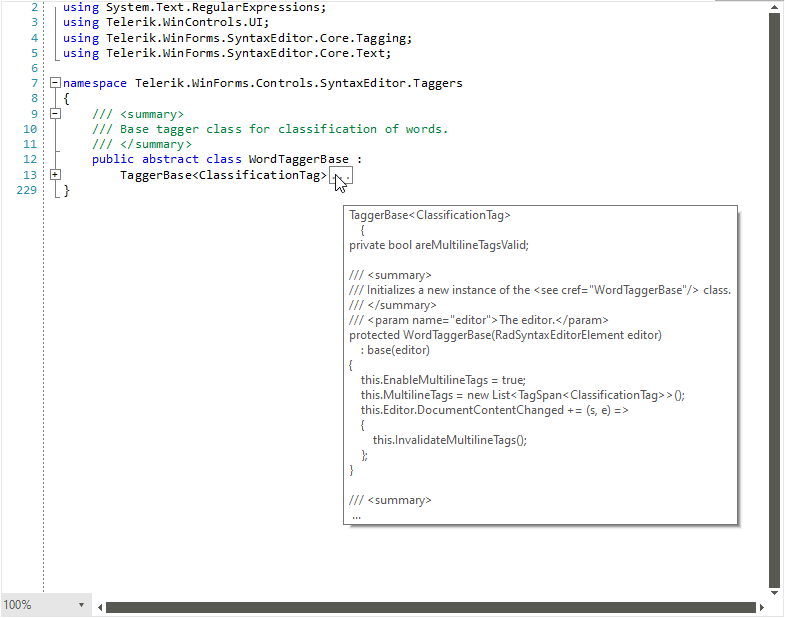

# Folding Taggers

The folding taggers are used when you want to create collapsible (foldable) sections of code in a document. **FoldingTaggerBase** class is the base class responsible for this functionality. The following folder taggers are available in our suite:

* **CSharpFoldingTagger**: A tagger responsible for code folding in C# files, allowing sections of code to be collapsed or expanded.
* **VisualBasicFoldingTagger**: A tagger responsible for code folding in Visual Basic files, enabling structured code navigation.
* **XmlFoldingTagger**: A tagger responsible for folding XML markup, allowing hierarchical data to be collapsed for easier reading.
* **JavaScriptFoldingTagger**: A tagger responsible for code folding in JavaScript files, helping to collapse/expand functions and blocks.
* **BracketFoldingTagger**: A tagger responsible for folding sections of code enclosed in standard curly brackets {} used in many programming languages.
* **SquareBracketFoldingTagger**:  Introduced with the Q4 2024 version, this tagger is responsible for folding sections enclosed in square brackets [], typically used in array definitions and attributes.

>caption RadSyntaxEditor with a registered CSharpFoldingTagger

 

## FoldingTaggerBase

**FoldingTaggerBase** is the class responsible for generating the collapsible code regions. You can inherit this class and add **FoldingRegionDefinitions** to define the start and end matching rules of a collapsible section.

#### Adding FoldingRegionDefinitions

<snippet id='syntax-editor-syntaxeditortaggers-regiondefinition-cs' />
<snippet id='syntax-editor-syntaxeditortaggers-regiondefinition-vb' />

In addition, you may also want to override the **BuildStartRegionBlockPattern** and **BuildEndRegionBlockPattern** and return a custom regular expression to match the start and end.

#### Default implementation of the BuildStartRegionBlockPattern and BuildEndRegionBlockPattern methods of the VisualBasicFoldingTagger

<snippet id='syntax-editor-syntaxeditortaggers-defaultstartendtagger-cs' />
<snippet id='syntax-editor-syntaxeditortaggers-defaultstartendtagger-vb' />

Here's a full list of the overridable methods which you can use in order to create your own custom folding taggers. You can check their default implementations in the various out of the box folding taggers to get a general understanding of how to use them by [downloading the source code]() of the UI for WinForms suite.
* **string BuildStartRegionBlockPattern(Dictionary<string, string> startToEndMap)**: Prepares patters for matching start of collapsible folding section. Default implementation is to join all start strings of provided collapsible sections.
* **string BuildEndRegionBlockPattern(Dictionary<string, string> startToEndMap)**: Prepares patters for matching end of collapsible folding section. Default implementation is to join all end strings of provided collapsible sections.
* **string GetFoldingRegionTitle(Span foldingSpan)**: Gets the text displayed in the collapsed folding section. (... by default)
* **string GetFoldingRegionToolTipContent(Span foldingSpan)**: Gets the folding region's tooltip content.
* **string Span CoerceFoldingSpan(Span defaultFoldingSpan)**: Coerces the default provided folding span - span starting from the start of the region's start text and ending in the end of the region's end text.
* **string void RebuildFoldingRegions**: Rebuilds the list of all collapsible (folding) regions.
* **void InvalidateFoldingRegions**: Clears all collapsible (folding) regions and rebuilds them.

