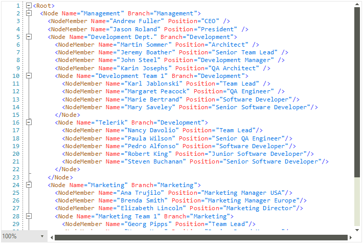

# Zooming

The **RadSyntaxEditor** control provides out of the box zooming functionality. You can zoom in the opened document by holding the **Ctrl** key and spinning the mouse wheel or by using the **ZoomComboBox** located in the bottom-left corner of the control.

#### Figure 1: Zooming the RadSyntaxEditor



The zooming functionality is enabled by default. To enable or disable it at run time you can use the **AllowScaling** property. If you want to disallow users to zoom through the control's UI, you can set the **AllowScalling** property to *false*.

#### Enable/Disable zooming

{{source=..\SamplesCS\SyntaxEditor\SyntaxEditorGettingStarted.cs region=DisableZooming}} 
{{source=..\SamplesVB\SyntaxEditor\SyntaxEditorGettingStarted.vb region=DisableZooming}}

````C#
this.radSyntaxEditor1.AllowScaling = false;

````
````VB.NET
Me.RadSyntaxEditor1.AllowScaling = False

````

{{endregion}} 

## ScaleFactor

The zoom factor can also be controlled by setting the control's **ScaleFactor** property as demonstrated in Example 1. It can take values from 0.25 to 4 while values outside this range are corected to the closest valid value.

#### Setting the ScaleFactor

{{source=..\SamplesCS\SyntaxEditor\SyntaxEditorGettingStarted.cs region=ScaleFactor}} 
{{source=..\SamplesVB\SyntaxEditor\SyntaxEditorGettingStarted.vb region=ScaleFactor}}

````C#
this.radSyntaxEditor1.ScaleFactor = 1.5;

````
````VB.NET
Me.RadSyntaxEditor1.ScaleFactor = 1.5

````

{{endregion}} 

#### Figure 2: Setting the ScaleFactor


## Programmatic Zooming

You can also zoom the **RadSyntaxEditor** control programmatically by using the **ZoomIn**, **ZoomOut** and **ZoomTo** methods. When invoked, the **ZoomIn** and **ZoomOut** methods increase or decrease the **ScaleFactor**.

#### Zoom in and Zoom out

{{source=..\SamplesCS\SyntaxEditor\SyntaxEditorGettingStarted.cs region=ProgrammaticZooming}} 
{{source=..\SamplesVB\SyntaxEditor\SyntaxEditorGettingStarted.vb region=ProgrammaticZooming}}

````C#
this.radSyntaxEditor1.ZoomIn(); // The zoom increase factor is 1.1
this.radSyntaxEditor1.ZoomOut(); // The zoom decrease factor is 0.91

````
````VB.NET
Me.RadSyntaxEditor1.ZoomIn() 'The zoom increase factor Is 1.1
Me.RadSyntaxEditor1.ZoomOut() 'The zoom decrease factor Is 0.91

````

{{endregion}} 

The **ZoomTo** method accepts a single argument - the zoom level to scroll to. This argument is directly set as the control's **ScaleFactor** and can thus accept values from 0.25 to 4, inclusive.

#### Zoom to a particular zoom level

{{source=..\SamplesCS\SyntaxEditor\SyntaxEditorGettingStarted.cs region=ZoomTo}} 
{{source=..\SamplesVB\SyntaxEditor\SyntaxEditorGettingStarted.vb region=ZoomTo}}

````C#
this.radSyntaxEditor1.ZoomTo(2);

````
````VB.NET
Me.RadSyntaxEditor1.ZoomTo(2);

````

{{endregion}} 
