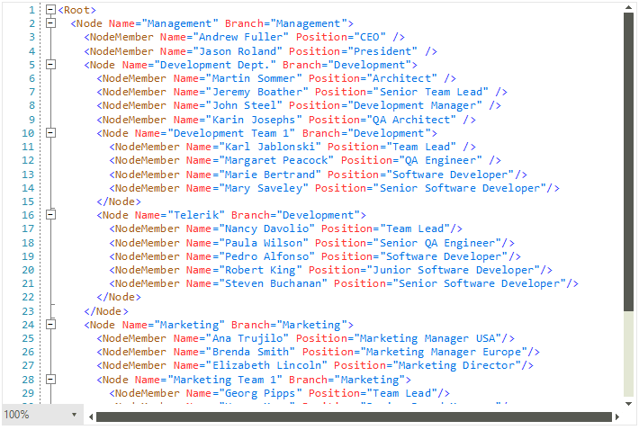
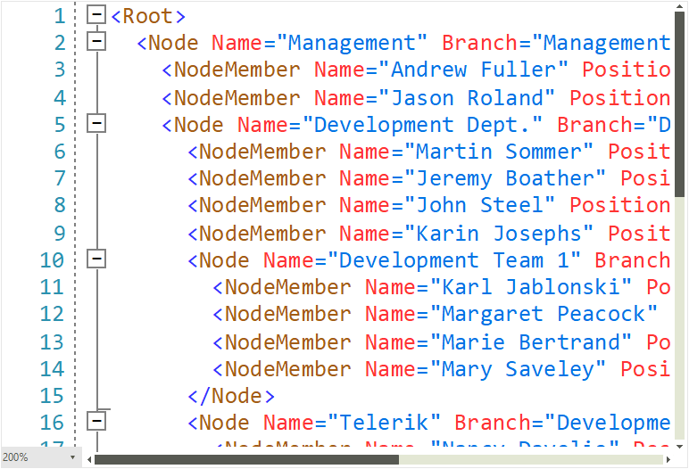

# Zooming

The **RadSyntaxEditor** control provides out of the box zooming functionality. You can zoom in the opened document by holding the **Ctrl** key and spinning the mouse wheel or by using the **ZoomComboBox** located in the bottom-left corner of the control.

#### Figure 1: Zooming the RadSyntaxEditor

The zooming functionality is enabled by default. To enable or disable it at run time you can use the **AllowScaling** property. If you want to disallow users to zoom through the control's UI, you can set the **AllowScalling** property to *false*.

#### Enable/Disable zooming

<snippet id='syntax-editor-syntaxeditorgettingstarted-disablezooming-cs' />
<snippet id='syntax-editor-syntaxeditorgettingstarted-disablezooming-vb' />

## ScaleFactor

The zoom factor can also be controlled by setting the control's **ScaleFactor** property as demonstrated in Example 1. It can take values from 0.25 to 4 while values outside this range are corected to the closest valid value.

#### Setting the ScaleFactor

<snippet id='syntax-editor-syntaxeditorgettingstarted-scalefactor-cs' />
<snippet id='syntax-editor-syntaxeditorgettingstarted-scalefactor-vb' />

#### Figure 2: Setting the ScaleFactor

## Programmatic Zooming

You can also zoom the **RadSyntaxEditor** control programmatically by using the **ZoomIn**, **ZoomOut** and **ZoomTo** methods. When invoked, the **ZoomIn** and **ZoomOut** methods increase or decrease the **ScaleFactor**.

#### Zoom in and Zoom out

<snippet id='syntax-editor-syntaxeditorgettingstarted-programmaticzooming-cs' />
<snippet id='syntax-editor-syntaxeditorgettingstarted-programmaticzooming-vb' />

The **ZoomTo** method accepts a single argument - the zoom level to scroll to. This argument is directly set as the control's **ScaleFactor** and can thus accept values from 0.25 to 4, inclusive.

#### Zoom to a particular zoom level

<snippet id='syntax-editor-syntaxeditorgettingstarted-zoomto-cs' />
<snippet id='syntax-editor-syntaxeditorgettingstarted-zoomto-vb' />

