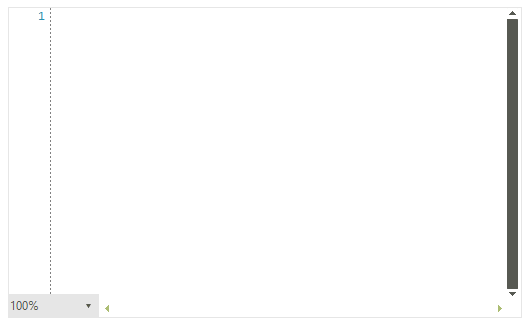
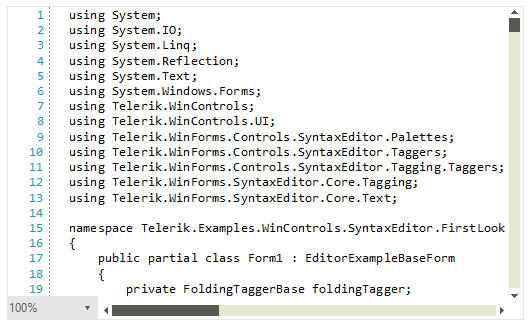
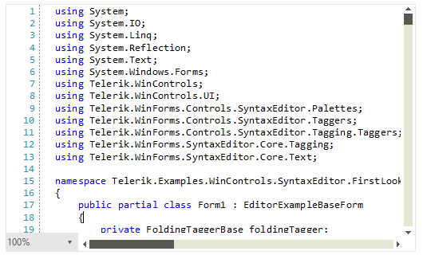

# Getting Started

This tutorial will walk you through the creation of a sample application that contains a **RadSyntaxEditor** control.

## Defining RadSyntaxEditor

To start using the control you only need to add a **RadSyntaxEditor** to the form either at design time by dragging it from the Toolbox and dropping it into the form or at run time via code.
  
#### Adding a RadSyntaxEditor at run time

````C#
RadSyntaxEditor radSyntaxEditor1 = new RadSyntaxEditor();

````
````VB.NET
Dim radSyntaxEditor1 As RadSyntaxEditor = New RadSyntaxEditor()

````

#### Figure 1: Empty RadSyntaxEditor

 

## Opening a File

To load a file in the **RadSyntaxEditor** you need to use its **Document** property.

{{source=..\SamplesCS\SyntaxEditor\SyntaxEditorGettingStarted.cs region=GettingStartedLoadDocument}} 
{{source=..\SamplesVB\SyntaxEditor\SyntaxEditorGettingStarted.vb region=GettingStartedLoadDocument}}

````C#

public RadForm1()
        {
            InitializeComponent();

            using (StreamReader reader = new StreamReader("../../CS_File.txt"))
            {
               this.radSyntaxEditor1.Document = new TextDocument(reader);
            }
        }

````
````VB.NET

Public Sub New()
    InitializeComponent()

    Using Reader As StreamReader = New StreamReader("../../CS_File.txt")
        Me.RadSyntaxEditor1.Document = New TextDocument(Reader)
    End Using
End Sub

````

#### Figure 2: RadSyntaxEditor with a loaded C# file

 

## Enable Syntax Highlighting

Once you have loaded the code, you need to register an appropriate tagger to enable syntax highlighting for the particular language.

{{source=..\SamplesCS\SyntaxEditor\SyntaxEditorGettingStarted.cs region=CSharpTagger}} 
{{source=..\SamplesVB\SyntaxEditor\SyntaxEditorGettingStarted.vb region=CSharpTagger}}

````C#

CSharpTagger cSharptagger = new CSharpTagger(this.radSyntaxEditor1.SyntaxEditorElement);
this.radSyntaxEditor1.TaggersRegistry.RegisterTagger(cSharptagger);

````
````VB.NET
Dim CSharptagger As CSharpTagger = New CSharpTagger(Me.radSyntaxEditor1.SyntaxEditorElement)
Me.RadSyntaxEditor1.TaggersRegistry.RegisterTagger(CSharptagger)

````

#### Figure 3: RadSyntaxEditor with C# code highlighting

 

