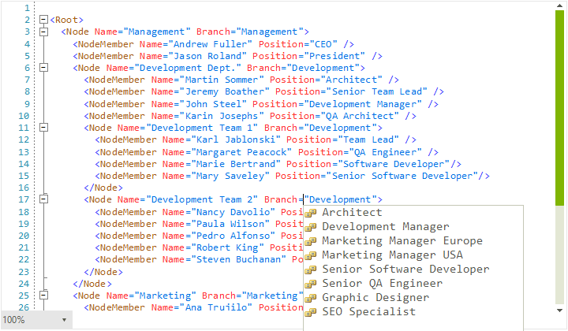

# WinForms SyntaxEditor Overview

As of **R1 2020** Telerik UI for WinForms suite offers a **RadSyntaxEditor** control. **RadSyntaxEditor** is a useful text editor control which provides built-in syntax highlighting and code editing experience for popular languages. It allows users to create custom syntax highlighting of keywords and operators of their own language.





## Key Features

* **Syntax highlighting** - Provides syntax highlighting for procedural programming and markup languages. Also allows users to customize built-in languages or create highlighting for their own custom language. 
* **Code outlining** - Displays code blocks in tree structure and allows users to expand and collapse the code blocks interactively for readability. **RadSyntaxEditor** automatically chooses where to create outlines for built-in languages. It also allows users to create outlining for their own syntax highlighting. 
* **Undo and redo** - Include support for undo and redo operations that erase the last change in a document and reinsert it. 
* **IntelliPrompts** - **RadSyntaxEditor** can show IntelliPrompts for code completion and method overloading to speed up coding by reducing typos and other common mistakes.
* **Find and replace** - Users can replace the specified text with the replacement text as per the conditions specified. Includes options to replace the first occurrence or all occurrences of the search text.
* **Zooming** - Allows users to zoom in and out of the control up to 4 times the original font size.
* **Line numbers** - Displays the line number at the start of a line for the users to identify the current number.
* **Palettes** - The control comes with 4 different palettes from which you can choose from and allows for custom palettes to be created.
* **Keyboard Shortcuts** - **RadSyntaxEditor** supports the most widely-spread keyboard hotkeys which can also be found in other text editors.

## Telerik UI for WinForms Learning Resources
* [Telerik UI for WinForms SyntaxEditor Homepage](https://www.telerik.com/products/winforms/syntax-editor.aspx)
* [Get Started with the Telerik UI for WinForms SyntaxEditor]()
* [Telerik UI for WinForms API Reference](https://docs.telerik.com/devtools/winforms/api/)
* [Getting Started with Telerik UI for WinForms Components]()
* [Telerik UI for WinForms Virtual Classroom (Training Courses for Registered Users)](https://learn.telerik.com/learn/course/external/view/elearning/17/TelerikUIforWinForms) 
* [Telerik UI for WinForms Forum](https://www.telerik.com/forums/winforms)
* [Telerik UI for WinForms Knowledge Base](https://docs.telerik.com/devtools/winforms/knowledge-base)

## Telerik UI for WinForms Additional Resources
* [Telerik UI for WinForms Product Overview](https://www.telerik.com/products/winforms.aspx)
* [Telerik UI for WinForms Blog](https://www.telerik.com/blogs/desktop-winforms)
* [Telerik UI for WinForms Videos](https://www.telerik.com/videos/product/winforms)
* [Telerik UI for WinForms Roadmap](https://www.telerik.com/support/whats-new/winforms/roadmap)
* [Telerik UI for WinForms Pricing](https://www.telerik.com/purchase/individual/winforms.aspx)
* [Telerik UI for WinForms Code Library](https://www.telerik.com/support/code-library/winforms)
* [Telerik UI for WinForms Support](https://www.telerik.com/support/winforms)
* [What’s New in Telerik UI for WinForms](https://www.telerik.com/support/whats-new/winforms)

