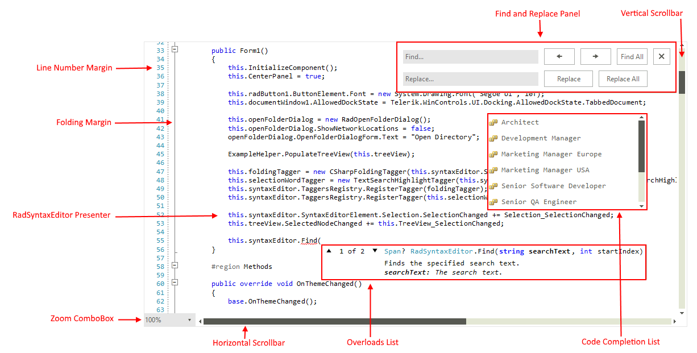

# Structure

This section defines terms and concepts used in the scope of the **RadSyntaxEditor** control.

#### Figure 1: RadSyntaxEditor's structure

 

- **Line Number Margin**: Displays a number for each line of the current document.
- **Folding Margin**: Displays a folding tagger that allows to create collapsible (foldable) sections of code in the document.
- **RadSyntaxEditor Presenter**: Displays the content of the loaded document. 
- **Find and Replace Panel**: The panel is used for searching in the document as well as replacing occurrences of a given word. It can be opened by using the **Ctrl + F5** key combination.
- **Vertical Scrollbar**: Scrolls the content of the document vertically.
- **Horizontal Scrollbar**: Scrolls the content of the document horizontally.
- **Code Completion List**: Displays a list of items for code completion which will be inserted at the position of the cursor.
- **Overloads List**: Displays a list of possible overloads for a given method.
- **Zoom ComboBox**: Can be used to change the scale factor of the document.

# Element Hierarchy

#### Figure 2: RadSyntaxEditor's elements hierarchy

