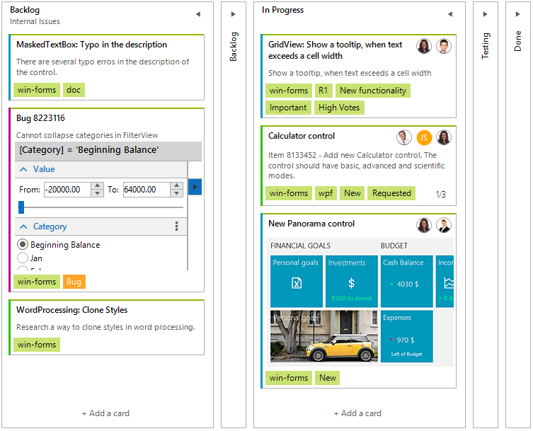

# Task Board

**RadTaskBoard** (also known as Kanban Board) is a powerful new control designed to enable users to track their tasks in a simple, agile-style manner. The control provides a clean and user-friendly interface for a functional task management application.

## Key Features:

* **Task Card Template**: RadTaskBoard provides build-in design for each task which exposes the most required properties that allow you to track your task life cycle. 

* **Accent Indicator**: Using colors is a quick way to make tasks stand out on the board. It helps users to quickly identify priority, type of work or an assignee as well as to group tasks for further reporting using the color criteria.

* **Tags**: You can highlight given tasks by adding tags to their Tags collection. Adding tags can be a great way to associate items with a release, sub-tasks to a story, feature, or project, etc.

* **Drag-Drop Support**: Users can easily reorder tasks between their life cycle.

* **Selection**: The control supports task selection.

* **Styling and Appearance**: RadTaskBoard comes with a variety of themes and properties that allow you to enhance the control's appearance.

* **Touch Support**: The RadTaskBoard control also provides out-of-the-box touch support.
 
# See Also

* [Getting Started]()
* [Structure]()
 
        
