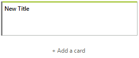
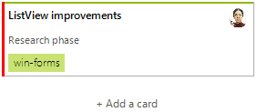

# Adding Task Cards

Each column element in **RadTaskBoard** has a button at the bottom for adding new task cards to this particular column. This button can be accessed by the RadTaskBoardColumnElement.**AddTaskCardButton** property. If you want to disable it for certain columns, manage the AddTaskCardButton.**Visibility** property respectively. 

However, if the button is enabled, the default **RadTaskCardElement** that is generated is almost empty and it contains only a title:

**RadTaskBoardColumnElement** offers the **TaskCardAdding** event which allows you to define default values for the new task card of a certain column element.

>note The **TaskCardAdding** event is also an appropriate place to show a custom dialog and present the end user an appropriate UI for filling in the necessary information. Just make sure that such a dialog is modal and its information is used when assigning the TaskCardAddingEventArgs.TaskCard.

#### Create a Predefined RadTaskCardElement

<snippet id='task-board-taskboardgettingstarted-predefinedcard-cs' />
<snippet id='task-board-taskboardgettingstarted-predefinedcard-vb' />

  
# See Also

* [Design Time]()
* [Structure]()
* [Task Card Edit Dialog]()
 
        
