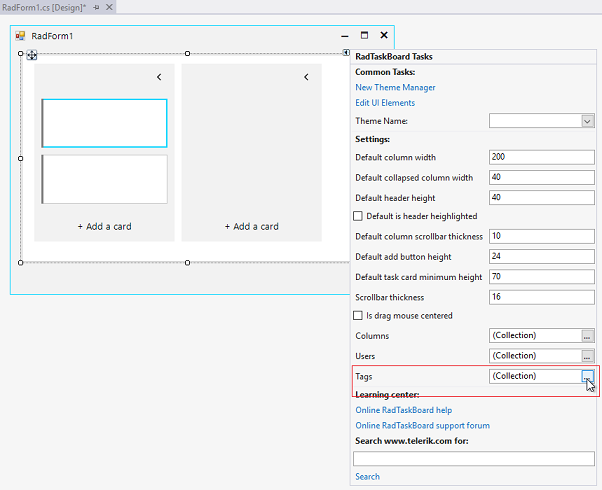
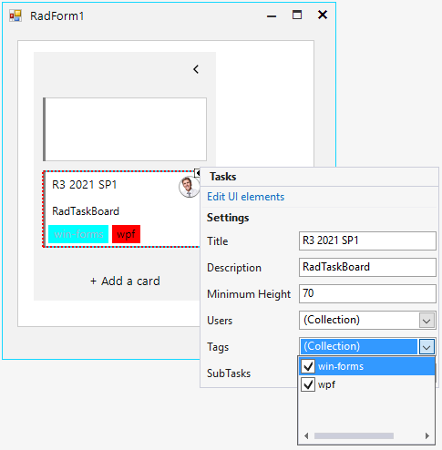

## Adding Users

**RadTaskBoard** allows you to define users at control level via the RadTaskBoard.**Users** collection. It can be achieved either at design time through the [smart tag](), or programmatically:  

#### Adding Users at Design time
 


Once, there are users in the RadTaskBoard.**Users** collection at design time, they will be available for adding to the task cards:


#### Adding Users at Run time

{{source=..\SamplesCS\TaskBoard\TaskBoardGettingStarted.cs region=AddUser}} 
{{source=..\SamplesVB\TaskBoard\TaskBoardGettingStarted.vb region=AddUser}} 

````C#
UserInfo user1 = new UserInfo();
user1.FirstName = "Anne";
user1.LastName = "Dodsworth";
user1.Avatar = Properties.Resources.anne;

UserInfo user2 = new UserInfo();
user2.FirstName = "Andrew";
user2.LastName = "Fuller";
user2.Avatar = Properties.Resources.andrew1;

this.radTaskBoard1.Users.Add(user1);
this.radTaskBoard1.Users.Add(user2);

````
````VB.NET
Dim user1 As UserInfo = New UserInfo()
user1.FirstName = "Anne"
user1.LastName = "Dodsworth"
user1.Avatar = My.Resources.anne
Dim user2 As UserInfo = New UserInfo()
user2.FirstName = "Andrew"
user2.LastName = "Fuller"
user2.Avatar = My.Resources.andrew1
Me.radTaskBoard1.Users.Add(user1)
Me.radTaskBoard1.Users.Add(user2)

````

{{endregion}}  

## Adding Tags

**RadTaskBoard** allows you to define tags at control level via the RadTaskBoard.**Tags** collection. It can be achieved either at design time through the [smart tag](), or programmatically: 

#### Adding Tags at Design time



Once, there are tags in the RadTaskBoard.**Tags** collection at design time, they will be available for adding to the task cards:



#### Adding Tags at Run time

{{source=..\SamplesCS\TaskBoard\TaskBoardGettingStarted.cs region=AddTag}} 
{{source=..\SamplesVB\TaskBoard\TaskBoardGettingStarted.vb region=AddTag}} 

````C#
TagInfo tagWF = new TagInfo();
tagWF.ForeColor = Color.Red;
tagWF.BackColor = Color.Black;
tagWF.Text = "win-forms";

TagInfo tagWPF = new TagInfo();
tagWPF.Text = "wpf";
tagWPF.ForeColor = Color.Aqua;
tagWF.BackColor = Color.Blue;

this.radTaskBoard1.Tags.Add(tagWF);
this.radTaskBoard1.Tags.Add(tagWPF);

````
````VB.NET

Dim tagWF As TagInfo = New TagInfo()
tagWF.ForeColor = Color.Red
tagWF.BackColor = Color.Black
tagWF.Text = "win-forms"
Dim tagWPF As TagInfo = New TagInfo()
tagWPF.Text = "wpf"
tagWPF.ForeColor = Color.Aqua
tagWF.BackColor = Color.Blue
Me.radTaskBoard1.Tags.Add(tagWF)
Me.radTaskBoard1.Tags.Add(tagWPF)

````

{{endregion}} 
 
>note When you add a **TagInfo** to a card, the TagInfo is added to the main collection in **RadTaskBoard**, so it can be reused.
  
# See Also

* [Design Time]()
* [Structure]()
* [Task Card Edit Dialog]()
 
        
