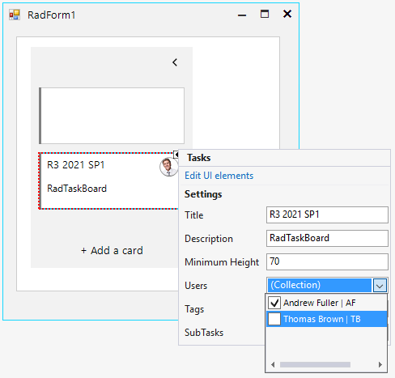
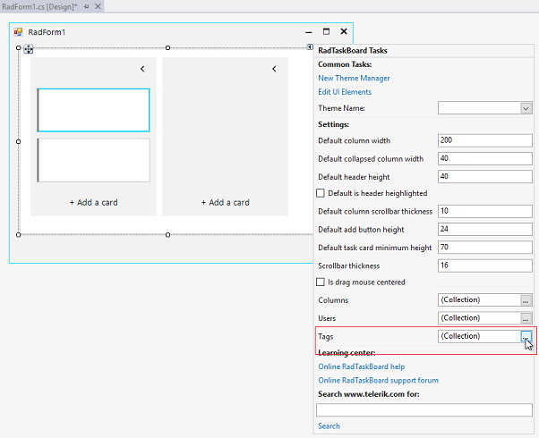
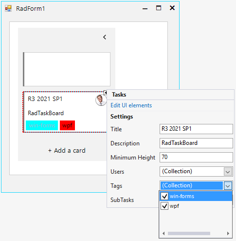

## Adding Users

**RadTaskBoard** allows you to define users at control level via the RadTaskBoard.**Users** collection. It can be achieved either at design time through the [smart tag](), or programmatically:  

#### Adding Users at Design time
 

Once, there are users in the RadTaskBoard.**Users** collection at design time, they will be available for adding to the task cards:

#### Adding Users at Run time

<snippet id='task-board-taskboardgettingstarted-adduser-cs' />
<snippet id='task-board-taskboardgettingstarted-adduser-vb' />

## Adding Tags

**RadTaskBoard** allows you to define tags at control level via the RadTaskBoard.**Tags** collection. It can be achieved either at design time through the [smart tag](), or programmatically: 

#### Adding Tags at Design time

Once, there are tags in the RadTaskBoard.**Tags** collection at design time, they will be available for adding to the task cards:

#### Adding Tags at Run time

<snippet id='task-board-taskboardgettingstarted-addtag-cs' />
<snippet id='task-board-taskboardgettingstarted-addtag-vb' />

>note When you add a **TagInfo** to a card, the TagInfo is added to the main collection in **RadTaskBoard**, so it can be reused.
  
# See Also

* [Design Time]()
* [Structure]()
* [Task Card Edit Dialog]()
 
        
