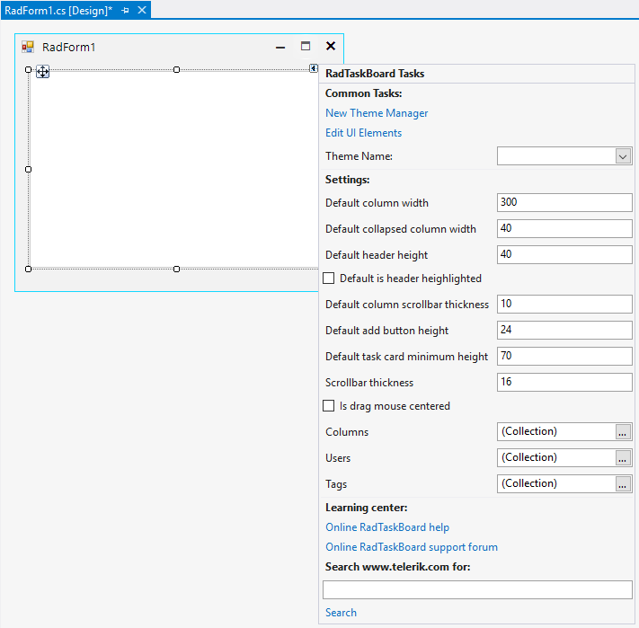
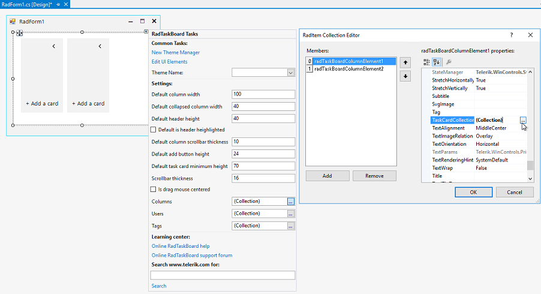
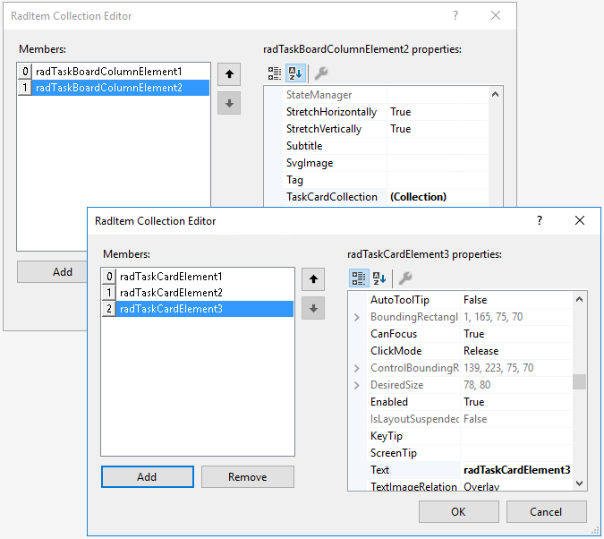
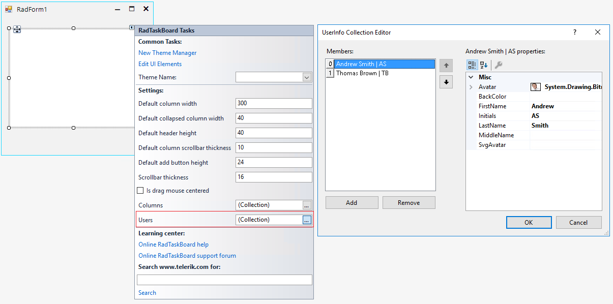
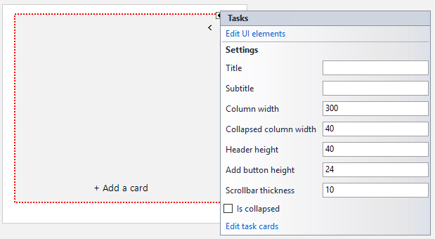
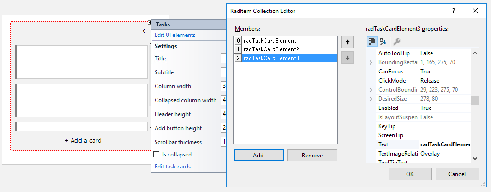
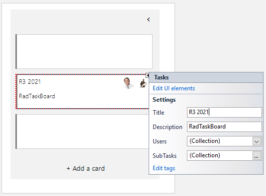
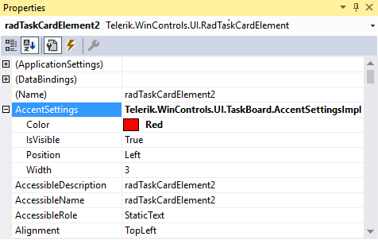

# Design Time

To start using **RadTaskBoard**, just drag it from the toolbox and drop it onto the form.
 
## Smart Tag 

Select **RadTaskBoard** and click the small arrow on the top right position in order to open the Smart Tag.

It is possible to fine-tune the default columns' settings such as column width, collapsed column width, add button's height, add columns, add users etc.

### Adding Columns

Click the browse button next to the **Columns** property in the Smart Tag. This will show the Collection Editor allowing you to add columns to **RadTaskBoard**. The **TaskCardCollection** editor allows you to add as many task cards as needed for every defined column:

### Adding Users

Click the browse button next to the **Users** property in the Smart Tag. This will show the Collection Editor allowing you to add users to **RadTaskBoard**. 

### Adding Task Cards to Columns

Each column also offers its own Smart Tag. Just select the column element at design time. Thus, you can specify the column specific settings:

Clicking the "Edit task cards" option opens the collection editor allowing you to define task card elements for the particular column: 

Once the task cards are added, select the desired task card element and open its Smart Tag to specify the title, description, users, sub tasks, etc.

In the *Properties* window on the right side in Visual Studio, it is possible to specify the accent color for the task card, the accent width or whether the accent indicator to be visible or not:

 
# See Also

* [Design Time]()
* [Structure]()
 
        
