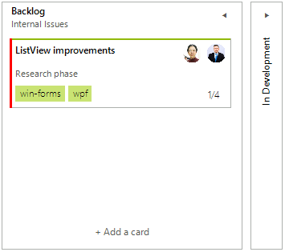

# Getting Started with WinForms TaskBoard

This article shows how you can start using **RadTaskBoard**. Just drag a **RadTaskBoad** from the toolbox and drop it onto the form. Then, define the columns you need in the control and the task cards contained in each column:

{{source=..\SamplesCS\TaskBoard\TaskBoardGettingStarted.cs region=GettingStarted}} 
{{source=..\SamplesVB\TaskBoard\TaskBoardGettingStarted.vb region=GettingStarted}} 

````C#

UserInfo user1 = new UserInfo();
user1.FirstName = "Anne";
user1.LastName = "Dodsworth";
user1.Avatar = Properties.Resources.anne;
UserInfo user2 = new UserInfo();
user2.FirstName = "Andrew";
user2.LastName = "Fuller";
user2.Avatar = Properties.Resources.andrew1;

RadTaskCardElement card = new RadTaskCardElement();

RadTaskBoardColumnElement c1 = new RadTaskBoardColumnElement();
c1.Title = "Backlog";
c1.Subtitle = "Internal Issues";

RadTaskBoardColumnElement c2 = new RadTaskBoardColumnElement();
c2.Title = "In Development";
c2.Subtitle = "Prioritized Issues";
c2.IsCollapsed = true;
this.radTaskBoard1.Columns.Add(c1);
this.radTaskBoard1.Columns.Add(c2);

card.TitleText =   "ListView improvements"; 
card.DescriptionText =   "Research phase";
card.AccentSettings.Color = Color.Red;

card.Users.Add(user1);
card.Users.Add(user2);

TagInfo tagWF = new TagInfo();
tagWF.Text = "win-forms";
TagInfo tagWPF = new TagInfo();
tagWPF.Text = "wpf";
card.Tags.Add(tagWF);
card.Tags.Add(tagWPF);

card.SubTasks.Add(new SubTask(card));
card.SubTasks.Add(new SubTask(card));
card.SubTasks.Add(new SubTask(card));
SubTask x = new SubTask(card);
x.Completed = true;
card.SubTasks.Add(x);
c1.TaskCardCollection.Add(card);

````
````VB.NET
Dim user1 As UserInfo = New UserInfo()
user1.FirstName = "Anne"
user1.LastName = "Dodsworth"
user1.Avatar = My.Resources.anne
Dim user2 As UserInfo = New UserInfo()
user2.FirstName = "Andrew"
user2.LastName = "Fuller"
user2.Avatar = My.Resources.andrew1
Dim card As RadTaskCardElement = New RadTaskCardElement()
Dim c1 As RadTaskBoardColumnElement = New RadTaskBoardColumnElement()
c1.Title = "Backlog"
c1.Subtitle = "Internal Issues"
Dim c2 As RadTaskBoardColumnElement = New RadTaskBoardColumnElement()
c2.Title = "In Development"
c2.Subtitle = "Prioritized Issues"
c2.IsCollapsed = True
Me.radTaskBoard1.Columns.Add(c1)
Me.radTaskBoard1.Columns.Add(c2)
card.TitleText = "ListView improvements"
card.DescriptionText = "Research phase"
card.AccentSettings.Color = Color.Red
card.Users.Add(user1)
card.Users.Add(user2)
Dim tagWF As TagInfo = New TagInfo()
tagWF.Text = "win-forms"
Dim tagWPF As TagInfo = New TagInfo()
tagWPF.Text = "wpf"
card.Tags.Add(tagWF)
card.Tags.Add(tagWPF)
card.SubTasks.Add(New SubTask(card))
card.SubTasks.Add(New SubTask(card))
card.SubTasks.Add(New SubTask(card))
Dim x As SubTask = New SubTask(card)
x.Completed = True
card.SubTasks.Add(x)
c1.TaskCardCollection.Add(card)

````

{{endregion}} 


 
 
# See Also

* [Design Time]()
* [Structure]()
 
        

## Telerik UI for WinForms Learning Resources
* [Telerik UI for WinForms TaskBoard Component](https://www.telerik.com/products/winforms/task-board.aspx)
* [Getting Started with Telerik UI for WinForms Components](https://docs.telerik.com/devtools/winforms/getting-started/first-steps)
* [Telerik UI for WinForms Setup](https://docs.telerik.com/devtools/winforms/installation-and-upgrades/installing-on-your-computer)
* [Telerik UI for WinForms Application Modernization](https://docs.telerik.com/devtools/winforms/winforms-converter/overview)
* [Telerik UI for WinForms Visual Studio Templates](https://docs.telerik.com/devtools/winforms/visual-studio-integration/visual-studio-templates)
* [Deploy Telerik UI for WinForms Applications](https://docs.telerik.com/devtools/winforms/deployment-and-distribution/application-deployment)
* [Telerik UI for WinForms Virtual Classroom(Training Courses for Registered Users)](https://learn.telerik.com/learn/course/external/view/elearning/17/telerik-ui-for-winforms)
* [Telerik UI for WinForms License Agreement)](https://www.telerik.com/purchase/license-agreement/winforms-dlw-s)

