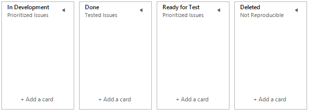
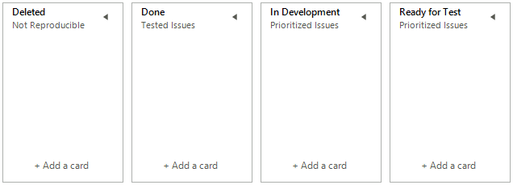

## Sorting Tasks

As of R1 2023 SP1 **RadTaskBoard** supports sorting functionality for the columns and for the tasks defined in a column. 

>caution Note that the sorting functionality in RadTaskBoard is a one-time operation, and once performed, changes in the state of the column elements or task card elements are not monitored, as this would lead to inconsistent behavior and break other control's functionality such as drag and drop. This behavior is similar to Excel sorting. If the developers/users need to sort the tasks or columns they can just invoke the sort methods. 

### Sorting Columns

The **SortColumns** method sorts all columns in the Columns collection using the RadTaskBourdElement.ColumnComparer property. The default ColumnComparer sorts the columns by their title. If you need custom or more complex sorting you need to inherit from Telerik.WinControls.UI.TaskBoard.ColumnComparer and override the Compare method which will give you access to the ColumnElements instances.

>Default Tasks Order



{{source=..\SamplesCS\TaskBoard\TaskBoardGettingStarted.cs region=ApplyCustomColumnComparer}} 
{{source=..\SamplesVB\TaskBoard\TaskBoardGettingStarted.vb region=ApplyCustomColumnComparer}} 

````C#
this.radTaskBoard1.TaskBoardElement.ColumnComparer = new MyCustomComparer();
this.radTaskBoard1.SortColumns();

````
````VB.NET
Me.radTaskBoard1.TaskBoardElement.ColumnComparer = New MyCustomComparer()
Me.radTaskBoard1.SortColumns()

````

{{endregion}}  


{{source=..\SamplesCS\TaskBoard\TaskBoardGettingStarted.cs region=SortingColumns}} 
{{source=..\SamplesVB\TaskBoard\TaskBoardGettingStarted.vb region=SortingColumns}} 

````C#
private class MyCustomComparer : ColumnComparer
{

    public override int Compare(RadTaskBoardColumnElement x, RadTaskBoardColumnElement y)
    {
        if (x.Title == "Done")
        {
            // The column with Done text is First.
            return -1;
        }
        return base.Compare(x, y);
    }
}

````
````VB.NET
Private Class MyCustomComparer
    Inherits ColumnComparer

    Public Overrides Function Compare(ByVal x As RadTaskBoardColumnElement, ByVal y As RadTaskBoardColumnElement) As Integer
        If x.Title = "Done" Then
            Return -1
        End If

        Return MyBase.Compare(x, y)
    End Function
End Class

````

{{endregion}}  

>caption Sorted Tasks



### Sorting Tasks in All Columns

The **SortTasks** method sorts the tasks of all columns. The default Comparer used by all columns is RadTaskBoardElement.**TaskCardComparer** and it will sort the tasks by their TitleText. If you need custom sort for all columns you can create an ancestor of the TaskCardComparer class and set it to the TaskBoardElement.TaskCardComparer. To create custom tasks sorting per column you can use the RadTaskBoardColumnElement.TaskCardComparer property which is defined per column. If the RadTaskBoardColumnElement.TaskCardComparer is not explicitly set it will refer to the TaskBoardElement.TaskCardComparer.

### Sorting Tasks in a Single Column

The **SortTasks(RadTaskBoardColumnElement column)** method sorts the tasks of a single column. The description of the other tasks sorting method is valid here too.

# See Also

* [Design Time]()
* [Structure]()
* [Task Card Edit Dialog]()
 
        
