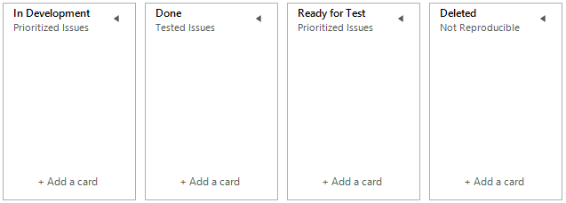
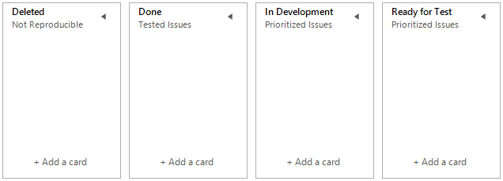
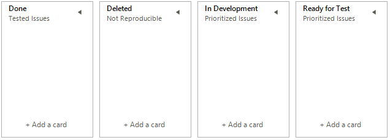
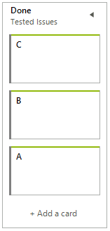

## Sorting Functionality

As of R1 2023 SP1 **RadTaskBoard** supports sorting functionality for the columns and for the tasks defined in a column. 

>caution Note that the sorting functionality in RadTaskBoard is a one-time operation, and once performed, changes in the state of the column elements or task card elements are not monitored, as this would lead to inconsistent behavior and break other control's functionality such as drag and drop. This behavior is similar to Excel sorting. If the developers/users need to sort the tasks or columns they can just invoke the sort methods. 

### Sorting Columns

The **SortColumns** method sorts all columns in the Columns collection using the RadTaskBourdElement.**ColumnComparer** property. The default ColumnComparer sorts the columns by their title. If you need custom or more complex sorting you need to inherit from Telerik.WinControls.UI.TaskBoard.**ColumnComparer** and override the **Compare** method which will give you access to the ColumnElements instances.

By default, the columns are displayed in the order of adding the columns. Let's consider that the columns are added in this way: "In Development", "Done", "Ready for Test", "Deleted":

>caption Default Columns Order

If the **SortColumns** method is called, the column's title is considered and the columns are ordered alphabetically:

>caption Default Columns Sort Order

However, after applying the custom comparer, "Done" column is always first:

<snippet id='task-board-taskboardgettingstarted-applycustomcolumncomparer-cs' />
<snippet id='task-board-taskboardgettingstarted-applycustomcolumncomparer-vb' />

Here is the specific implementation ensuring that the first column:

<snippet id='task-board-taskboardgettingstarted-sortingcolumns-cs' />
<snippet id='task-board-taskboardgettingstarted-sortingcolumns-vb' />

>caption Custom Columns Sort Order

### Sorting Tasks in All Columns

The **SortTasks** method sorts the tasks of all columns. The default Comparer used by all columns is RadTaskBoardElement.**TaskCardComparer** and it will sort the tasks by their TitleText. If you need custom sort for all columns you can create an ancestor of the TaskCardComparer class and set it to the TaskBoardElement.TaskCardComparer. To create custom tasks sorting per column you can use the RadTaskBoardColumnElement.TaskCardComparer property which is defined per column. If the RadTaskBoardColumnElement.TaskCardComparer is not explicitly set it will refer to the TaskBoardElement.TaskCardComparer.

<snippet id='task-board-taskboardgettingstarted-applycustomtaskcomparer-cs' />
<snippet id='task-board-taskboardgettingstarted-applycustomtaskcomparer-vb' />

Here is the specific implementation ensuring the reversed alphabetical order for the tasks:

<snippet id='task-board-taskboardgettingstarted-sortingtasks-cs' />
<snippet id='task-board-taskboardgettingstarted-sortingtasks-vb' />

>caption Sorted Tasks in Reversed Alphabetical Order

### Sorting Tasks in a Single Column

The **SortTasks(RadTaskBoardColumnElement column)** method sorts the tasks of a single column. The description of the other tasks sorting method is valid here too.

# See Also

* [Design Time]()
* [Structure]()
* [Task Card Edit Dialog]()
 
        
