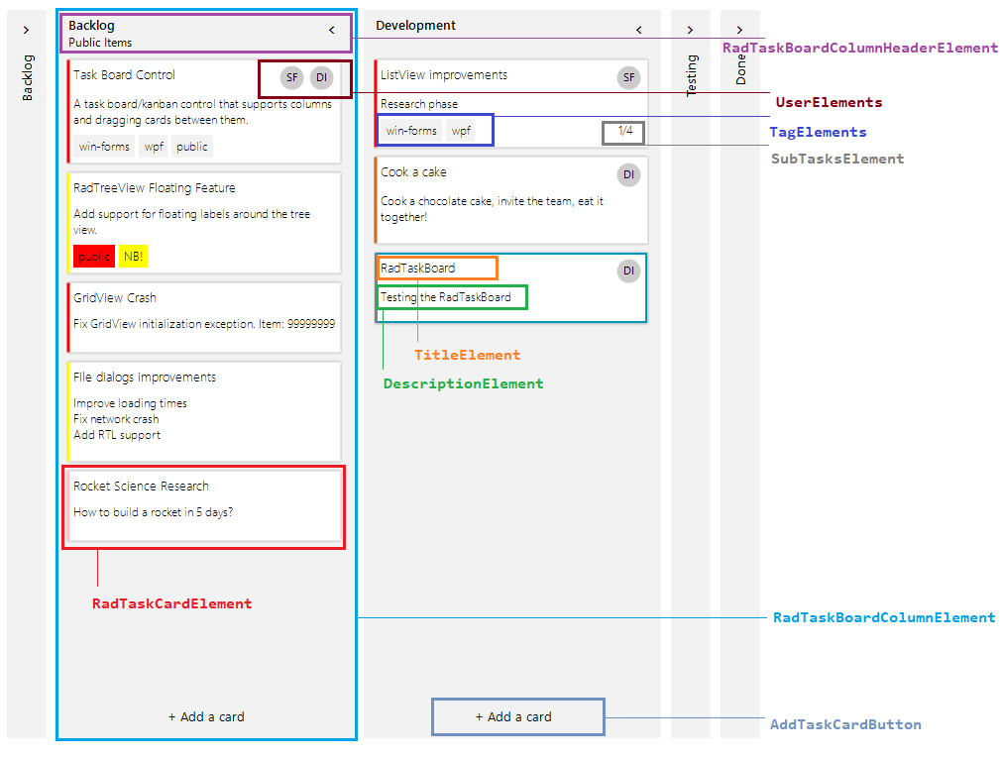
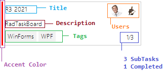
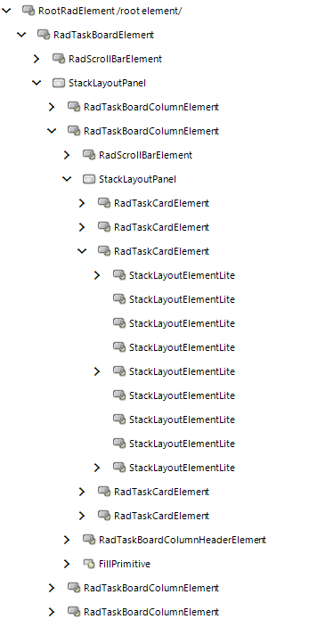

# Structure

This article describes the inner structure and organization of the elements which build **RadTaskBoard**.

**RadTaskBoard** is composed of column elements. Each **RadTaskBoardColumnElement** contains a header, task card elements and a button at the bottom for adding more task cards. Every **RadTaskCardElement** contains 9 containers: 3 x 3. This allows adding different elements top-left, top-center, top-right, middle-left, middle-center, middle-right, bottom-left, bottom-center, bottom-right. The RadTaskCardElement.**ElementsCollections** offers a dictionary which Value is **ContentAlignment** allowing you easily to access the **RadItemOwnerCollection** for the respective container.

* Column: Essential building block, represented by the base class RadTaskBoardColumnElement. The columns inside the control can be collapsed.
 
* Column Header: Represents the header of the columns inside the RadTaskBoard control.

* Task Title: Represents the title of the task item.

* User: Represents the circle container which can display an icon image of the RadTaskBoard card.

* Tags: Displays a collection of highlight objects applied to a given item.

* Accent/Category Indicator: Represents the color container on the left side for a RadTaskBoard card.

* Task Description: Represents the description of the item.

* Expand/Collapse Column Button: Collapses and expands the column.

Each **RadTaskCardElement** offers accent color, title, description, user info, tags, sub tasks. The sub tasks are displayed in the following format: "Number of Completed Tasks/ Total number of tasks". 

## Elements Hierarchy
 

 
# See Also

* [Getting Started]()
* [Design Time]()
 
        
