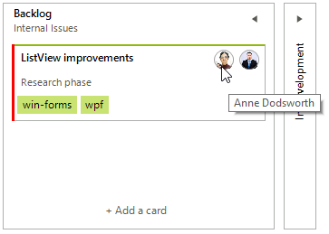
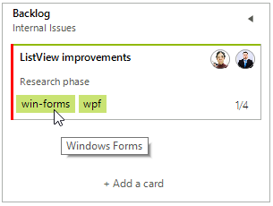
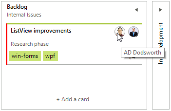

# Tooltips

There are two ways to assign tooltips to the different elements in RadTaskBoard, namely setting the respective property from the below list, or as in most of the RadControls by using the [ToolTipTextNeeded]() event.

Specifying global tooltips for the RadTaskBoard control:

* **ToolTipCollapse**: Gets or set the tooltip string for the collapse button, when the column is expanded - "Collapse the column"(introduced in R3 2021 SP1)
* **ToolTipExpand**: Gets or set the tooltip string for the collapse button, when the column is collapsed - "Expand the column" (introduced in R3 2021 SP1)
* **AddButtonToolTipText**: Gets or sets the tooltip text of the RadTaskBoardColumnElement.AddTaskCardButton element for all columns (introduced in R3 2021 SP1)
* **SubTasksToolTipStringFormat**: This string format is used to represent the tooltip of the completed subtasks against the totals subtasks in the card.The default value is "{0} out of {1} subtasks completed.", where {0} is the number of completed tasks and {1} is the number of total tasks (introduced in R3 2021 SP1)

Specifying tooltips for the elements in RadTaskCardElement:

* RadTaskCardUserElement.**ToolTipText**: Gets or sets the tooltip string for the user element inside the task card. By default, the tooltip text contains the user names.



* The sub-task elements consider the **SubTasksToolTipStringFormat** and apply the respective value to the **ToolTipText** property for the sub-task element.

## Setting Tooltips in the ToolTipTextNeeded event

The code snippet below demonstrates how you can use RadTaskBoard.**ToolTipTextNeeded** event handler to set **ToolTipText** for the given sender element.

#### Changing the Tooltips for the Card Tags and Card Users

{{source=..\SamplesCS\TaskBoard\TaskBoardGettingStarted.cs region=Tooltips}} 
{{source=..\SamplesVB\TaskBoard\TaskBoardGettingStarted.vb region=Tooltips}} 

````C#

private void RadTaskBoard1_ToolTipTextNeeded(object sender, ToolTipTextNeededEventArgs e)
{
    RadTaskCardTagElement  tagElement = sender as RadTaskCardTagElement;
    RadTaskCardUserElement userElement = sender as RadTaskCardUserElement;
    LightVisualElement lve = sender as LightVisualElement;
    if (tagElement!=null )
    {
        if (tagElement.Text=="win-forms")
        {
            e.ToolTipText = "Windows Forms";
        }
        else if (tagElement.Text=="wpf")
        {
            e.ToolTipText = "Windows Presentation Foundation";
        }
    }
    else if (userElement!=null)
    {
        e.ToolTipText = userElement.UserInfo.Initials + " " + userElement.UserInfo.LastName;
    }
    else if (lve!=null && lve.Class== "TaskCardDescription")
    {
        e.ToolTipText = "Custom description";
    }
}

````
````VB.NET
Private Sub RadTaskBoard1_ToolTipTextNeeded(ByVal sender As Object, ByVal e As ToolTipTextNeededEventArgs)
    Dim tagElement As RadTaskCardTagElement = TryCast(sender, RadTaskCardTagElement)
    Dim userElement As RadTaskCardUserElement = TryCast(sender, RadTaskCardUserElement)
    Dim lve As LightVisualElement = TryCast(sender, LightVisualElement)

    If tagElement IsNot Nothing Then

        If tagElement.Text = "win-forms" Then
            e.ToolTipText = "Windows Forms"
        ElseIf tagElement.Text = "wpf" Then
            e.ToolTipText = "Windows Presentation Foundation"
        End If
    ElseIf userElement IsNot Nothing Then
        e.ToolTipText = userElement.UserInfo.Initials & " " + userElement.UserInfo.LastName
    ElseIf lve IsNot Nothing AndAlso lve.[Class] = "TaskCardDescription" Then
        e.ToolTipText = "Custom description"
    End If
End Sub

````

{{endregion}}  

>caption Custom tooltip for the Tag element



>caption Custom tooltip for the User element



# See Also

* [Design Time]()
* [Structure]()
* [Task Card Edit Dialog]()
 
        
